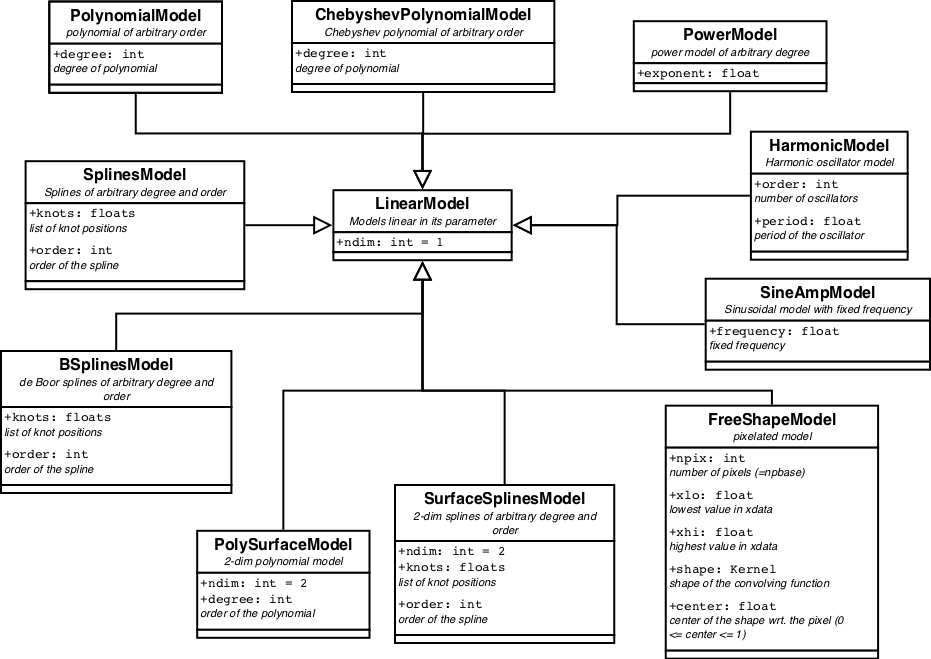
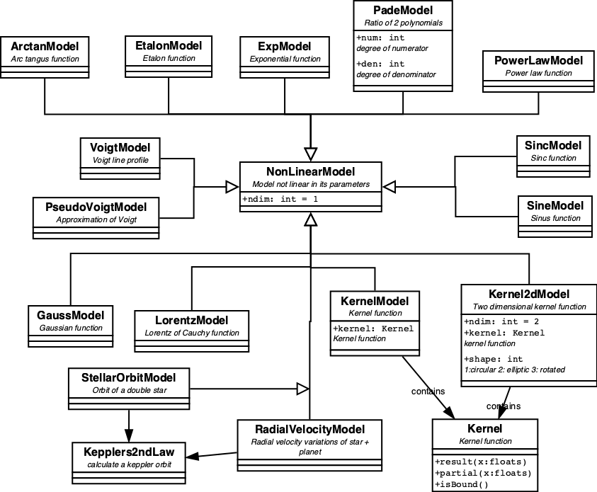
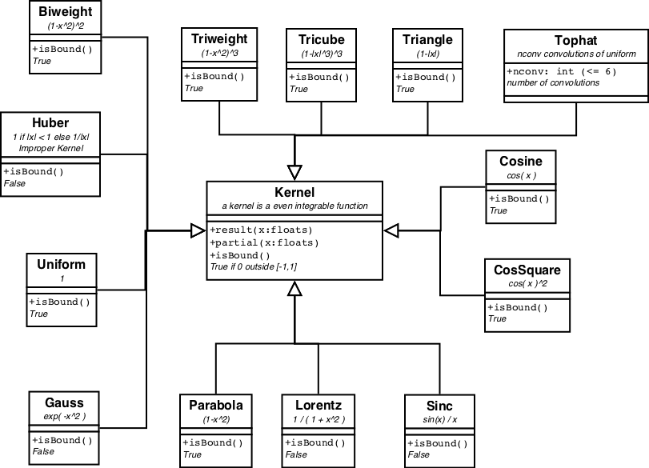
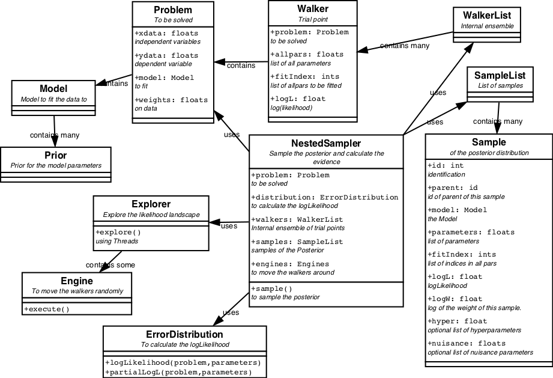
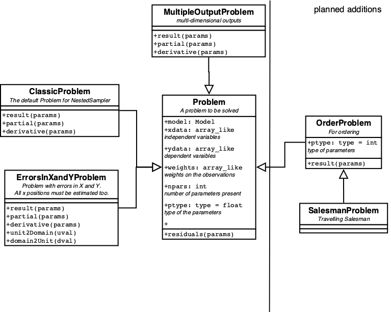
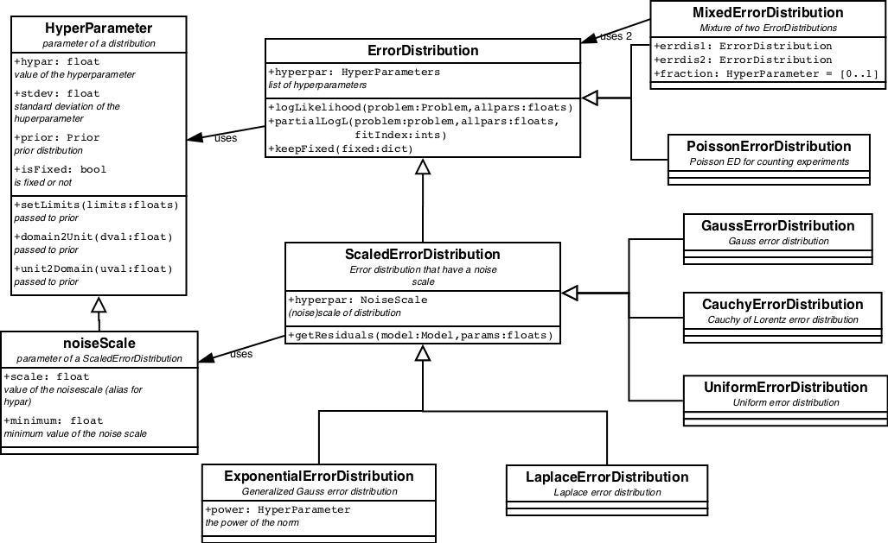
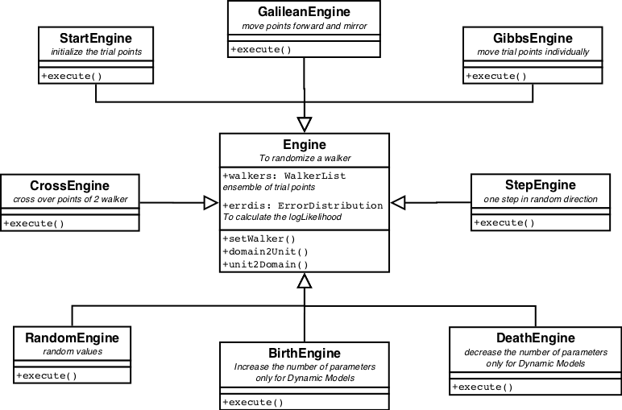

# BayesicFitting Design Documentation

Write some notes about style: camelcase and spaces. 
code should read like a sentence.

## Contents.

1. [Introduction](#intro)
2. [Model Classes](#modelclasses)
3. [Fitter Classes](#fitterclasses)
4. [Nested Sampling](#nested)
5. [References](#reference)

## 1. Introduction

The BayesicFitting package offers a general way to fit
models to data in a Bayesian way.
It consists of 3 families of classes: the Model classes, the Fitter 
classes and the NestedSampling classes.

This is not the place to explain either the mathematics behind 
Bayesian modelling of data or the algorithms used. For the mathematics look at
the [Sivia][1], [Bishop][2], [von der Linden][3] and [Jaynes][4] 
and for some fitter algorithms [Press][5]. 

### Some notes about coding style.

Here I present my style rules, developed over more that 40 years of
programming. I was quite pleased when I learned that they mostly comply
with PEP 8.

* Naming conventions

  + All classes are written in CamelCase, capitalizing each word and glueing
them together without underscore. 

  + All methods (functions) are witten in camelCase: starting with a lower
case letter. If more words are needed they are capitalized, again no
underscores.

  + Instance attributes are also written in camelCase. Some of them are
read-only, meaning they can be enquired at a certain stage in the
objects existence. It is indicated in the documentation whether an
attribute is read-only.

  + Class attributes are written as all capitalized WORDS. They act as
constants and should not be changed. 

  + There is very little difference between private and public items as
in python the difference between private and public exists only by
convention. 

* Coding conventions 
Code statements should read like sentences optimized for the user/coder
to read. The computer does not care as long as it is grammatically
correct. See [Obfuscated C](https://ioccc.org), a competition in writing 
unreadable code.

  + Readable sentences have spaces between words. Operators are words: + reads
as "plus", = reads as "is". So operators have spaces on each side. 

  + Brackets as ()[]{} have spaces too if they are selfstanding. E.g. in
grouping things together, in tuples, lists or dictionaries. 

  + If parentheses, (), are part of a function the opening parenthesis
clings to the functionname, followed by a space. The closing one is
preceeded and followed by a space.

  + Brackets, [], that index an array or a dictionary, have no spaces at
all, indicating the close connection between the index and the indexed
item.

  + The same close relationship exists between an object and its methods or
attributes. So the connecting dot, ., has no spaces.

  + The comma is fuctioning as a punctuation mark, separating items in a
list or a dictionary. So it has a space after it, but not before.

  + The colon has different tasks. It announces a new indented block of
code. To make this task clear, it should stand alone with a space in
front of it. The other task is to separate items in a dictionary:
something between a separator and an operator. 

## 2. Model Classes.

The Model classes define the model functions which are to be fitted. A
model class has methods to return its function value and partial
derivates given one input value and a set of parameters. It is  also the
place where the parameters and standard deviations are stored once they
are fitted. Limits on the allowed parameter range belong to the model
domain too. Just like fixed parameters.

A partial and schematic view on the model classes and their
relationships can be  found in figure 1. 

For all images it holds that the boxes are classes. In the upper
panel the name, in the mid panel some of the attributes of the class and
in the lower panel some methods. Not all attributes and methods are
displayed. An open arrow indicates inheritance: Model inherits from
FixedModel which inherits from BaseModel. A black arrow indicates a
relationship between the classes, which is written next to it.

### BaseModel.

**BaseModel** defines a simple or basic model and all its methods. 
A basic model has methods to return the functional result,  
__y = f( x:p )__, where __p__ represents the parameters; it is an array (or
list) of K floats. __x__ is the independent variable. It can have any length, 
even being a single number. If the model is more-dimensional, __x__ needs to
have 2 dimensions, an array of points in a more-dimensional space. The
shape of __x__ is N or (N,D), where N is the number of points and D (>=2) is
the dimensionality. __y__ is the result of the function. It has a length of
N, irrespective of the dimensionality of the model.
If the **BaseModel** can handle it, the __x__ variable can even be a list of
different types. No pre-defined model in this package is like that, but
a user might see some usage for it.

**BaseModel** also defines the partial derivatives of __f__ to __p__, 
__&part;f(x:p)&thinsp;/&thinsp;&part;p__ and derivatives of __f__ to __x__. The shapes are
resp. (N,K) and N or (N,D).
When no (partial) derivatives can be calculated, this class automatically
provides numerical (partial) derivatives.
The derivative, __&part;f&thinsp;/&thinsp;&part;x__, is only used when
models are connected via a pipe operation. See [**Model**](#model).
However, the partials, 
__&part;f&thinsp;/&thinsp;&part;p__, are intensively used by the fitters to feel
its ways towards the minimum.

Each **BaseModel** provides its own name and names for its parameters.

**BaseModel**s reach out to concrete implementations of simple models,
see Figures 2 and 3, via methods called `baseResult`, `basePartial`,
`baseDerivative` and `baseName`, to get the there implemented result,
partial etc.

### FixedModel.

In each **BaseModel** one or more parameters can be replaced either by a
constant or by another **Model**. This is handled in **FixedModel**.
For each fixed parameter, the model loses one item in the parameter
list. When the parameter is replaced by a **Model**, the parameters of
the **Model** are appended to the **BaseModel**s parameter list; in the
same order as they are provided.

**FixedModel**s stay fixed for as long as the object exists.
Consequently they can only be constructed when the **BaseModel** itself
is constructed. **Model**s can only be fixed up on construction.

Results and partial derivatives for **FixedModel**s are calculated from
the constituent **Model**s. The derivative to the independent
variable cannot be calculated in general. They are replaced by
numeric derivatives.

A **FixedModel** is still a simple model, even though quite elaborate
functionality can be constructed this way. 

### Model.

In the center of the tree sits **Model**, the last common anchestor
of the model classes. It is the class that fitters and nested sampling
work up on. A **Model** needs to define all methods that the fitters
might need, in particular the methods `result( xdata, parameters )` and 
`partial( xdata, parameters )`, where `xdata` and `parameters` are the __x__
and __p__ in __f( x:p )__ as defined above.

It also contains methods for keeping some of the parameters fixed,
temporarily during the fitting, for checking for positivity of some
parameters and/or non-zeroness and for applying limits on the
parameters. 

Two or more models can be concatinated to form a new compound model with 
`model1 + model2`. The result equals the sum 
of the individual results. The parameters are listed with the ones from
model1 first, followed by those of model2, etc. Other arithmetic
operators (-*/|) can be used too, with obvious results.

The methods of a compound model are called recursively over the chain.

For every (simple) model in a chain. relevant information is kept
within the **Model** itself: lists of parameters, standard deviations
(when available) and **Prior**s. The latter one is only seriously used
when the **Model** is used in [**NestedSampler**](#nested).

<!--
There are provisions to handle limits on the parameters although they
are relegated to  the <a href="#prior">priors</a> which are defined for
each of the parameters.  Similarly the complementary methods unit2Domain
and domain2Unit obtain their information from the prior. 
Most of this prior stuff can be disregarded for now. It becomes relevant
when doing full Bayesian calculations as in the 
<a href="../sample/doc/sample.html">sample</a> subpackage. 

Finally there are a few methods which are relevant only for Dynamic
models. These models will be introduced in the sample subpackage too.

-->

After the **Model** things starts to diversify into different
directions, 
**LinearModel** and **NonLinearModel**, the **BracketModel**
and the **ConstantModel**.

### BracketModel.

**BracketModel** provides brackets () in the model chain. It enables to
distinguish between __m1 * m2 + m3__ and __m1 * (m2 + m3)__. In the model
chain the models are handled strictly left to right, so __m1 + m2 * m3__
is implemented as __(m1 + m2 ) * m3__. The **BracketModel** can change the
order of calculation where that is needed.

### CombiModel

A **CombiModel** combines a fixed number of **Model**s into one, while
maintaining certain relations between similar parameters. E.g. to fit a
triplet of lines in a spectrum, combine 3 line models (**GaussModel**)
into a **CombiModel** with all the same linewidths and the known
distances of the lines in the triplet. This way there are only 5
parameters (3 amplitudes, 1 position and 1 width) to be fitted.
See Example (TBD)  

### ConstantModel.

**ConstantModel** is the first concrete child of **Model**. It returns a
constant form, no matter what the input. The constant form could be 0
everywhere, but also another **Model** with known parameters, or even a
table.

### LinearModels

**LinearModel**s are linear in its parameters, meaning that the result
of a concrete linear model is the inner product of the partial
derivatives with the parameters. This operation is defined in this
class. Consequently concrete linear models only need to define the
partials as `basePartial`.

All pre-defined linear models are displayed in figure 2

**LinearModel**s have quite some benefits. Using a Gaussian error
distribution (aka least squares) the optimal parameters can be found
directly by inverting the Hessian matrix. Computationally there are
several methods to achieve it, which are all relatively simple. They are
implemented in the [linear fitter classes](#linearfitter). Another benefit
is that the posterior for the parameters is also a multidimensional
Gaussian, which is completely characterized by its covariance matrix and
can be easily integrated to obtain the evidence. 

It is not wrong to use a non-linear fitter on a linear model. Sometimes
it can even be necessary e.g. when the number of parameters gets large. 

### NonLinearModels

All **Model**s that are not linear are **NonLinearModels**. They at
least need to define the result as `baseResult`. When `basePartial` or
`baseDerivative` is not implemented, numeric approximations are used.

All pre-defined non-linear models are displayed in figure 3

**NonLinearModel**s need [non-linear (NL) fitters](#nonlinearfitter) to
optimize their parameters. As NL fitters are iterative, more
complicated, slower and not guaranteed to find the best solution,
**NonLinearModel**s are harder to handle.

### DynamicModels

**Dynamic** models are specialisations of **Model**s that have a fixed
attribute. E.g **PolynomialModel** with fixed degree or
**HarmonicModel** with fixed order. **Dynamic** implements methods to
let the model grow or shrink. These models can not be used with ordinary
**Fitter**s. Using **NestedSampler** they automatically converge on the
model with the optimal number of components. 

All pre-defined **Dynamic** models are displayed in figure 4.

### KernelModels

A special case of **NonLinearModel**s are the **KernelModel**s and their
more-dimensional variants, **Kernel2dModel**.
A **KernelModel** encapsulates a **Kernel** function, which is defined
as an even function with a definite integral over (-inf,+inf). 

All pre-defined kernels are displayed in figure 5.

Of the more-dimensional variants, only the 2-dim is defined, where the
2d kernel is either round or elliptic along the axes, or rotated
elliptic. For more-dimensional kernels some kind of rotational matrix
needs to be defined. It more or less waits for a real case where it is
needed.

Note that **GaussModel** and **LorentzModel** could both be implemented
as a **KernelModel**, while **SincModel** actually *is* a wrapper
around a **KernelModel**.

<!--
I am not sure if this still works, or even if I want to advertise it.

### Mixed Models.

Some non-linear models can specialize into a so-called Mixed Model,
using the function <code>setMixedModel</code>.
These models have both linear and non-linear
parameters. When the linear parameters have been indicated all 
Nonlinear Fitters (descendants from NonLinearFitter) will use this
information to fit the linear parameters directly.
This slashes the dimensions of the search space of the
parameters by the number of linear parameters as these are
fitted directly. It might turn an impossible problem into an acceptable
one. 

-->

### Construction of new Models

If the needed model can not be constructed via the  [fixing of
parameters](#fixedmodel) or by [concatenating models](#model), it is
advised to take a similar (linear or non-linear) model as an example and
change the revelant methods. As a bare minimum the method `baseResult`
need to be filled. The method `basePartial` either needs to be filled or
the method should be removed. In the latter case numeric derivatives are
used.

The method `testPartial` in **Model** can be used to check the
consistency between the methods `baseResult` and `basePartial`.

When a new model is constructed either from existing ones or new, it is
the users responsibility to make sure the the parameters are not
degenerate, i.e. measuring essentially the same thing.

## 3. The Fitter Classes ##

### BaseFitter

The root of the fitter classes is **BaseFitter**, a large class
containing the common methods for parameter fitting. Mostly these are
methods  using the covariance matrix, like calculating the standard
deviations or the confidence regions of the fit.  And most importantly
the calculation of the evidence. This is done by a Gaussian
approximation of the posterior, also known as Laplace's method. For the
prior a **UniformPrior** is asumed, for which limits are necessary to
make it a proper probability. The limits need to be provided by the user. 

In case of parameter estimation of a **LinearModel** Laplace's method is
exact, provided that the limits on the parameters are wide enough. In
all other cases it is an approximation, better or worse depending on the
problem at hand. Nontheless it can be used succesfully in model
comparison when some reasonable provisions are taken into account, like
comparing not too different models, feeding the same data (and weights)
to all models etc.

The Fitter inheritance tree is displayed in figure 6.

### Linear Fitters

The package contains 2 linear fitter classes: **Fitter** and
**QRFitter**. The former applies LU-decomposition of the Hessian matrix
and is best for solving single problems. The latter applies a
QR-decomposition of the Hessian. When the same problem needs to be
solved for several different datasets QR-decomposition is more
efficient. 

A third method, Singular Value Decomposition (SVD), is somewhat more
robust when the Hessian is nearly singular. SVD decomposes the design
matrix into a singular value decomposition.  Those singular values which
do not exceed a threshold are set to zero. As a consequence the
degenerate parameters get values which are  minimalised in a absolute
sense. 

The SVD-Fitter is TBW.

### NonLinear Fitters

The other descendants of the **BaseFitter** are all iterative fitters to
be used with non-linear models. **IterativeFitter** implements a number
of methods common to all non-linear fitters.

Non-linear fitters are iterative, take more time and have *no* guarantee
that it will find the global optimal. Most NL fitters fall in the first
local minimum and can not escape from there.  These fitters can only be
used effectively on problems where the global minimum is close by;
either because the problem has only one minimum (it is monomodal), or
the initial parameters are close to the final global minimum. When
uncertain about it, one could start the fitter at widely different
initial positions and see whether it ends up at the same location.

### LevenbergMarquardtFitter

The **LevenbergMarquardtFitter** is an implementation of
Levenberg-Marquardt algorithm from Numerical Recipes par. 15.5. It
actively uses the partial derivatives. The **LevenbergMarquardtFitter**
will go downhill from its starting point, ending wherever it will find a
minimum. Whether the minumum is local or global is unclear.

### CurveFitter

**CurveFitter** ecapsulates the method `scipy.optimize.curvefit`. See 
[curvefit](https://docs.scipy.org/doc/scipy/reference/generated/scipy.optimize.curve_fit.html)
for details.

### MaxLikelihoodFitter

Up to now all fitters try to find the minimum in the __&chi;2__-landscape.
They are strictly "least squares". **MaxLikelihoodFitter**s can also
maximize the log likelihood of a selected [**ErrorDistribution**](#errdis). 

### AmoebaFitter

The **AmoebaFitter** performs the simplex method described in
[AnnealingAmoeba](#amoeba) to find the minimum in __&chi;2__ or the
maximum in the likelihood.

### AnnealingAmoeba

**AnnealingAmoeba** implements the simplex method designed by Nelder and
Mead to find the minimum value in a functional landscape. In its simple
invocation with temperature = 0, it proceeds  downhill only in the
functional landscape. Steps where the value increases
are refused so it falls and stays in the first minimum it encounters.
In that respect it has the same limitations as the
**LevenbergMarquardtFitter**. 

The implementation here adds Metropolis annealing to it: Depending on
the temperature it sometimes takes steps in the uphill direction, while
downhill steps are always taken. Gradually the temperature diminishes.
This way it might escape from local minima and find the global minimum.
No guarantee however. In doubt start it at different initial values etc.

**AnnealingAmoeba** evolved from earlier implementations of the
Nelder-Mead algorithm in [Press][5] par 10.4 and 10.9. 

###  ScipyFitter

The method `scipy.optimize.minimize` implements about 10 minimization
algorithms. **ScipyFitter** encapsulates the minimize method and call 
the algorithms by their name. However there are also 10 named fitters
all residing within **ScipyFitter**.

They are presented here as is. We dont have much experience with most of
them, except with the **ConjugateGradientFitter**. 

#### ConjugateGradientFitter

The ConjugateGradientFitter is especially usefull when there are many
(>20) parameters to be fitted, as it does  not require matrix
manipulations. For models with very many parameters (>10000) where
construction of the Hessian matrix starts to run out of memory, it is
possible to implement the `gradient` method directly in the model.

The others are
**NelderMeadFitter**, **PowellFitter**, **BfgsFitter**,
**NewtonCGFitter**, **LbfgsFitter**, **TncFitter**, **CobylaFitter**,
**SlsqpFitter**, **DoglegFitter** and **TrustNcgFitter**.

For details on the individual **ScipyFitter**s see 
[minimize](https://docs.scipy.org/doc/scipy/reference/generated/scipy.optimize.minimize.html)

#### RobustShell

In real life data often outliers are present, little understood large
excursions from the general trend. It also can occur that some parts of
the data need to be excluded from the fit, e.g. because at those places
there is flux and the fit should be only to the background. In those
cases **RobustShell** is usefull. **RobustShell** is a shell around a
**Fitter**. In an iterative way it de-weights the outliers. **Kernel**
functions can be used as de-weighting schemes.

Robust fitting is even more error prone than normal fitting. Always
carefully check the results.
 

## 4. NestedSampler

Nested Sampling is an algorithm invented by David MacKay and John
Skilling, to integrate the posterior to obtain the evidence.
At the same time samples from the posterior are collected into a 
**SampleList**. 
**NestedSampler** follows the core algorithm as presented in
[Sivia][1] closely, but is expanded with pluggable **Problem**s, **Model**s,
**Prior**s, **ErrorDistribution**s and **Engine**s. It offers solutions
to a wide variety of inverse problems.

Initially an ensemble of trial points, a **WalkerList**, in the space 
spanned by the (hyper)parameters is randomly distributed over the
**Prior**s of the parameters. These points are **Walkers** and
typically there are 100 of them. In an iterative loop, the walker with
the lowest likelihood is removed from the ensemble of walkers. It is
weighted and stored as a **Sample** in a **SamleList**. 
One of the remaining walkers is
copied and randomly moved around by **Engine**s, provided that its
likelihood stays higher than that of the stored **Sample**. This way the
walkers slowly climb to the maximum value of the likelihood. The stored
**Sample**s provide enough pointers into the Likelihood function to make
a good estimate of the integral (evidence).

The classes associated with NestedSampler are displayed in figure 7.

**NestedSampler** acts upon a **Problem**. A **Problem** is a object
that encodes a solvable problem. This is meant in a very broad sense.
The solution of the problem is contained in the parameters. Together
with (special) ErrorDistribution, Engines and Priors, NestedSampler 
can optimize the parameters. What the Problem, parameters, etc. exactly 
are, is completely dependent on the problem to be solved. 

In versions 1.0 of this package and below, only problems with parameterized
models, one or more dimensional input and one-dimensional outputs were 
handled. For these kind of problems ClassicProblem is introduced. Mostly 
it stays behind the scenes and is invisible for the users.

More **Problem**s can be found in figure 8.

A **Problem** knows how to calculate its result, partial and derivative
given the parameters. It also knows which **Engine**s and which 
**ErrorDistribution** is the best choice.

The **ClassicProblem** has a **Model**, containing a list of parameters, each
of which has a **Prior**. Together with the `xdata`, the `ydata` and the
optional `weights`, the likelihood can be calculated by the
**ErrorDistribution**. The **ErrorDistribution** itself might have
**HyperParameter**s, that have to be estimated too. Finally there is the
**Explorer** which explores the likelihood via various **Engine**s.  

### Priors

The **Prior**s contain information about the parameters which is known
before the data is taken into account. It is the range that the
parameters can move, without being frowned up on. 

The predefined **Prior**s are displayed in figure 9.

All **Prior**s define two methods `unit2domain` which transforms
(random) value in [0,1] into a (random) value from the prior
distribution, and its inverse `domain2unit`.    

### ErrorDistribution

The main task of the **ErrorDistribution** is to calculate the
likelihood, or better the log thereof. The partial derivative of the
logLikelihood wrt the parameters is also defined. It is used in the
**Engine** of choice for parameter with continuous values:
**GalileanEngine**. 

The predefined **ErrorDistribution**s are displayed in figure 10.

Some **ErrorDistribution**s have parameters of themselves, so called
**HyperParameter**s. One special case is the **NoiseScale**.

### NoiseScale

The **NoiseScale** contains information about the amount of noise in
the data. This can be in the form of a fixed number, claimimg that the
amount of noise is known beforehand. Or it can be in the form of a
prior. As the amount of noise is a positive definite number, the
non-informative prior for it is the **JeffreysPrior**. 
The **JeffreysPrior** is, like the **UniformPrior**, an improper prior, which
means that its integral is unbound. Low and high limits (both > 0) need
to be provided when calculating the evidence.

### Engine

The way the walkers are moved around in the available parameter space is
determined by the **Engine**s. Several **Engine**s are availble:
**GibbsEngine**, **CrossEngine** and **StepEngine**. For
**Dynamic**Models **BirthEngine** and **DeathEngine** are needed too.

The available **Engine**s are displayed in figure 11.

Two need special mentioning. The **StartEngine** generates the initial
random ensemble. The **GalileanEngine** moves the point in a random
direction for several steps. When the walker is moving outside the area
defined by the lowest likelihood, the direction is mirrored on the
likelihood boundary. The **GalileanEngine** is the most efficient
engine.  

## 5. References.

[1]: D.S. Sivia and J. Skilling. **Data Analysis, A Bayesian Tutorial.** 
2nd Edition. Oxford University Press. 2006. 
[2]: C.M. Bishop. **Pattern Recognition and Machine Learning.**
Springer Science. 2006. 
[3]: W. von der Linden, V. Dose, U. Toussaint. **Bayesian Probabilty
Theory.** 
Cambridge University Press. 2014. 
[4]: E.T. Jaynes. **Probability Theory.**
Cambridge University Press. 2003. 
[5]: W.H.Press, S.A.Teukolsky, W.T.Vetterling and B.P.Flannery 
**Numerical Recipes**, 
Cambridge University Press. 1988-2007.  

<!--
D.J.M.Kester (2004), "A Software Package for Parameter Estimation and 
Model Comparison."
In: Bayesian Inference and Maximum Entropy Methods in Science and Engineering
Eds: R. Fischer et al.
Garching, 2004, AIP Conference Proceedings 735 2004, p. 379. 
Also available 
<a href="http://www.sron.rug.nl/~do/publications/maxent04.ps">here</a>.
-->

