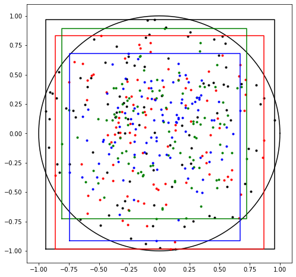
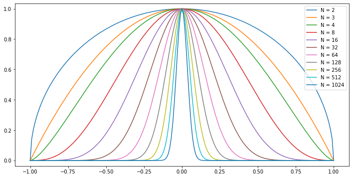
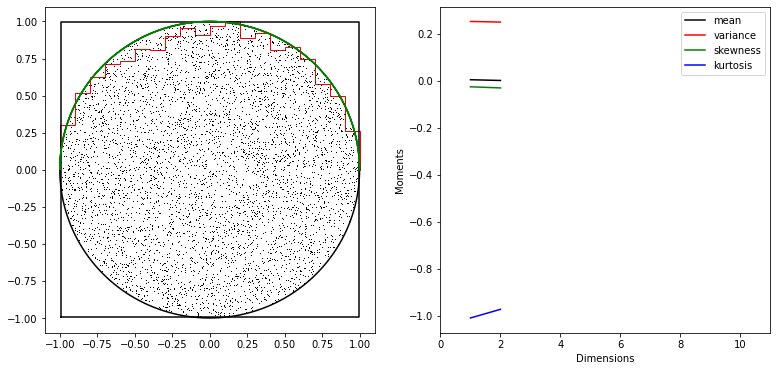
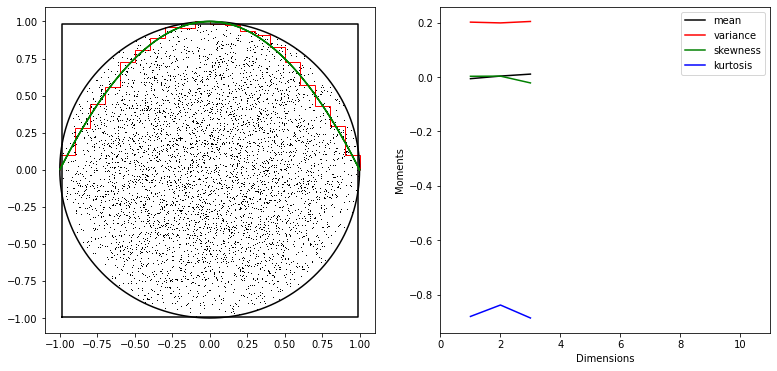
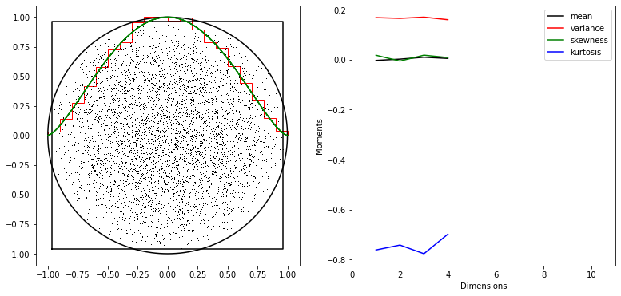
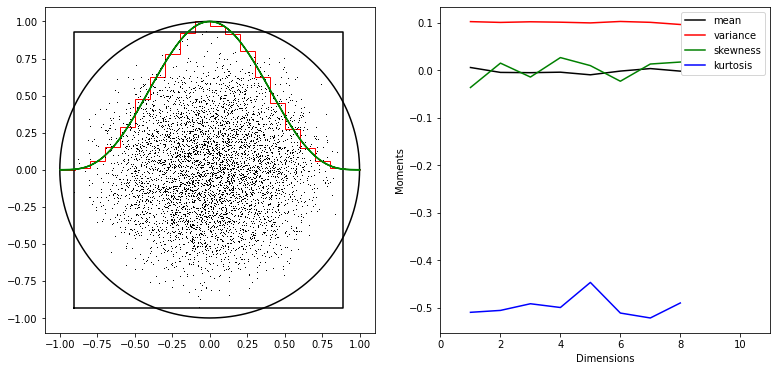
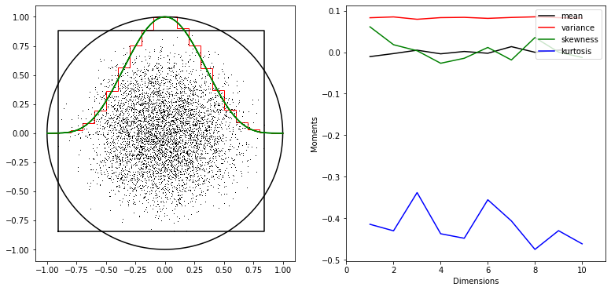
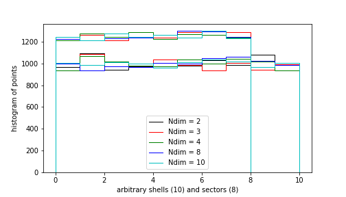

# Bounding Boxes 

In the note we want to investigate how bounding boxes behave in higher
dimensions. 

Bounding boxes are rectangular N-dimensional boxes encompassing an
ensemble of M (random) points, fullfilling some (likelihood) constraint. 
See our paper [Kester and Mueller (2021)](./references.md/#kester8).

We will plot 100 random points inside 4 N-balls of radius 1.0, for resp
N = [2,4,6,8], in black, red, green and blue.  And their bounding boxes. 
They are found by rejection sampling. 

Note that for higer dimensions, more and more points need to be
rejected.  For an 8-ball only one in 73 points is OK.  The random
points tend to concentrate to the middle. 

| ndim | nsamples | rejected |
|:-:|:-:|:-:|
| 2 | 100 | 22 |
| 4 | 100 | 233 |
| 6 | 100 | 991 |
| 8 | 100 | 7306 |

&nbsp;

    

With all tese rejections it will not get us to a 1000-ball. 
We need to find something different.

## Distribution

We calculate the distribution of points thrown randomly into an N-ball,
as projected on a line through the center.  It is obvious that this
distribution is proportional to the projected volume. 

For a 2-ball (circle) the distribution is proportional to a half-circle.  
&nbsp;&nbsp;&nbsp;&nbsp;d2( x ) = SQRT( 1 - x * x )
    
For a 3-ball (cannonball) there is the volume of a circle present at
every x.  It is proportional to 
&nbsp;&nbsp;&nbsp;&nbsp;d3( x ) ~ ( 1 - x * x ) = d2( x ) 2

For a 4-ball (hyperball) there the projection is a 3-ball present at every x.
It is proportional to 
&nbsp;&nbsp;&nbsp;&nbsp;d4( x ) ~ d2( x ) 3
    
Etc.

In the figure below we plotted the distribution for powers of, upto 1024.
They are all scaled to a maximum of 1. 

    

    

For higher dimensions the projection of the ball gets more concentrated
toward the center.  Which is not so surprising as we need N random
points of which the sum of the squares must to be less than 1.  It is
easiest for all of them to be quite small.  Nontheless points with all
almost 0's, except one that is between -1 and +1 are also part of the
N-ball.  These points are exceedingly rare.  The bulk sits around 0. 

Quite counterintuitively, more and more "space" is located at the edges
of the N-ball as N increases. However when displayed in a 2-d image,
almost all of this space is projected away to small values. 

In the table we show the relation between radius and the contained space
for a number of dimensions. The higer the dimension the more space
is concentrated near the edges of the unit sphere. 

<table width=100%; border=1px>
<tr>
<th colspan=6>Radii encompassing equal percentages of space</th>
</tr><tr>
<th>dimensions</th>
<th>20 %</th>
<th>40 %</th>
<th>60 %</th>
<th>80 %</th>
<th>100 %</th>
</tr><tr>
<td>  1</td><td>0.200</td><td>0.400</td><td>0.600</td><td>0.800</td><td>1.000</td>
</tr><tr>
<td>  2</td><td>0.447</td><td>0.632</td><td>0.775</td><td>0.894</td><td>1.000</td>
</tr><tr>
<td>  4</td><td>0.669</td><td>0.795</td><td>0.880</td><td>0.946</td><td>1.000</td>
</tr><tr>
<td>  8</td><td>0.818</td><td>0.892</td><td>0.938</td><td>0.972</td><td>1.000</td>
</tr><tr>
<td> 10</td><td>0.851</td><td>0.912</td><td>0.950</td><td>0.978</td><td>1.000</td>
</tr><tr>
<td> 20</td><td>0.923</td><td>0.955</td><td>0.975</td><td>0.989</td><td>1.000</td>
</tr><tr>
<td> 50</td><td>0.968</td><td>0.982</td><td>0.990</td><td>0.996</td><td>1.000</td>
</tr><tr>
<td>100</td><td>0.984</td><td>0.991</td><td>0.995</td><td>0.998</td><td>1.000</td>
</tr>
</table>

The bounding box, defined as the upper and lower values in each
dimension of an ensemble of points, randomly drawn from the N-ball, also
shrinks to smaller values.  It will miss the extreme possibilities of
the balls, which are getting more and more improbable.  A bounding box
for an ensemble of M points will miss on average 1/M volume area.

N-balls (and other objects) in higher dimensions are quite
couterintuitive. 

## Sanity check

Below we investigate, whether the distributions conform a
random ensemble of M=5000 points

In the figure below, we have 5000 points in N (=2,3,4,8,10) dimensions. 
In green we see the calculated distribution scaled to a maximum of 1.0. 
In red we have a histogram of the ensemble projected on each of the
dimensional axes.  N*5000 point in all, scaled to the same volume. 

On the right hand side we plot the moments of the distributions as
projected on each of the dimensional axes. Just to get a feel how much
they can vary when the distribution inside the N-balls is the golden
standard on uniformity. (made by rejection sampling). 

    

    

    

    

    

    

The experiment follows the theory quite well.

## More checks

Next we check the distribution of random points in 10 N-dim shells of
equal volume and in 8 perpendicular sectors.  We take 10000 points,
random in spheres of 2,3,4,6, and 8 dimensions, by rejection sampling. 
We expect 1000 points in each shell and 1250 in each sector. 

The edges of the shells are defined as 
[0,0.1,0.2,...,0.9,1.0] ** ( 1/ndim )

A point belongs to a shell when its 2-norm falls between the edges of
that shell.

The sectors are defined when ndim >= 3 and then dividing dimensions 1,
2, and 3 in its positive and negative values.

    

## Do Kester. 2024.
