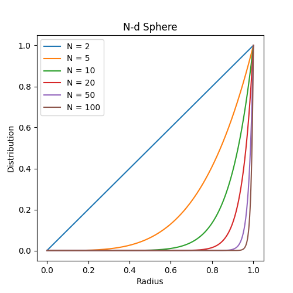
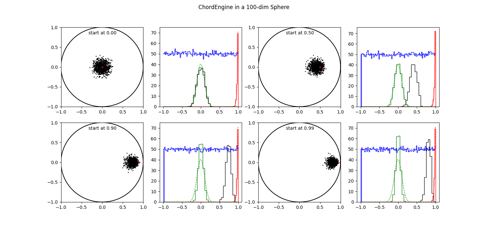
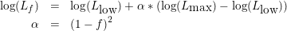

<!--
run: eqn4html.csh Dimensions.md
to convert the embedded latex equations into images.
-->

# Walkers and Engines (under development)

## Glossary

A *walker* is a member of an ensemble of (multidimensional) points each
one representing the parameter set of an inference problem. They are also
called "live points" [[Buchner]](./references.md#buchner). 

An *engine* is an algorithm that moves a walker around within the present
likelihood constraint until it is deemed independently distributed with
respect to the other walkers and more specificly to it origin. They are
also called likelihood-restricted prior sampling (LPRS) methods 
[[Stokes]](./references.md#stokes)

A *phantom* is a valid point visited by an engine during the search for
a new walker position. As such, all walkers are also phantoms.

*Allowed space* is the part of prior space where the log Likelihood
is larger than a certain log Likelihood, called lowLogL.

*Forbidden space* is the complement of allowed space.

*Edge" is the N-1 dimensional surface where log Likelihood equals
LowLogL.

## Introduction.

In this note we consider 2 engines, the ChordEngine 
[[Handley et al.]](references.md#handley) and
the GalileanEngine [[Skilling]](./references.md#skilling), 
[[Henderson]](./references.md#henderson). Especially we look at
their performance in higher dimensions. But first we have to take a look
at some properties of N-dimensional spaces.

## Spaces.

To study properties of higher dimensional spaces we turn to a simple
structure, the N-d unit sphere, i.e.  all points within a euclidean
distance of 1 from the origin.  The N-d sphere is a good proxy for
Gaussian log Likelihoods of N independently measured pixels.  This is
about the simplest problem imaginable that scales easily into higher
dimensions. Our engines should behave well in this case otherwise we
have little hope for more complicated cases.

N-d spheres are hard to depict or even to imagine, except for dimensions 1
and 2. We can project them in several ways to show the distribution of
space along those projections. The first we are interested in is a
projection to one axis through the origin. 

In 1 dimension we have an uniform distribution of space along that axis.

<!--latex
\begin{displaymath}
\quad d_1(x) \propto 1
\end{displaymath}
latex-->

| &nbsp; |  | (1) |
|:-:|:-|-------------------------------------------------:|

In 2 dimensions we have a circle. Its projection along the x-axis is
proportional to 

<!--latex
\begin{displaymath}
\quad d_2(x) \propto \sqrt( 1 - x^2 ).
\end{displaymath}
latex-->

| &nbsp; |  | (2) |
|:-:|:-|-------------------------------------------------:|

In 3 dimensions we have a ball. There is a circle present al every x
value. The volumes is proportional to 

<!--latex
\begin{displaymath}
\quad d_3(x) \propto ( 1 - x^2 ) = d_2^2(x)
\end{displaymath}
latex-->

| &nbsp; |  | (3) |
|:-:|:-|-------------------------------------------------:|

For a 4-d (hyper)ball there is a 3-d ball at every x value.

<!--latex
\begin{displaymath}
\quad d_4(x) \propto d_2^3(x)
\end{displaymath}
latex-->

| &nbsp; |  | (4) |
|:-:|:-|-------------------------------------------------:|

Etc. So for an N-sphere it is proportional to

<!--latex
\begin{displaymath}
\quad d_N(x) \propto d_2^{N-1}(x)
\end{displaymath}
latex-->

| &nbsp; |  | (5) |
|:-:|:-|-------------------------------------------------:|

In figure 1 we display the distributions for a number of spheres in
several dimensions from 2 to 1024.  The bulk of the points in this
projection is around zero with an average distance of sqrt(1/N).

<table><tr>
<td style="width: 20px;">  </td>
<td style="width: 350px;">
Figure 1 shows the distribution of space as projected on a main axis for
several N-d unit spheres. They are normalised to 1.0.
</td></tr>
</table>

Although it would seem that the bulk of an N-d sphere is located at the
center, this is not the case. Most points near the center have an
euclidean distance very near to 1. So most of them are found on the
outskirts.  If we trace the space in consecutive shells centered on the
origin we see that it is proportional to the the surface area, a (N-1)-d
space.

<!--latex
\begin{displaymath}
\quad s_N(r) \propto r^{N-1} 
\end{displaymath}
latex-->

| &nbsp; |  | (6) |
|:-:|:-|-------------------------------------------------:|

In figure 2 we show how the available space inside a N-d sphere is
distributed as a function of the radius. After about N > 100 it gets so
extreme that the distribution is almost a delta function at 1.

<table><tr>
<td style="width: 20px;">  </td>
<td style="width: 350px;">
Figure 2 shows the distribution of space in shells at equal distance to
the origin for several N-d unit spheres. They are normalised to 1.0.
</td></tr>
</table>

In figures 3, 4 and 5 we show unit spheres of dimensions 2, 10 and 100, resp.
In each sphere we have 10000 points, uniformly distributed, using the
Marsaglia algorithm [https://en.wikipedia.org/wiki/N-sphere : Uniformly at
random within the n-ball]. 

In the left hand panels we see the points in the first two axes and a
histogram of the the points projected on the main axes (red line).  For
comparison the theoretical distribution is also shown (in green).  In
the right hand panels, the histograms of the distance to the origin (in
red) and the theory (in green) are shown for the same spheres. 

<table><tr>
<td style="width: 20px;">  </td>
<td style="width: 350px; text-align: left;">
Figure 3 shows the distribution uniform points in a 2-d sphere.
</td></tr>
</table>

<table><tr>
<td style="width: 20px;">  </td>
<td style="width: 350px; text-align: left;">
Figure 4 shows the distribution uniform points in a 10-d sphere.
</td></tr>
</table>

<table><tr>
<td style="width: 20px;">  </td>
<td style="width: 350px; text-align: left;">
Figure 5 shows the distribution uniform points in a 100-d sphere.
</td></tr>
</table>

## Engines

An engine is an algorithm that moves a walker around within the present
likelihood constraint until it is deemed independently distributed with
respect to the other walkers and more specificly to it origin.

Each engine is called with the list of walkers and the value of the
lowLogLikelihood constraint, `lowL`. All engines have attributes like `nstep`
and maybe `size` to govern the number of steps and the step size. Other
attributes may be present in an engines to select different variants. 

When it returns, the list of walkers is updated with a new independent
and identically distributed walker to replace the discarded one.  It is
essential that the new points are indeed independent of each other and
that they explores all of the available space,

### Schematic Algorithms.

We present the schematic algorithms of the 2 engines we would like to
discuss: The GalileanEngine and the ChordEngine.

<table><tr>
<td style="width: 20px;">  </td>
<td style="width: 350px;">
Algorithm 1. Galilean Engine.
</td></tr>
</table>

    1 Find a starting point from walkers or phantoms above lowL
    2 Find a random velocity from bounding box and size 
    3 set trial position = ( point + step )
    4 Calculate logL for trial
    5 if succesful :
        Store trial as phantom
        Move to point = trial
    6 elif not yet mirrored :
        Mirror the velocity on the local gradient
        Set trial = ( trial + step )
        goto line 4
    7 else :
        Reflect the velocity
        goto line 4
    8 if enough steps :
        store point as new walker
        return
    9 else :
        Perturb the velocity by some amount
        Adapt size to success-to-failure ratio
        goto line 3

    Variants at lines:
    1 find starting point somewhat higher than lowL
    6 find edge of likelihood constrained area and mirror there 

<table><tr>
<td style="width: 20px;">  </td>
<td style="width: 350px;">
Algorithm 2. Chord Engine.
</td></tr>
</table>

    1 Find a starting point from walkers or phantoms
    2 Find a normalised velocity
    3 Intersect with bounding box to get entrance and exit times: t0, t1.
    4 Get random time, t, between [t0,t1]
    5 Move the point there and calculate logL
    6 if not successful :
        Replace t0 or t1, with t
        goto 4 
    7 Store point as phantom
    8 if enough steps :
        Store point as walker
        return
    9 else : 
        Find new velocity
        Orthonormalise it with respect to earlier ones
        goto 4

    Variants at lines:
    1 Find starting point somewhat higher than lowL.
    2 Use velocities along the parameter axes.
    3 Check that exit points are outside constrained area.
    9 Don't orthonormalise; use new random direction each time

### Test

The premisse that the newly wandered point is independent of all others,
entails that it does not matter which starting point we take and that all
points in the available space should be reachable from any starting
position. 

Due to the rotational symmetry of the N-sphere the only distinguishing
feature of a point, is its distance to the origin. Without loss of
generality, we take 4 points, positioned on axis 0 at 0.0, 0.5, 0.9 and
0.99. From these starting positions we generate 1000 points using one of our
two engines. We do this for N-spheres of 10 and 100 dimensions. The 2-d
sphere we skip, because it is very easy to check the preformance of engines
in 2 dimensions and consequently everything there is hunkydory.

In all tests we take 20 steps before we declare that we have a new
independent walker. We think 20 steps should be enough to reach
independency. When we have not reached independency in 20 steps, it is
doubtfull we ever get there.

In the figures 6 to 9, we have 4 times 2 panels, for 4 different
starting points.  Each starting points has 2 panels: on the left the
projection of the resulting points on the (0,1) plane.  The starting
position is indicated with a red '+'.  On the right several histograms
are shown.  In blue the percentage of points that are negative in each
of the dimensions, is displayed.  The value to watch is the very first
as there we introduced a possible asymmetry with our choice of the
starting value. 

The dotted blue line shows the theoretical value (50%, obviously).  All
dotted lines shows the theoretical values for the same-colored
histograms. 

In green (and black) we show the projections of the points on the main
axes.  In black the projection on axis 0, specifically displayed because
of the asymmetry in the starting position.  In green we added all
projections on the other axes together; we do not expect any surprises
there, as it is all very symmetric by construction. 

Finally in red we display the points as a function of distance to the
origin. 

### Galilean Engine

In the version of the Galilean engine we have used here, we set the
perturbation at each new step at 20%, the fraction of mirror steps to
0.25 and we first locate the lowL edge before mirroring.  The random
perturbation ensures that the engine is not moving around in circles
within the N-sphere, returning periodically to the starting point, while
still pushing forward to new regions.  The step size is dynamically
adapted such that on average 3 forward steps are taken before we need a
mirroring. 

As said before, the number of steps is 20 throughout.

In figures 6 and 7, we display the results of executing the Galilean
engine for 1000 runs, starting from four positions, one for each pair of
panels.  

<table><tr>
<td style="width: 20px;">  </td>
<td style="width: 350px;">
Figure 6 shows 1000 results of executing the Galilean Engine from 4
different starting positions in a 10-d sphere.
</td></tr>
</table>

In figure 6 we have a 10 dimensional problem, where all of our
statistics are mostly OK.  It does not matter much from where we start,
all spots in the sphere seem to be accessible. 

<table><tr>
<td style="width: 20px;">  </td>
<td style="width: 350px;">
Figure 7 shows 1000 results of executing the Galilean Engine from 4
different starting positions in a 100-d sphere.
</td></tr>
</table>

In figure 7 we have a 100 dimensional problem. The first 2 starting
points are still OK, but for points a 0.9 and 0.99, the resulting clouds
has not migrated to the center where they should be. Obviously all
resulting points are more or less correlated with the point they started
from. 

### Chord Engine

In the ChordEngine we did not use the orthonormalisation. For
a starting point at 0, the first step is always radially outward. When
all consecutive steps are (ortho)normal to this first step, they move
further and further into the edge of the sphere. So all points end up
even nearer the edge than the dimensionality of the sphere would warrant.
This also is true to a lesser extent, for a starting point at 0.5.

Again, the number of steps is 20.

<table><tr>
<td style="width: 20px;">  </td>
<td style="width: 350px;">
Figure 8 shows 1000 results of executing the Chord Engine from 4
different starting positions in a 10-d sphere.
</td></tr>
</table>

Already in a 10-d space we see correlated behaviour in the use of the
ChordEngine. We see clear shifts of the whole cloud, at 0.9 and 0.99.
But even at a starting position of 0.5, the black histogram is shifted
with respect to the green one, indicating a shift in resulting
positions. 

<table><tr>
<td style="width: 20px;">  </td>
<td style="width: 350px;">
Figure 9 shows 1000 results of executing the Chord Engine from 4
different starting positions in a 100-d sphere.
</td></tr>
</table>

Things are worse in 100 dimensions. The resulting cloud seems
to cling to the starting point, except for the one at 0. The green
histograms, projections on all other axes, get progressively thinner.
When one axis occupies more than 90 % of the available space, there is
less space on the 99 other axes.

The red histograms and the blue histograms, disregarding axis 0,  are OK
as far as can be judged from the figures.

### Discussion.

We did not very well, especially in higher dimensions. How can we
understand this situation. We assume that we are still working in a
N-sphere, which has much resemblance to working on a linear problem.

When proceeding from a point close to the edge, all directions, except
one, end up in forbidden likelihood space very soon.  The one exception
is the direction perpendicular to the local tangent plane.  Near the
edge there is very little space to move away from the starting point. 
The tangential distance from a point at 0.99 to the edge is only 0.14. 
It takes quite a number of these little steps to move a significant
distance. 

The ChordEngine has more problems to do so, as it draws a random chord
through the starting point and find a new position on that
chord.  Possibly even moving closer to the edge, and the higher the
dimensions the more probable it gets. A random direction is more likely
along the tangent plane than across.

The GalileanEngine tries a step in a random direction.  If the
step falls in forbidden space, it tries to mirror (or reverse) back into
allowed space.  However if the mirrored (or reversed) trial is also in
forbidden space the step fails.  So with the GalileanEngine we have more
options to move away from the starting point.

The problem we encountered here is caused by starting points close to
the edge, of which there are more in higher dimensional spaces, and at
the same time, an increasing tendency for step directions in the tangent
plane.  In high dimensions we select more points close to the edge to
start from, while most directions are along the tangent, forcing the
engine to small steps. 

An obvious solution would be to avoid starting positions close to the
edge.  While for a point at 0.99 the distance to the edge along the
tangent is 0.14, starting at 0.9 it is already 0.44.  A small avoidance
zone of 10 percent yields a stepping space, more that 3 times larger. 
And it works independent of the dimensionality.  New points should be
indenpendent and identically distributed anyway.  So avoiding some
starting positions should not make a difference. 

Just a we do not know exactly where the edge of allowed space is, we
also dont know where the avoidance edge for a fraction of f is.  In both cases
we use the calculated logL's as proxy. When the error distribution is a
Gaussian, The proxy for the f edge is found as

<!--latex
\begin{eqnarray*}
\quad \log( L_f ) &=& \log( L_{\mbox{low}} ) + \alpha * 
  ( \log( L_{\mbox{max}} ) - \log( L_{\mbox{low}} ) ) \\
\alpha &=& ( 1 - f ) ^ 2 
\end{eqnarray*}
latex-->

| &nbsp; |  | (7) |
|:-:|:-|-------------------------------------------------:|

LogL_max is the highest value in the ensemble (or in the phantoms). It
is the proxy for the point at the origin. 

When the error distribution is Laplace, &alpha; = ( 1 - f ).

All points with a logL < logL_f are avoided.  In higher dimensions,
more points are deselected as more points are located near the edge. 
This is exactly what we want to accomplice. 

In the next section we investigate how the engines perform in higher
dimensions. 

## Performance.

Of course we never use one starting position the generate an ensemble of
1000 walkers.  It was an artificial setup to see what would happen. In
this section we define a model which is easily extendable over more
dimensions and we try to find out which values for the avoidance
fraction and for the pertubation in the Galilean engine are optimal.

### Linear Model

As a model we take a cubic splines model with knots numbering from 2 to
98, yielding 4 to 100 parameters (i.e. dimensions). The model is fit to
just random noise from N(0,1). The length of the data set varies with
the dimensions such that there are some 5 data points per knot. Our
priors are uniform between [-10,10].

With this setup we can calculate the evidence analytically as a
multidimensional Gaussian. we call this the baseline evidence.

Subsequently we use NestedSampler to calculate the evidence for several
settings of &alpha; and the perturbance fraction, w. The baseline evidence
is subtracted so that the results should be 0. If everything were OK.

#### Galilean engine.

In figure 10 we show the performance of the Galilean engine for 3
settings of &alpha; (avoid) and 5 setting of the perturbance.  The
precision of the evidence calculation is 0.1 at dimension 4, increasing
to 0.6 at dimension 100. 

<table><tr>
<td style="width: 20px;">  </td>
<td style="width: 350px;">
Figure 10 shows the relalive evidences obtained with the Galilean
engine, at 3 settings of &alpha;, 5 settings of the perturbance
fraction, over dimensions ranging from 4 to 100.
</tr></table>

Firstly, we observe that a low dimensions the choice for &alpha; and w
does not make much difference.  At dimension 10 the lines start to
diverge.  When the avoidance zone is zero, all NS-calculated evidences
are too low, meaning that we have oversampled the outskirts of the
allowed space in the evidence integral.  For &alpha;s &gt; 0, we see a
split in the pertubance behaviour.  For w is 0 or 0.1, the NS-evidences
go up, meaning that we sampled too much of the central regions of
allowed space.  The other values of w, are better, although the higher
values 0.3 and 0.4, still have a tendency to to down. 

From this, and considering that it is philosophically better to have low
values for both &alpha; (more starting points) and w (more forward
movement), we choose values for &alpha; = 0.1 and w = 0.2. 

#### Chord engine.

In figure 11 we show in two panels, the performance of all engines,
Galilean, Chord and both, at an &alpha; setting of 0.1.  For the
Galilean engine the perturbance is set at w = 0.2.  The Chord engines
uses orthonormalised velocity vectors.  In the left panel the number of
steps is 10, in the right panel it is 20.  When both engines are used
each gets half of the steps. 

<table><tr>
<td style="width: 20px;">  </td>
<td style="width: 350px;">
Figure 11 shows the relalive evidences obtained with all
engines Galilean, Chord and both in two panels, left for 10 steps and
right for 20 steps.
</tr></table>

|  |  |
|:-:|:-:|

Throwing in a lower number of steps makes small difference, but not in
the right direction. At higher dimensions the differences with the
baseline evidence goes slightly up. Ten steps might not be enough to
obtain a new iid walker. As we have seen before, at 20 steps the
performance is OK at least up to dimension 100. 

### General Models

Up to here we always had a multidimensional spherical or elliptical
allowed space, either by construction with the N-sphere or by using a
linear model with a Gaussian error distribution, resulting in a
multidimensional ellipse.  In the latter case we could calculate the
evidence analytically and compare it with the evidences calculated by
Nested Sampling.  While the baseline evidences ranged in value from -8.7
to -281.6, the NS evidences were always within the precision, 0.1, for
low dimensions, and with some smart settings of two attributes, we could
achive the same over the whole range of dimensions, where the precision
inceases to 0.6. 

For non-linear models it is not that easy.  As there is a wide variety
of non-linear models, most (all?) of which can not be integrated
analytically, it is hard to draw definite conclusions. 

However, the iron properties of multi-dimensional space still hold. The
volumes of space goes up with the power of the dimensions. In high
dimensions most of the volumes of any shape, be it spherical,
ellipsoidal or even irregular and/or in parts, is at the edge. 
Consequently most walkers are located at the outskirts, near the edges.
When chosing one of these walkers near the edge to start a
randomisation from, all but one directions are in the local tangent
plane, where the options for moving into forbidden space are quite high.
Only one of the directinal vector has to pass over the edge to move the
walker out of allowed space. 

All these considerations were presented for the N-sphere and/or linear
models, they equally hold for general models because they only have to
do with the dimensionality of the parameter space and much less with the
specific shape of the allowed space.   

 
    

## Do Kester. 2025.
