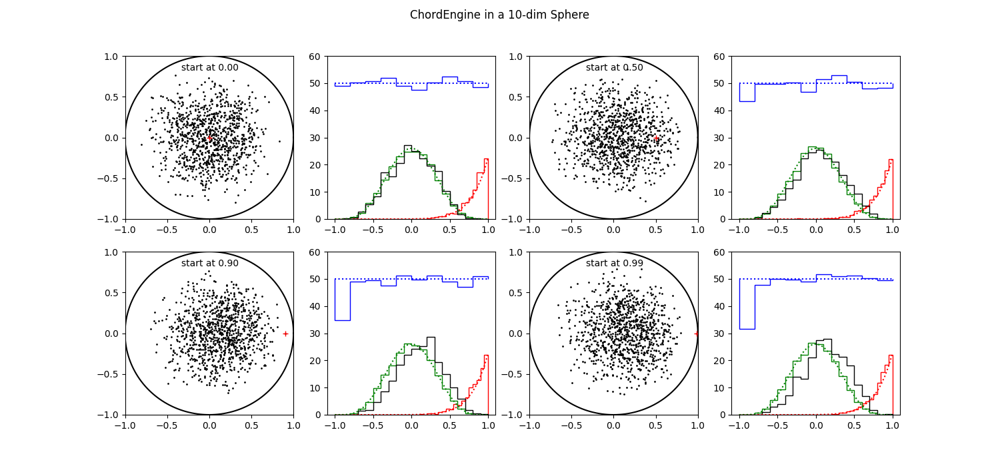

<!--
run: eqn4html.csh Dimensions.md
to convert the embedded latex equations into images.
-->

# Navigating High-Dimensional Parameter Space. 

<!--
## Still working on this note. DK.
-->

## 1. Introduction.

Nested Sampling (NS) is the algorithm of choice to calculate the
evidence in a Bayesian fitting problem. NS integrates the product
of prior and likelihood over the parameter space, to get the evidence
for a problem containing N adjustable parameters.  As a side results, it
yields weighted samples from the posterior. 

For its operations, NS maintains an ensemble of M points (typically 100)
evenly distributed over the prior.  These points are called walkers, or
live points.  Each live point in the ensemble represents a particular
parameter setting, for which the likelihood is calculated.  All
likelihoods are sorted in increasing order.  As the walkers are
uniformly distributed over the prior, each walker occupies one M-th of
the available space. 

Now an iterative scheme is set up.  The walker with lowest likelihood is
selected.  Its likelihood multiplied with the space the walker
represents, is added into the integration of the evidence.  Subsequently
the walker moved from the ensemble into a list of (weighted) samples, as
a representative of the posterior.  The next step is the most important
of the NS algorithm and it is crucial to the proper evaluation of the
evidence.  It is not for nothing called the "Central Problem of Nested
Sampling"[[Stokes]](.references.md#stokes). 

We choose one of the other members of the ensemble and move it randomly
around in the N-dimensional parameter space, provided that its
likelihood stays larger than the one of the discarded walker.  This is
called "Likelihood Restricted Prior Sampling (LRPS)"
[[Buchner]](.references.md#buchner).  When the new walker has stepped
sufficiently such that it is independent and identically distributed
(iid) with respect to it origin, we say that we have a new walker and a
new ensemble.  This emsemble has the same properties are the previous
one, except that it occupies a space with a size of (M-1)/M. 

When we iterate this scheme, the available space shrinks slowly with
steps of (on average) 1/M, while at the same time we climb to the
maximum of the likelihood.  In this way we convert an integral over N
dimensions into a simple one-dimensional integral.  The large space
steps at the beginning combine with low likelihood values, yielding a
small contribution to the evidence integral.  At the end we have high
likelihood values combined with small space steps, again a small
contribution.  Somewhere in between the bulk of the evidence is to be
found. 
 
In this note we investigate the Central Problem of Nested Sampling when
the number of parameters in the model increases from a handfull to 100.
Beyond 100 my implementation of NS gets too sluggish to do repeated
numerical experiments. 

Within NS we consider 2 [engines](#engine) to perform the LRPS: the
ChordEngine [[Handley et al.]](./references.md#handley) and the
GalileanEngine [[Skilling]](./references.md#skilling1),
[[Goggans]](./references.md#goggans).  Especially we look at their
performance in higher dimensions. 

In section 2, we take a look at some properties of N-dimensional
spheres. We show how space within a sphere is distributed when projected
in various ways. 

In section 3, we explain the workings of the engines and list some
variants we want to consider.

In section 4, we exercise both engines in multidimensional spheres,
starting from one point, to see whether the resulting walkers are
independent and identically distributed (iid).

In section 5, we find a way to ameliorate the problems found with walkers
clinging to the edge in high dimensional space.

In section 6, NS runs the engines on a linear problem where the resulting
evidences can be compared directly with analytically calculated values.

Section 7 discusses the results we have obtained on linear problems. 
Some thoughts are presented on how things are different (or the same)
for non-linear problems. 

## 2. High-dimensional Spaces.

To study properties of higher dimensional spaces we turn to a simple
structure, the N-d unit sphere, i.e.  all points within a euclidean
distance of 1 from the origin.  The N-d sphere is a good proxy for the
[allowed space](#allowed) in a problem of N independently measured
pixels.  This is about the simplest problem imaginable that scales
easily into higher dimensions.  Our engines should behave well in this
case otherwise we have little hope for more complicated cases. 

### Theory.

N-d spheres are hard to depict or even to imagine, except for dimensions
1, 2 and maybe 3.  We can project them in several ways to show the
distribution of available space along those projections.  The first we are
interested in, is the projection on a line through the origin. Due to
rotational symmetry, any line will do. We choose the projection on the 
axis numbered 0, aka the x-axis. 

In 1 dimension the available space is a line. 
So we have an uniform distribution of space along axis 0.

<!--latex
\begin{displaymath}
\quad d_1(x) \propto 1
\end{displaymath}
latex-->

| &nbsp; |  | (1) |
|:-:|:-|-------------------------------------------------:|

In 2 dimensions the available space is a circle. Its projection along the x-axis is
proportional to a half-circle.

<!--latex
\begin{displaymath}
\quad d_2(x) \propto \sqrt( 1 - x^2 ).
\end{displaymath}
latex-->

| &nbsp; |  | (2) |
|:-:|:-|-------------------------------------------------:|

In 3 dimensions the available space is a filled ball. At every x point
the cross section of the ball is a circle. The size of the circle is
proportional the the amount of available space.

<!--latex
\begin{displaymath}
\quad d_3(x) \propto ( 1 - x^2 ) = d_2^2(x)
\end{displaymath}
latex-->

| &nbsp; |  | (3) |
|:-:|:-|-------------------------------------------------:|

In 4 dimensions we have a 4-d filled (hyper)ball of which the projection
on the x axis yields a 3-d ball at every x value.

<!--latex
\begin{displaymath}
\quad d_4(x) \propto d_2^3(x)
\end{displaymath}
latex-->

| &nbsp; |  | (4) |
|:-:|:-|-------------------------------------------------:|

Etc. So for an N-sphere it is proportional to

<!--latex
\begin{displaymath}
\quad d_N(x) \propto d_2^{N-1}(x)
\end{displaymath}
latex-->

| &nbsp; |  | (5) |
|:-:|:-|-------------------------------------------------:|

In figure 1 we display the distribution of available space for a number
of spheres in dimensions from 2 to 100.  The bulk of the projected points
is around zero with an average distance of sqrt(1/N). 

<table><tr>
<td style="width: 20px;">  </td>
<td style="width: 350px;">
Figure 1 shows the distribution of space as projected on a main axis for
several N-d unit spheres. Their maxima are normalised to 1.0.
</td></tr>
</table>

Although it would seem that the bulk of an N-d sphere is located at the
center, this is not the case.  Most points near the center in the
projection, have an Euclidean distance very near to 1.  So most of them
are found on the outskirts.  If we trace the space in expanding shells
centered on the origin we see that it is proportional to the the surface
area, a (N-1)-d space. 

<!--latex
\begin{displaymath}
\quad s_N(r) \propto r^{N-1} 
\end{displaymath}
latex-->

| &nbsp; |  | (6) |
|:-:|:-|-------------------------------------------------:|

In figure 2 we show how the available space inside a N-d sphere is
distributed as a function of the radius. After about N > 100 it gets so
extreme that the distribution is almost a delta function at 1.

<table><tr>
<td style="width: 20px;">  </td>
<td style="width: 350px;">
Figure 2 shows the distribution of space in shells at equal distance to
the origin for several N-d unit spheres. Their maximum values are normalised to 1.0.
</td></tr>
</table>

### Praxis.

In figures 3, 4 and 5 we show unit spheres of dimensions 2, 10 and 100, resp.
In each sphere we have 10000 points, uniformly distributed, using the
[Marsaglia algorithm](https://en.wikipedia.org/wiki/N-sphere#Uniformly_at_random_within_the_n-ball)

In the left hand panels we see the points projected on the first two axes and a
histogram of the the points projected on the main axes (red line).  For
comparison the theoretical distribution is also shown (in green).  In
the right hand panels, the histograms of the distance to the origin (in
red) and the theory (in green) are shown for the same spheres. 

<table><tr>
<td style="width: 20px;">  </td>
<td style="width: 350px; text-align: left;">
Figure 3 shows the distribution uniform points in a 2-d sphere.
</td></tr>
</table>

<table><tr>
<td style="width: 20px;">  </td>
<td style="width: 350px; text-align: left;">
Figure 4 shows the distribution uniform points in a 10-d sphere.
</td></tr>
</table>

<table><tr>
<td style="width: 20px;">  </td>
<td style="width: 350px; text-align: left;">
Figure 5 shows the distribution uniform points in a 100-d sphere.
</td></tr>
</table>

## 3. Engines

An [engine](#engine) is an algorithm that moves a [walker](#walker)
around within the present likelihood constraint until it is deemed
independent and identically distributed with respect to the other
walkers and more specificly to the place it started from. 

Each engine starts with the list of walkers and the value of the
lowLogLikelihood constraint, `lowL`. The engines have attributes like `nstep`
to govern the number of steps and the Galilian also has `size` and
`maxtrial` to set the step size and the maximum number of trial steps. 
Other attributes may be present in an engine to select different
variants. 

When it returns, the list of walkers is updated with a new independent
and identically distributed (iid) walker to replace the discarded one.  It is
essential that the new points are indeed independent of each other and
that they explores all of the available space,

### Schematic Algorithms.

We present the schematic algorithms of the 2 engines we would like to
discuss: The GalileanEngine and the ChordEngine.

<table><tr>
<td style="width: 20px;">  </td>
<td style="width: 350px;">
Algorithm 1. Galilean Engine.
</td></tr>
</table>

    1 Find a starting point from walkers or phantoms above lowL
    2 Find a random step from bounding box and size
    3 set n_trial = 0 
    4 Set trial position = ( point + step )
    5 Calculate logL for trial
    6 if succesful :
        a Store trial as phantom
        b Move to point = trial
        c Set n_trial = 0
    7 elif not yet mirrored :
        a Mirror the step on the local gradient
        b Set trial = ( trial + step )
        c Increase n_trial += 1
        d Goto line 4
    8 else :
        a Shrink the step
        b Reflect the step
        c Increase n_trial += 1
        d Goto line 4
    9 if n_trial > maxtrial
        a Goto line 2
    10 if enough steps :
        a Store point as new walker
        b Return
    11 else :
        a Perturb the step by some amount
        b Adapt size to success-to-failure ratio
        c Goto line 3

    Variants at lines:
    1  Find starting point somewhat higher than lowL
    7a Find edge of likelihood constrained area and mirror there 

<table><tr>
<td style="width: 20px;">  </td>
<td style="width: 350px;">
Algorithm 2. Chord Engine.
</td></tr>
</table>

    1 Find a starting point from walkers or phantoms
    2 Find a random, normalised direction
    3 Intersect with bounding box to get entrance and exit times: t0, t1.
    4 Get random time, t, between [t0,t1]
    5 Move the point there and calculate logL
    6 if not successful :
        a Replace ( t0 = t ) if t < 0 else ( t1 = t )
        b Goto 4 
    7 Store point as phantom
    8 if enough steps :
        a Store point as walker
        b Return
    9 else : 
        a Find new direction
        b Orthonormalise it with respect to earlier ones
        c Goto 3

    Variants at lines:
    1  Find starting point somewhat higher than lowL.
    2  Use directions along the parameter axes.
    3  Check that exit points are outside constrained area.
    9b Don't orthonormalise; use new random direction each time

## 4. Correlation

The premisse that the newly wandered point is independent of all others,
entails that it does not matter which starting point we take and that all
points in the available space should be reachable from any starting
position. 

In this section we will test this premisse for spherical likelihood
constraints in moderate and high dimensional space for each of the
engines.  As said before, a NS setting with nested spherical likelihood
constraints can arise when solving a fitting problem with N independent
pixels. 

Due to the rotational symmetry of the N-sphere the only distinguishing
feature of a point, is its distance to the origin. Without loss of
generality, we take 4 points, positioned on the x-axis at 0.0, 0.5, 0.9 and
0.99. From these starting positions we generate 1000 points using one of our
two engines. We do this for N-spheres of 10 and 100 dimensions. The 2-d
sphere we skip, because it is very easy to check the performance of engines
in 2 dimensions and consequently everything there is hunkydory.

In all tests we take 20 steps before we declare that we have a new
independent walker. We think 20 steps should be enough to reach
independency. When we have not reached independency in 20 steps, it is
doubtfull we ever get there.

In the figures 6 to 9, we have 4 times 2 panels, for 4 different
starting points.  Each starting points has 2 panels: on the left the
projection of the resulting points on the (0,1) plane.  The starting
position is indicated with a red '+'.  On the right several histograms
are shown.  In blue the percentage of points that are negative in each
of the dimensions, is displayed.  The value to watch is the very first
one as we introduced a possible asymmetry in there with our choice of the
starting value. 

The dotted blue line shows the theoretical value (50%, obviously).  All
dotted lines shows the theoretical values for the same-colored
histograms. 

In green (and black) we show the projections of the points on the main
axes.  In black the projection on axis 0, specifically displayed because
of the asymmetry in the starting position.  In green we added all
projections on the other axes together; we do not expect any surprises
there, as it is all very symmetric by construction. 

Finally in red we display the points as a function of distance to the
origin. 

### Galilean Engine

In the version of the Galilean engine we have used here, we set the
perturbation at each new step at 20%, the fraction of mirror steps to
0.25 and we first locate the lowL [edge](#edge) before mirroring.  The random
perturbation ensures that the engine is not moving around in circles
within the N-sphere, returning periodically to the starting point, while
still pushing forward to new regions.  The step size is dynamically
adapted such that on average 3 forward steps are taken before we need a
mirroring. 

As said before, the number of steps is 20 throughout.

In figures 6 and 7, we display the results of executing the Galilean
engine for 1000 runs, starting from four positions, one for each pair of
panels.  

<table><tr>
<td style="width: 20px;">  </td>
<td style="width: 350px;">
Figure 6 shows 1000 results of executing the Galilean Engine from 4
different starting positions in a 10-d sphere.
</td></tr>
</table>

In figure 6 we have a 10 dimensional problem, where all of our
statistics are mostly OK.  It does not matter much from where we start,
all spots in the sphere seem to be accessible. 

<table><tr>
<td style="width: 20px;">  </td>
<td style="width: 350px;">
Figure 7 shows 1000 results of executing the Galilean Engine from 4
different starting positions in a 100-d sphere.
</td></tr>
</table>

In figure 7 we have a 100 dimensional problem. The first 2 starting
points are still OK, but for points a 0.9 and 0.99, the resulting clouds
has not migrated to the center where they should be. Obviously all
resulting points are more or less correlated with the point they started
from. 

### Chord Engine

In the ChordEngine we did not use the orthonormalisation. For
a starting point at 0, the first step is always radially outward. When
all consecutive steps are (ortho)normal to this first step, they move
further and further into the edge of the sphere. So all points end up
even nearer the edge than the dimensionality of the sphere would warrant.
This also is true to a lesser extent, for a starting point at 0.5.
Turning off orthonomalisation seemed to be the only sollution in this
specific case.

Again, the number of steps is 20.

<table><tr>
<td style="width: 20px;">  </td>
<td style="width: 350px;">
Figure 8 shows 1000 results of executing the Chord Engine from 4
different starting positions in a 10-d sphere.
</td></tr>
</table>

Already in a 10-d space we see correlated behaviour in the use of the
ChordEngine. We see clear shifts of the whole cloud, at 0.9 and 0.99.
But even at a starting position of 0.5, the black histogram is shifted
with respect to the green one, indicating a shift in resulting
positions. 

<table><tr>
<td style="width: 20px;">  </td>
<td style="width: 350px;">
Figure 9 shows 1000 results of executing the Chord Engine from 4
different starting positions in a 100-d sphere.
</td></tr>
</table>

Things are worse in 100 dimensions. The resulting cloud seems
to cling to the starting point, except for the one at 0. The green
histograms, projections on all other axes, get progressively thinner.
When one axis occupies more than 90 % of the available space, there is
less space on the 99 other axes.

The red histograms and the blue histograms, disregarding axis 0,  are OK
as far as can be judged from the figures.

## 5. Avoidance zone.

We did not do very well, especially in higher dimensions. How can we
understand this situation. 

We are still working in a N-sphere, which has much resemblance to
working on a linear problem.  When proceeding from a point close to the
edge, all directions except one, end up in [forbidden likelihood
space](#forbidden) very soon.  The one exception is the direction
perpendicular to the local tangent plane.  Near the edge there is very
little space to move away from the starting point.  Independently of the
dimensionality, the tangential distance from a point at 0.99 to the edge
is only 0.14.  In high dimensional space, every direction but one has
this small distance to the edge.  It takes quite a number of these little
steps to move a significant distance. 

The ChordEngine has more problems to do so, as it draws a random chord
through the starting point and find a new position on that
chord.  Possibly even moving closer to the edge, and the higher the
dimensions the more probable it gets. A random direction is more likely
along the tangent plane than across.

The GalileanEngine tries a step in a random direction.  If the step
falls in [forbidden space](#forbidden), it tries to mirror (or reverse)
back into [allowed space](#allowed).  However if the mirrored (or
reversed) trial is also in forbidden space the step fails.  So the
GalileanEngine is more geared to move away from the starting
point, even if it has to take small steps.

The problem we encountered here is caused by starting points close to
the edge, of which there are more in higher dimensional spaces, and at
the same time, an increasing tendency for step directions in the tangent
plane.  In high dimensions we select more points close to the edge to
start from, while most directions are along the tangent, forcing the
engine to take small steps. 

An obvious solution would be to avoid starting positions close to the
edge.  While for a point at 0.99 the distance to the edge along the
tangent is 0.14, starting at 0.9 it is already 0.44.  A small avoidance
zone of 10 percent in radius yields a stepping space, more that 3 times larger. 
And it works independent of the dimensionality.  New points should be
indenpendent and identically distributed anyway.  So avoiding some
starting positions should not make a difference. 

Just as we do not know exactly where the edge of allowed space is, we
also do not know where the avoidance edge for a fraction of f is.  In both cases
we use the calculated logL's as proxy. When the error distribution is a
Gaussian, the proxy for the f edge is found as

<!--latex
\begin{eqnarray*}
\quad \log( L_f ) &=& \log( L_{\mbox{low}} ) + \alpha * 
  ( \log( L_{\mbox{max}} ) - \log( L_{\mbox{low}} ) ) \\
\alpha &=& ( 1 - f ) ^ 2 
\end{eqnarray*}
latex-->

| &nbsp; |  | (7) |
|:-:|:-|-------------------------------------------------:|

LogLmax is the highest value in the ensemble (or in the phantoms). It
is the proxy for the point at the origin. 

All points with a logL < logLf are avoided.  In higher dimensions,
more points are deselected as more points are located near the edge. 
This is exactly what we want to accomplice. 

In the next section we try to find out what the optimal value for
&alpha; could be. 

## 6. Performance.

Of course we never use one starting position to generate an ensemble of
1000 walkers.  It was an artificial setup to see what would happen. In
this section we define a model which is easily extendable over many
dimensions and we try to find out which values for the avoidance
fraction and for the pertubation in the Galilean engine are optimal.

### Linear Model

As a model we take a cubic splines model with knots numbering from 2 to
98, yielding 4 to 100 parameters (i.e. dimensions). The model is fit to
just random noise from N(0,1). The length of the data set varies with
the dimensions such that there are some 5 data points per knot. Our
priors are uniform between [-10,10].

With this setup we can calculate the evidence analytically as a
multidimensional Gaussian. We call this the baseline evidence.
In the table, we present the baseline evidences for models used in this
section.

| Npars | evidence |
|:-----:|:--------:|
|     4 |   -8.7   |
|     7 |  -21.5   |
|    10 |  -32.4   |
|    20 |  -74.1   |
|    30 | -112.3   |
|    40 | -151.9   |
|    50 | -188.7   |
|    75 | -281.6   |
|   100 | -376.6   |

Subsequently we use NestedSampler to calculate the evidence for several
settings of &alpha; and the perturbance fraction, w. The baseline evidence
is subtracted so that the results should be 0. If everything were OK.

#### Galilean engine.

In figure 10 we show the performance of the Galilean engine for 3
settings of &alpha; (avoidance zone) and 5 setting of the perturbance.  The
precision of the evidence calculation is 0.1 at dimension 4, increasing
to 0.6 at dimension 100. 

<table><tr>
<td style="width: 20px;">  </td>
<td style="width: 350px;">
Figure 10 shows the relalive evidences obtained with the Galilean
engine, at 3 settings of &alpha;, 5 settings of the perturbance
fraction, over dimensions ranging from 4 to 100.
</tr></table>

We observe that at low dimensions the choice for &alpha; and w
does not make much difference.  It is well known that things are simple
when dealing with few parameters (low dimensionality).  

At dimension 10 the lines start to
diverge.  When the avoidance zone is zero, all NS-calculated evidences
are too low, meaning that we have oversampled the outskirts of the
allowed space in the evidence integral.  For &alpha; &gt; 0, we see a
split in the pertubance behaviour.  For w is 0 or 0.1, the NS-evidences
go up, meaning that we sampled too much of the central regions of
allowed space.  The other values of w, are better, although the higher
values 0.3 and 0.4, still have a tendency to to down. 

From this, and considering that it is philosophically better to have low
values for both &alpha; (more starting points) and w (more forward
movement), we choose values for &alpha; = 0.1 and w = 0.2. 

This value of &alpha; does not translate directly via equation 7 in a
value for f, the avoidance radius, for two reasons. Firstly because the
problem here does not have a spherical allowed space, and secondly
because logLmax is the maximum value in the ensemble and
<em>always</em> lower than the global maximum likelihood value. 
The value found for &alpha; is a heuristic one which helps fixing the
problem of starting points too close to the [edge](#edge).

 
#### Chord engine.

In figure 11 we show in two panels, the performance of all engines,
Galilean, Chord and both, at an &alpha; setting of 0.1.  For the
Galilean engine the perturbance is set at w = 0.2.  The Chord engines
uses orthonormalised directions.  In the left panel the number of
steps is 10, in the right panel it is 20.  When both engines are used
each gets half of the steps. 

<table><tr>
<td style="width: 20px;">  </td>
<td style="width: 350px;">
Figure 11 shows the relalive evidences obtained with all
engines Galilean, Chord and both in two panels, left for 10 steps and
right for 20 steps.
</tr></table>

|  |  |
|:-:|:-:|

Throwing in a lower number of steps makes small difference, but not in
the right direction. At higher dimensions the differences with the
baseline evidence goes slightly up. Ten steps might not be enough to
obtain a new iid walker. As we have seen before, at 20 steps the
performance is OK at least up to dimension 100. 

## 7. Discussion.

In section 4, we found that the combination of high dimensions and
points near the edge, lead to wandering walkers which have not yet lost
their correlation with their starting point.  Correlation is stronger
when the starting points are nearer to the edge.  In higher dimensions
there are increasingly more points near the edge, leading possibly to
serious problems for our engines, and consequently to the calculation of
the evidence by NS. 

In section 5 we described a way forward by defining a zone of avoidance
near the edges, where we should not select starting points.  Under the
assumption that the newly found position for the walker is iid, it
should not matter where we start from.  All points should be reachable
from any other position.  Hence we should be able to ignore starter
points in the avoidance zone, without penalty. It goes without saying
that the points in the avoidance zone are *not* ignored when performing
other calculations, like the evidence.

In section 6 we run several numeric experiments to establish optimal
values for &alpha; (avoidance) and w (perturbation). We have done more
experiments than are shown here, but in all of them there seem to be a
more or less linear relation between the deviation of the NS evidence
values, compared to the baseline values, versus the number of
dimensions. At low dimensions the deviations vanish, while they increase
linearly with the number of parameters. The linearity in itself is a
surprising fact. One setting of &alpha; and w results in one consistent
line extending over more 2 orders of magnitude in dimensionality. Even
more surprising is the fact that there are settings of &alpha; en w that
result in a horizontal line, where the baseline evidences and the NS
evidences are consistent over the whole range of dimensions, from 4 to
100.  This is what we hoped for and it is what we got.

Up to here we discussed multidimensional spherical or elliptical
allowed spaces, either by construction with the N-sphere or by using a
linear model with a Gaussian error distribution, resulting in a
multidimensional ellipse.  In the latter case we could calculate the
evidence analytically and compare it with the evidences calculated by
Nested Sampling.  

For non-linear models, or non-Gaussian error distributions, it is not
that easy.  As there is a wide variety of non-linear problems, most (all?)
of which can not be integrated analytically, it is hard to draw definite
conclusions. 

However, the iron properties of multidimensional space still hold.  The
volumes of space goes up with the power of the dimensions.  In high
dimensions most of the volumes of any shape, be it spherical,
ellipsoidal or even irregular and/or in parts, is at the edge, defined
by the value of `lowL`.  Consequently most walkers are located at the
outskirts, near the edges.  When chosing one of these walkers near the
edge to start a randomisation process from, all but one directions are
in the local tangent plane, where the options for moving into forbidden
space are quite high.  Only one of the directional vector components has
to pass over the edge to move the walker out of allowed space, forcing
to take small steps, etc.

All these considerations were presented for the N-sphere and/or linear
models; they equally hold for general models because they only have to
do with the dimensionality of the parameter space and much less with the
specific shape of the allowed space.   

## Conclusion.

We have investigated the LRPS of NS in moderately high dimensional
problems.  It became clear that LRPS poses more challenges with larger
parameter sets.  The challenges have to do with the unique character of
high dimensional space, where most of the volume is on the outskirts of
the LRPS allowed space.  Consequently most walkers are also near the
edge where there is little room to move around.  Very soon the walker
ends in forbidden space.  Having little room to move around is
detrimental to finding a new iid position for the walker.  It is locked
in place, resulting in overweighting the outskirts in the calculation of
the evidence integral.

When we avoid walkers too close to the edge as starting positions, we
escape the correlation of almost stationary walkers.  We found that one
value for the avoidance zone, &alpha;, is suitable for the whole range
of dimensions between 0 and 100.  Considering the fact that this
avoidance zone operates the same way in all dimensions, by avoiding an
extra fraction of above `lowL` as starting position, it is likely that
the same &alpha; will also work at even higher dimensions.

For the GalileanEngine we found another attribute to set, the
perturbation.  This one is less important as it only is necessary when
the allowed space is something regular, like a sphere or a
multidimensional ellipsoid, where the walker would run around in
circles.  In other, irregular situations where the walker is mirrored
around in various directions, the perturbation value of 0.2, does
neither matter nor hurt. 

## Finally.

Something unrelated to the issues described here, but not completely, as
it has to do with LRPS, likelihood restricted prior sampling.  LRPS is
not unproblematic, especially when the prior is a Gaussian.  It is
another example of "The math is all OK, computation is the nightmare". 

On a 64 bits floating point machine, a Gaussian cannot produce samples
in regions further away from the center than about 8 &sigma;. The
calculation there is indistinguishable from zero.

In a separate [note](./Sampling.md) we give more details, and we
conclude that integrating log likelihood + log prior over a rectangular
box would be better. That way we are using both the likelihood and the
prior in the log, avoiding awkward near zeros.
 
## Appendix: Glossary

**Walker** is a member of an ensemble of (multidimensional) points each
one representing the parameter set of an inference problem. They are also
called "live points" [[Buchner]](./references.md#buchner). 

**Engine** is an algorithm that moves a walker around within the present
likelihood constraint until it is deemed identically and independently
distributed with respect to the other walkers and more specificly to its
origin.  They are also called likelihood-restricted prior sampling
(LPRS) methods [[Stokes]](./references.md#stokes)

**Phantom** is a valid point visited by an engine during the search for
a new walker position. As such, all walkers are also phantoms.

**Allowed Space** (or available space) is the part of prior space where
the log likelihood is larger than a certain value of the log likelihood
constraint, called lowL.  Wandering walkers are allowed to move anywhere
within this constraint. 

**Forbidden Space** is the complement of allowed space. A wandering walker 
if not allowed to move in there.   

**Edge** is the N-1 dimensional surface where log Likelihood equals
lowL.

**Bounding Box** in a rectangular box aligned along the axes, of minimum
extent that contains all the active walkers cq. phantoms.

## Do Kester. 2025.
