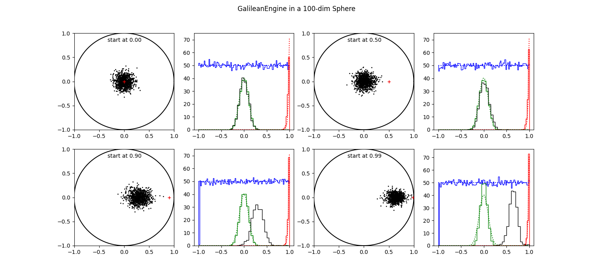

# Walkers and Engines

## Glossary

A *walker* is a member of an ensemble of (multidimensional) points each
one representing the parameter set of an inference problem. They are also
called "live points" [1 - Buchner]. 

An *engine* is an algorithm that moves a walker around within the present
likelihood constraint until it is deemed independently distributed with
respect to the other walkers and more specificly to it origin. They are
also called likelihood-restricted prior sampling (LPRS) methods [2 - Stokes]

A *phantom* is a valid point visited by an engine during the search for
a new walker position. As such, all walkers are also phantoms.

## Introduction.

In this note we consider 2 engines, the ChordEngine [3 - Handley] and
the GalileanEngine [4 - Skilling, Henderson]. Especially we look at
their performance in higher dimensions. But first we have to take a look
at some properties of N-dimensional spaces.

## Spaces.

To study properties of higher dimensional spaces we turn to a simple
structure, the N-d unit sphere, i.e.  all points within a euclidean
distance of 1 from the origin.  The N-d sphere is a good proxy for
Gaussian log Likelihoods of N independently measured pixels.  This is
about the simplest problem imaginable that scales easily into higher
dimensions. Our engines should behave well in this case otherwise we
have little hope for more complicated cases.

N-d spheres are hard to depict or even to imagine, except for dimensions 1
and 2. We can project them in several ways to show the distribution of
space along those projections. The first we are interested in is a
projection to one axis through the origin. 

In 1 dimension we have an uniform distribution of space along that axis.

    d_1(x) ~ 1

In 2 dimensions we have a circle. Its projection along the x-axis is
proportional to 

    d_2(x) ~ sqrt( 1 - x^2 ).

In 3 dimensions we have a ball. There is a circle present al every x
value. The volumes is proportional to 

    d_3(x) ~ ( 1 - x^2 ) = d_2(x)^2

For a 4-d (hyper)ball there is a 3-d ball at every x value.

    d_4(x) ~ d_2(x)^3

Etc. So for an N-sphere it is proportional to

    d_N(x) ~ d_2(x)^(N-1)

In figure 1 we display the distributions for a number of spheres in
several dimensions from 2 to 1024.  The bulk of the space in this
projection is around zero with an average distance of at most sqrt(1/N).

<table><tr>
<td style="width: 40px;">  </td>
<td style="width: 350px;">
Figure 1 shows the distribution of space as projected on a main axis for
several N-d unit spheres. They are normalised to 1.0.
</td></tr>
</table>

Although it would seem that the bulk of an N-d sphere is located at the
center, this is not the case. Most points near the center have an
euclidean distance of somewhat less than 1. So most of them are found on the
outskirts.  If we trace the space in consecutive shells centered on the
origin we see that it is proportional to the the surface area, a (N-1)-d
space.

    s_N(r) ~ r^(N-1) 

In figure 2 we show how the available space inside a N-d sphere is
distributed as a function of the radius. After about N > 100 it gets so
extreme that the distribution is almost a delta function at 1.

<table><tr>
<td style="width: 40px;">  </td>
<td style="width: 350px;">
Figure 2 shows the distribution of space in shells at equal distance to
the origin for several N-d unit spheres. They are normalised to 1.0.
</td></tr>
</table>

In figures 3, 4 and 5 we show unit spheres of dimensions 2, 10 and 100, resp.
In each sphere we have 10000 points, uniformly distributed, using the
Marsaglia algorithm [https://en.wikipedia.org/wiki/N-sphere : Uniformly at
random within the n-ball]. 

In the left hand panels we see the points in the first two axes and a
histogram of the the points projected on the main axes (red line).  For
comparison the theoretical distribution is also shown (in green).  In
the right hand panels, the histograms of the distance to the origin (in
red) and the theory (in green) are shown for the same spheres. 

<table><tr>
<td style="width: 40px;">  </td>
<td style="width: 350px;">
Figure 3 shows the distribution uniform points in a 2-d sphere.
</td></tr>
</table>

<table><tr>
<td style="width: 40px;">  </td>
<td style="width: 350px;">
Figure 4 shows the distribution uniform points in a 10-d sphere.
</td></tr>
</table>

<table><tr>
<td style="width: 40px;">  </td>
<td style="width: 350px;">
Figure 5 shows the distribution uniform points in a 100-d sphere.
</td></tr>
</table>

## Engines

Each engine is called with the list of walkers and the value of the
lowLogLikelihood constraint. All engines have attributes like *nstep*
and maybe *size* to govern the number of steps and the step size. Other
attributes may be present in an engines to select different variants. 

When it returns, the list of walkers is updated with a new independent
and identically distributed walker to replace the discarded one.  It is
essential that the new points are indeed independent of each other and
that they explores all of the available space,

** Algorithm 1.** Galilean Engine.

    1 Find a starting point from walkers or phantoms above lowL
    2 Find a random velocity from bounding box and size 
    3 set trial position = ( point + step )
    4 Calculate logL for trial
    5 if succesful :
        Store trial as phantom
        Move to point = trial
    6 elif not yet mirrored :
        Mirror the velocity on the local gradient
        Set trial = ( trial + step )
        goto line 4
    7 else :
        Reflect the velocity
        goto line 4
    8 if enough steps :
        store point as new walker
        return
    9 else :
        Perturb the velocity by some amount
        Adapt size to success-to-failure ratio
        goto line 3

    Variants at lines:
    1 find starting point somewhat higher than lowL
    6 find edge of likelihood constrained area and mirror there 

** Algorithm 2. ** Chord Engine.

    1 Find a starting point from walkers or phantoms
    2 Find a normalised velocity
    3 Intersect with bounding box to get entrance and exit times: t0, t1.
    4 Get random time, t, between [t0,t1]
    5 Move the point there and calculate logL
    6 if not successful :
        Replace t0 or t1, with t
        goto 4 
    7 Store point a a phantom
    8 if enough steps :
        Store point as walker
        return
    9 else : 
        Find new velocity
        Orthonormalise it with respect to earlier ones
        goto 4

    Variants at lines:
    1 Find starting point somewhat higher than lowL.
    2 Use velocities along the parameter axes.
    3 Check that exit points are outside constrained area.
    9 Don't orthonormalise; use new random direction each time

### Test

The premisse that the newly wandered point is independent of all others,
entails that it does not matter which starting point we take and that all
points in the available space should be reachable from any starting
position. 

Due to the rotational symmetry of the N-sphere the only distinguishing
feature of a point, is its distance to the origin. Without loss of
generality, we take 4 points, positioned on axis 0 at 0.0, 0.5, 0.9 and
0.99. From all these points we generate 1000 points using one of our
two engines. We do this for N-sphres of 10 and 100 dimensions. The 2-d
sphere we skip, because it is very easy to check the preformance of engines
in 2 dimensions and consequently everything there is hunkydory.

In all tests we take 20 steps before we declare that we have a new
independent walker. We think 20 steps should be enough to reach
independency. When we have not reached independency in 20 steps, it is
doubtfull we ever get there.

In the figures 6 to 9, we have 4 times 2 panels, for 4 different
starting points.  Each starting points has 2 panels: on the left the
projection of the resulting points on the (0,1) plane.  The starting
position is indicated with a red '+'.  On the right several histograms
are shown.  In blue the percentage of points that are negative in each
of the dimensions, is displayed.  The value to watch is the very first
as there we introduced a possible asymmetry with our choice of the
starting value. 

The dotted blue line shows the theoretical value (50%, obviously).  All
dotted lines shows the theoretical values for the same-colored
historgams. 

In green (and black) we show the projections of the points on the main
axes. In black the projection on axis 0, special because of the
asymmetry. In green we added all projections on the other axes together;
we do not expect any surprises there, as it is all supersymmetric.

Finally in red we display the points as a function of distance to the
origin. 

### Galilean Engine

In the version of the Galilean engine we have used here, we set the
perturbation at each new step at 20%, the fraction of mirror steps to
0.25 and we first locate the lowL edge before mirroring.  The random
perturbation ensures that the engine is not moving around in circles,
returning periodically to the starting point, while still pushing
forward to new regions. The step size is dynamically adapted such that
on average 3 forward steps are taken before we need a mirroring. 

As said before, the number of step is 20 throughout.

<table><tr>
<td style="width: 40px;">  </td>
<td style="width: 350px;">
Figure 6 shows 1000 results of executing the Galilean Engine from 4
different starting positions in a 10-d sphere.
</td></tr>
</table>

In 10 dimensions 

<table><tr>
<td style="width: 40px;">  </td>
<td style="width: 350px;">
Figure 7 shows 1000 results of executing the Galilean Engine from 4
different starting positions in a 100-d sphere.
</td></tr>
</table>

## Do Kester. 2025.
