<!--
run: eqn4html.csh EclipsingStars.md
to convert the embedded latex equations into images.
-->

# A model for eclipsing stars. 

<!--
## Still working on this note. DK.
-->

## Prologue.

This is not a scientific paper. It is my take on eclipsing stars using a
simple model with little assumptions. It is about a model with as few
(adjustable) parameters as I can get away with. While still adhering to
elementary physics. 

## 1. Introduction.

Eclipsing binaries are double stars that pass in front of each other
while orbiting. Here we are only concerned with stars that are so close
and far away, that they manifest themselves as one point of light
(star). These stars show periodic behaviour as the light diminishes when
one star is behind the other.

On the face of it, the light curve is simple: add the light when both
stars are seen, otherwise subtract the occluded parts. And indeed such
systems exist. When the stars are really close to each other, of the
order of a few stellar radii, other effects start to emerge. The stars
heat each other, making a hot hemisphere where the stars face each
other. Depending on the time, the hot spots are seen in phases. Think of
the phases of the Moon or Venus. Also at close distances, tidal
attaction will distort the spherical shape of the stars.  

## 2. Stellar Orbit in 3 dimensions.

We start with a stellar orbit model in 3 dimensions.  As both stars are
merged into one point, we set the semi-major axis to 1 and the rotation
of the line of nodes to 0.  Those parameters of a stellar orbit model
have no effect in an eclipsing star system. 

When the orbit has grinded down to a completely circular one, 3 more
parameters of the steller orbit model vanish: the eccentricity is 0 by
definition for circles; the phase and the longitude from north disappear
by want of a periastron.  Both are undefined as the periastron does
not exist any more.  We set both values to 0.  This latter model has
only 2 parameters left: the period and the inclination. 

The stellar orbit model yields 3 coordinates (x,y,z).  The +x coordinate
is pointing to the east, -y is pointing north and z is towards the
observer.  We can transform the rectangular coordinates (x,y,z) to
spherical coordinates (&rho;,&phi;,&theta;).  Now &rho; is the spatial
distance between the stars, &phi; is the rotational angle in the
sky-plane, measured from north, and &theta; is the angle measured from
the xy-plane, up (to the observer) is positive and down is negative. 
The apparent distance (in the xy-plane) between the stars is indicated
as d. 

We minimally need 4 more parameters: the radii of both stars and their
luminosities. The radii are given in fractions of the semi-major axis,
i.d. r1,r2 < 1. The luminosities need to be additive, so they cannot be
magnitudes. We need to translate to the magnitude, m, to luminosty, L,
and scale them to some nice number range.

<!--latex
\begin{displaymath}
L = 10 ^ { -m / 2.5 } 
\end{displaymath}
latex-->

| &nbsp; | 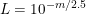 | (1) |
|:-:|:-|-------------------------------------------------:|

In total, these simple eclipsing star models have 6 or 9 adjustable
parameters. 

## 3. Constraints

There are 2 obvious constraints for the parameters. Firstly the stars
should not crash or rupture each other en secondly they should actually
show eclipses.

Constraints are implemented as change in the likelihood, but
theoretically they are extra priors. It is knowledge we have beforehand,
but it can not be implemented with simple, mutually independent
probability distributions. It is the relation between the parameters
that define the prior.

The no-crash constraint entails that the sum of the stellar radii must
be smaller than the distance between the stars, or better even the Roche
limits must be smaller.  The distance between the stars depends on the
eccentricity, e, of the system.  The closest approach, the periastron
distance, is (1 - e) times the semi-major axis, that we have defined as
being 1. Here we have a simple prior that is 0 when a crash occurs and 1
otherwise. 

The second constraint, actual eclipses, demands that the inclination
must be near enough to perpendicular to the sky plane. The constraint is a
function of the stellar radii, the eccentricity, the inclination and the
angle between periastron and north (longitude).  From these parameters
we can calculate the nearest approach as projected on the sky plane.
We define an extra prior which accepts the orbit setting when eclipses
are possible (Pr = 1), rejects them when there can not be any eclipses
(Pr = 0) and a linear relation in the in-between zone.

## 4. Overlap.

When the projected distance, d, is larger than the sum or the radii,
there is no overlap. When the difference between the radii is smaller
than the distance there is complete overlap. In these cases the overlap
area, Ao, is defined as

<!--latex
\begin{eqnarray*}
\quad A_o =\!&\!0 \quad\ \ & \mbox{if}\ d > r_1 + r_2 \\
           \!&\!A_m    \ \ & \mbox{if}\ d < | r_1 - r_2 |
\end{eqnarray*}
latex-->

| &nbsp; | 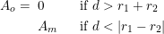 | (2) |   
|:-:|:-|-------------------------------------------------:|   

Am is the area of the smaller star (in radius).

The overlap of 2 stars approaching each other is given by the
pink area in figure 1. The area can be calculated as the sum of the two
sectors starting in A and B and subtracting the 2 triangles ACD and BCD.

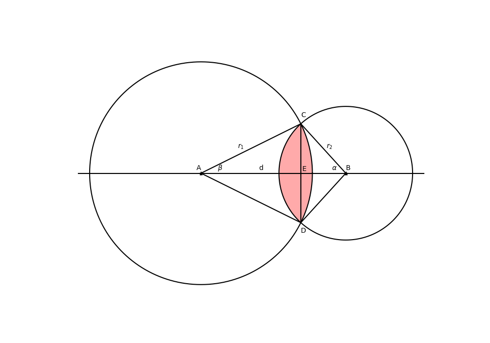
<table><tr>
<td style="width: 10px;">  </td>
<td style="width: 350px; text-align: left;">
Figure 1. Area of two overlapping circles.
</td></tr>
</table>

The sector A is found as 2 &beta; * r12. 
The triangle ACD is equal to 2 * AE * ED = 
r12 cos( &beta; ) sin( &beta; )

For sector B and triangle BCD hold similar equations so that the
combined overlap area, Ao, equals

<!--latex
\begin{displaymath}
A_o = \beta r_1^2 + \alpha r_2^2 - 0.5 r_2^2 \sin( 2 \alpha ) 
      - 0.5 r_1^2 \sin( 2 \beta )
\end{displaymath}
latex-->

| &nbsp; | 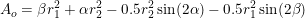 | (3) |
|:-:|:-|-------------------------------------------------:|

  
The angle &alpha; and &beta; are found using the cosine rule.

From the overlap area, the fraction of occluded light is found.
The total luminosity, L, 

<!--latex
\begin{eqnarray*}
L =\!&\!\!L_1 ( 1 - A_o / A_1 ) + L_2 \quad & \mbox{if}\ z > 0 \\ 
   \!&\!\!L_1 + L_2 ( 1 - A_o / A_2 ) \quad & \mbox{if}\ z < 0
\end{eqnarray*}
latex-->

| &nbsp; | 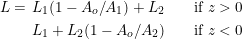 | (4) |
|:-:|:-|-------------------------------------------------:|

Limb darkening or variations in temperature over the surface of the
stars (like sun spots) are not taken into account. 

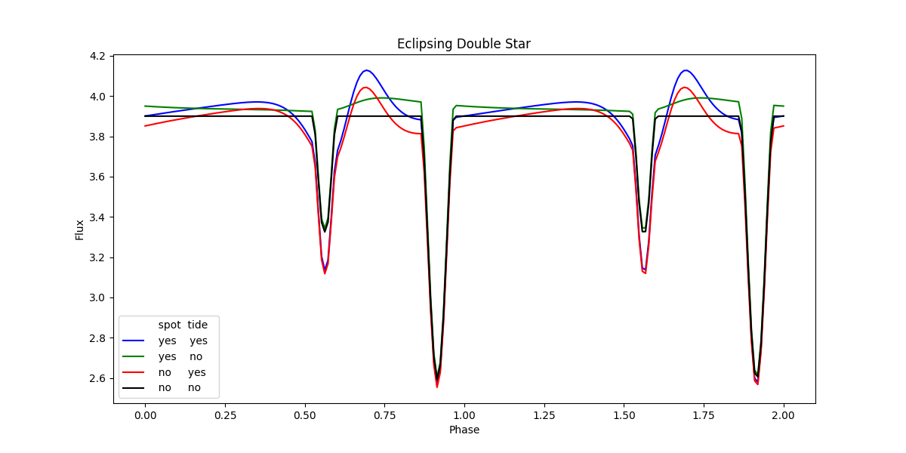
<table><tr>
<td style="width: 10px;">  </td>
<td style="width: 350px; text-align: left;">
Figure 2. Eclipsing binary star.
</td></tr>
</table>

The eclipsing of stars can be seen in figure 2, the black line.

## 5. Spot Illumination.

When two stars are real close, they heat each other up, on the near
sides only. The heating is proportional to the temperature of the other star
times it surface, and inversely proportional to the true distance
squared. The equation was taken from 
[Dzygunenko and Tvardovskyi](./references.md/#dzygunenko) or 
[PDF](https://oejv.physics.muni.cz/issues/oejv_0258.pdf).
It gives the extra temperture on star 2, caused by star 1

<!--latex
\begin{displaymath}
T_{2,s}^4 \propto T_1^4 \frac{r_1^2}{2 \rho^2} 
\end{displaymath}
latex-->

| &nbsp; | 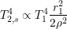 | (5) |
|:-:|:-|-------------------------------------------------:|

The hot spot is always facing the other star, so the observer sees
it in phases, with the larger contribution when z < 0, i.e. star 2 
is behind star 1. The phase modulates the spot with 
cos2( 2 ( &theta; - 90 ) )

The proportionality in eq.5 defines another adjustable parameter,
fs, which combined with the fact that the luminosity is
proportional to T4, yields the result, to be added to
L2

<!--latex
\begin{displaymath}
L_2\,+\!\!= f_s L_1 \frac{r_1^2}{\rho^2} ( 1 - z / \rho )
\end{displaymath}
latex-->

| &nbsp; | 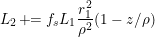 | (6) |
|:-:|:-|-------------------------------------------------:|

There is also a heating of star 1 by star 2, which is the same, mutatis
mutandis, as eq.6, except that the phase is reversed, as star 1 needs to
be behind star 2 for full illumination: phase = ( 1 + z / &rho; ). 

Even though the hotter star produces a much larger effect on the other
than reverse, we implemented both as we don't know in advance which star
will be the hotter of the two.

Similar to limb darkening and other temperature variations, we consider
the star surface as uniform when doing the overlap calculations. On the
other hand, when the stars are eclipsing, the rear one is in "full
moon", while the near one is in "new moon". So no terminators in sight. 

The effects of spot illumination can be seen in figure 2, the green line.

## 6. Tidal Distortion.

Another effect present in close binaries is tides due to gravitational
differences on the near and far side of a star. 
The tidal forces follows from Newton's law of gravity:

<!--latex
\begin{displaymath}
\Delta F_1 = 2 r_1 \frac{G m_1 m_2}{\rho^3} 
\end{displaymath}
latex-->

| &nbsp; | 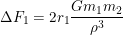 | (7) |
|:-:|:-|-------------------------------------------------:|

A similar formula holds for star 2. 

The result of this gravitational pull is a distortion of the spherical
star into a prolate (elongated) ellipsoid. As the tidal forces are
proportional to the radius of the star, the ellipsoids on both stars
have the same shape, except for the size. 

In figure 3, we display the binary system, as seen from the side.  The
observer is at the top.  The variables a1, b1, and
c1 are defined as the true semi-major axis, the semi-minor
axis and the apparent semi-major axis of the ellipsoid, respectively. 
As the ellipsoid is rotationally symmetric along the long axis, the
apparent semi-minor axis is the same as the true one. 

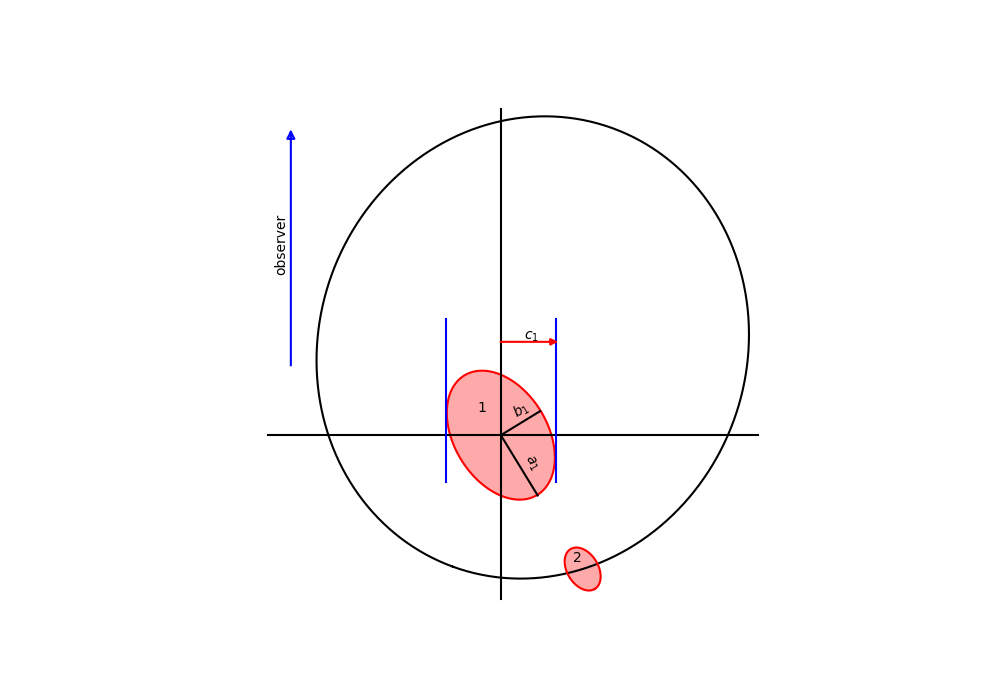
<table><tr>
<td style="width: 10px;">  </td>
<td style="width: 350px; text-align: left;">
Figure 3. Gravitational tides.
</td></tr>
</table>

We dont know the masses of the stars and also not the true distance,
so we introduce another parameter: pt. The gravity works on
bot stars in the same way, resulting in conformal ellipsoids. So we can
calculate the semi-major axis, mj, of the ellipsoid,
independent of the star as

<!--latex
\begin{displaymath}
m_j = 1 + \frac{p_t}{\rho^3} 
\end{displaymath}
latex-->

| &nbsp; | 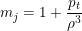 | (8) |
|:-:|:-|-------------------------------------------------:|

We assume that the deformation is either instantaneous or the stars are
tidally locked. Anyway, the long axis of the ellipsoids is always
pointing to the other star. Also assuming that the volumes of the stars
are conserved, we can calculate the semi-minor axis, mn, as

<!--latex
\begin{displaymath}
m_n = \sqrt{ \frac{1}{m_j} } 
\end{displaymath}
latex-->

| &nbsp; | 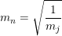 | (9) |
|:-:|:-|-------------------------------------------------:|

Projecting a prolate ellipsoid, yields an ellipse with the same minor
axis as the ellipsoid, and an apparent major axis, ma,
varying between both axis.  The size of the major axis depends on the
aspect angle &theta;. 

<!--latex
\begin{displaymath}
m_a = \sqrt{ m_j^2 \sin^2 \theta + m_n^2 \cos^2 \theta  } 
\end{displaymath}
latex-->

| &nbsp; | 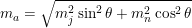 | (10) |
|:-:|:-|-------------------------------------------------:|

Assuming, as we did before, that the surface temperature is the same
everywhere, we see the luminosity increase when looking sideways at the
prolate ellipsoid and decrease when looking head-on. 
The luminosity changes proportional to the apparent surface area: 
ma * mn.

The effects of tidal distortion can be seen in figure 2, the red and
blue lines.

## 7. Symmetry.

As we are seeing only one dot of light which contains the contribution of
both stars, the orbit that fit the light curve, is not unique.  Even
after we fixed the line of nodes to pointing north and the semi-major
axis to 1, there are still several completely identical solutions. 
We can find the other solutions by mirroring of the main axes.

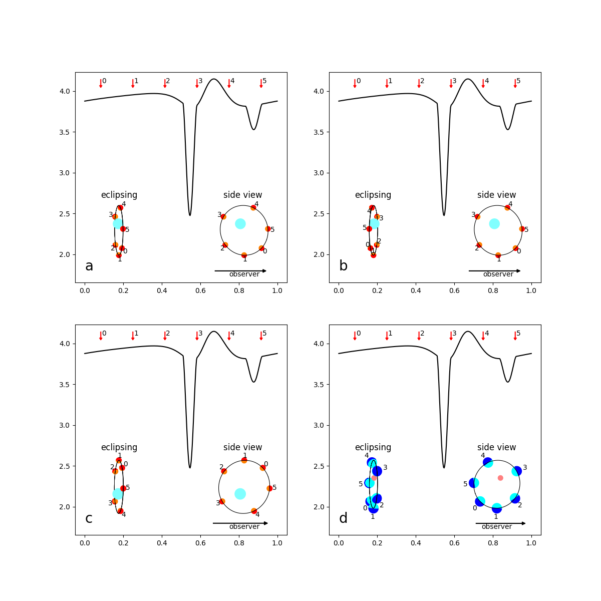
<table><tr>
<td style="width: 10px;">  </td>
<td style="width: 350px; text-align: left;">
Figure 4. Orbital symmetries.
</td></tr>
</table>

In figure 4 we display 4 panels. The first one, panel a, shows the
starting point, from which we mirror to get to the other panels. In each
panel we see the light curve at the top. The numbered arrows refer to the
positions of star 2 in the insets low-left and low-right. The insets
give two views of the orbit; to the left as eclipsing view and to the
right in a sideways view, with the observer further to the right. The
effects of spot illumination and tidal distortion is only shown in star
2. It would be confusing to show it also for star 1.

Panel b shows the orbit mirrored in the y-z plane, most clearly in the
left inset.  We see star 2 pass on the other side over star 1.  This can
be achieved by changing the inclination into ( 180 - inclination )

Panel c shows the orbit mirrored in the x-z plane, most clearly in the
right inset. The stars are running anti-clockwise. This mirroring comes
about when both the inclination and the longitude of the periastron are 
increased by 180 degrees. The orbit is flipped with respect to
the sky plane and the orbit itself is moved forward by half a period. 

Panel d shows the orbit mirrored in the x-y plane. What was back is now
up front and vice versa. To keep the same light curve we also have to
flip the stars. To achieve this we increase the inclination by 180
degrees and exchange the radii and luminosities of the stars.

The mirrorings are summarized in the table below.

| mirror | panel  |  incl  |  long  |  radius   |  lumen   | 
|:------:|:------:|:------:|:------:|:---------:|:--------:|
|   y z  |   b    | &pi;-i |        |           |          | 
|   x z  |   c    |  +&pi; |  +&pi; |           |          |
|   x y  |   d    |  +&pi; |        |1&le;&gt;2 |1&le;&gt;2|

The 3 mirrorings on fundamental planes, can be combined into 8
parameter sets that all produce the same light curve.
 
We could make the choice here to allow all these solutions and see where 
the final ends. However we already have a 10 dimensional parameter space
where the solution must be found in a tiny area, with in some dimensions
almost no gradient leading to it. If e.g. the period is of by a very
small fraction, it is just as bad as when is is off by a large factor.

## 8. Constriction.

Constricting the search space as much as possible is a must.

First and foremost we need to know the period. 

