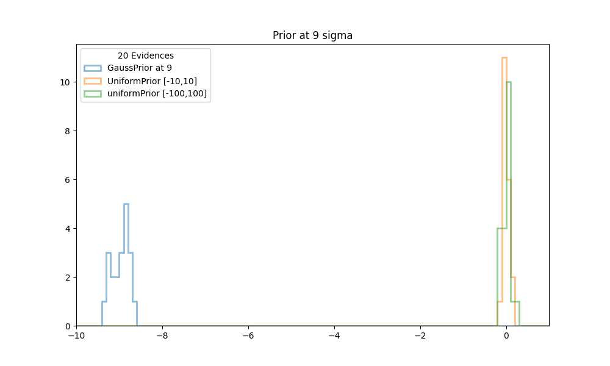

# Sampling from the Prior.

## Introduction.

The implementation of NestedSampling in BayesicFitting achieves
"sampling over the prior" by defining for each Prior-class, 2 functions
which are each others inverse: `domain2Unit()` and `unit2Domain()`.  
The `unit2Domain()` method converts a random sample uniformly drawn in [0,1]
into a sample drawn from the prior distribution.  The other one
`domain2Unit()` is used to transform a parameter into unit space [0,1]. 
The inverse means that 

    p = unit2Domain( domain2Unit( p ) )
    u = domain2Unit( unit2Domain( u ) )  

More information about this behaviour is in Kester and Mueller (2022). 

## Basic Truth.

Mostly this works fine.  However, for a GaussPrior we developed some
suspicion.  In this note, we investigate what is
the matter.  We use a very simple problem of taking the average of 200
points from N(0,1) with a conformal prior centered on positions between
0 and 9. 

We define a PolynomialModel of order 0 to calculate the average.  With
this model, we want to obtain the log10 evidence for priors with
center ranging from 0 to 9.  We do a numerical integration of the
likelihood and prior, over an area from -10 to 10.  This is the basic
truth.  As prior we use a conformal Gaussian prior centered at points
from 0 to 10, and a sigma equal to 1.0. 

In Table 1, we present the truth values for the evidences and the
calculated means, including the prior. The evidence decrease with 
increasingly ill-adapted priors, while the means increase towards the
prior positions. 

<table><tr>
<td style="width: 40px;">  </td>
<td style="width: 350px;">
Table 1. Numeric integration of Log Z..
</td></tr>
</table>

| center |  lZ_true |  mean | 
|:------:|:--------:|:-----:| 
|   0    | -124.08  | 0.000 | 
|   1    | -124.29  | 0.005 | 
|   2    | -124.94  | 0.010 | 
|   3    | -126.02  | 0.015 | 
|   4    | -127.54  | 0.020 | 
|   5    | -129.48  | 0.025 | 
|   6    | -131.86  | 0.030 |
|   7    | -134.67  | 0.035 | 
|   8    | -137.91  | 0.040 | 
|   9    | -141.58  | 0.045 | 
|  10    | -145.68  | 0.050 |

## Gauss Priors in Nested Sampling.

Now we will run NestedSampler (NS) with a Gauss prior with centers from
0 to 9, and calculate the evidence again.  In these runs, we are using
"uniform sampling over the prior". 

In Table 2, we compare the NS evidence with the true values. Up to priors,
4 sigma away from the sample average, the evidences are within the
calculated errors, dlZ, of the thruth.  After that it starts to deviate
and it deviates fast.  Even the NS means is affected when the prior is
at 9 sigma away. 

<table><tr>
<td style="width: 40px;">  </td>
<td style="width: 350px;">
Table 2. Gaussian priors.
</td></tr>
</table>

| center |  lZ_ns  |  dlZ  | lz_true  |    mean |
|:------:|:-------:|:-----:|:--------:|:-------:|
|    0   | -124.03 |  0.06 | -124.07  |   0.003 |
|    1   | -124.29 |  0.07 | -124.29  |   0.000 |
|    2   | -124.93 |  0.08 | -124.94  |   0.013 |
|    3   | -126.03 |  0.11 | -126.02  |   0.016 |
|    4   | -127.61 |  0.13 | -127.53  |   0.019 |
|    5   | -129.67 |  0.16 | -129.48  |   0.022 |
|    6   | -132.34 |  0.19 | -131.85  |   0.032 |
|    7   | -135.11 |  0.22 | -134.66  |   0.039 |
|    8   | -138.18 |  0.25 | -137.90  |   0.041 |
|    9   | -150.86 |  0.16 | -141.58  |   0.500 |

The reason for this behaviour is the sampling from the prior.  If the
developing posterior mean of the parameter moves farther away from
center of the (Gauss) prior than 8 sigma, the prior becomes
(computationally) zero. The prior can not produce any samples anymore.
Another way to look at this, is that we are using logarithms for all
distributions in NS except for the prior. The prior is used directly. 

The effects on the evidence already sets in when the prior is
only 4 sigma away from the sample mean.

## Uniform sampling.

We can remedy this bad behaviour by sampling from a uniform space, large
enough to encompass the complete posterior. We add the logPrior to the
logLikelihood, before integrating over it to get the evidence. This way
the prior is also used in its logarithmic form, while we are sampling
from a uniform distribution with the "same amount" of samples everywhere. 

As we have not implemented this idea into our NestedSampler, we use a
trick. We use an UniformPrior with enough space and add the prior as an
extra point to the dataset. Both the prior and the errordistribution are
Gaussians with a sigma of 1.0. Afterwards we have to divide the uniform
prior out of the evidence. In the log we subtract log( 1/priorrange ),
or add log( priorrange )

We do this for a uniform prior between [-10,10] and as a sanity check
also for a uniform prior between [-100,100]

<table><tr>
<td style="width: 40px;">  </td>
<td style="width: 350px;">
Table 3. Uniform priors.
</td></tr>
</table>

| center | lZ_true | lZ_ns10 |mean_10|lZ_ns_100|mean_100|
|:------:|:-------:|:-------:|:-----:|:-------:|:------:|
|   0    | -124.07 | -123.99 | 0.002 | -123.90 |  0.003 |
|   1    | -124.29 | -124.26 | 0.010 | -124.28 |  0.006 |
|   2    | -124.94 | -124.95 | 0.013 | -124.98 |  0.015 |
|   3    | -126.02 | -126.00 | 0.023 | -126.01 |  0.021 |
|   4    | -127.53 | -127.46 | 0.022 | -127.52 |  0.024 |
|   5    | -129.48 | -129.46 | 0.033 | -129.38 |  0.037 |
|   6    | -131.85 | -131.88 | 0.036 | -131.81 |  0.026 |
|   7    | -134.66 | -134.61 | 0.036 | -134.62 |  0.038 |
|   8    | -137.90 | -137.81 | 0.039 | -137.93 |  0.044 |
|   9    | -141.58 | -141.53 | 0.046 | -141.61 |  0.051 |

Now the evidence calculated by NS is very similar to the truth, i.e.
direct integration. Also the mean values correspond well the the direct
calculation.

## More tests.

Finally we like to see how stable the previous evidence calculations
are, and how it compares with the truth. We ran NS 20 times with a
GaussPrior, centered at each of the values [1,3,5,7,9], and with
simulated priors as described above. Histogram plots are made for each
of the prior positions.

<table><tr>
<td style="width: 40px;">  </td>
<td style="width: 350px;">
Figure 1 shows histograms of the evidences obtained in
20 runs of NS with conformal Gaussian priors and
similated Gaussian priors, between [-10,10] and [-100,100]. 
The center of the prior is at 1.
All evidences are scaled to the truth at 0.
</td></tr>
</table>

<table><tr>
<td style="width: 40px;">  </td>
<td style="width: 350px;">
Figure 2 shows histograms of the evidences obtained in
20 runs of NS with conformal Gaussian priors and
similated Gaussian priors, between [-10,10] and [-100,100]. 
The center of the prior is at 3.
All evidences are scaled to the truth at 0.
</td></tr>
</table>

<table><tr>
<td style="width: 40px;">  </td>
<td style="width: 350px;">
Figure 3 shows histograms of the evidences obtained in
20 runs of NS with conformal Gaussian priors and
similated Gaussian priors, between [-10,10] and [-100,100]. 
The center of the prior is at 5.
All evidences are scaled to the truth at 0.
</td></tr>
</table>

<table><tr>
<td style="width: 40px;">  </td>
<td style="width: 350px;">
Figure 4 shows histograms of the evidences obtained in
20 runs of NS with conformal Gaussian priors and
similated Gaussian priors, between [-10,10] and [-100,100]. 
The center of the prior is at 7.
All evidences are scaled to the truth at 0.
</td></tr>
</table>

<table><tr>
<td style="width: 40px;">  </td>
<td style="width: 350px;">
Figure 5 shows histograms of the evidences obtained in
20 runs of NS with conformal Gaussian priors and
similated Gaussian priors, between [-10,10] and [-100,100]. 
The center of the prior is at 9.
All evidences are scaled to the truth at 0.
</td></tr>
</table>

In all cases the calculations with the simulated gauss priors (orange
and green histograms in the figures above), cluster very well around the
truth values at 0. The calculations with a standard
GaussPrior (blue histograms) deviate more and more from the true values.
Even as early as 3 sigma away some effects start to be noticeable.
Although there might seem to be no problems with extracting samples at
these locations, it could be that the posterior extends so far from the
prior that there are problems calculating the tails.

## Conclusion.

Sampling over the prior does not always yield the proper
results. Especially for priors that slowly approach zero. At a certain
point the computed value for the prior is 0.0, while mathematically they
are not yet zero. This is another example of "Mathematically it is all
OK, computationally it is a nightmare."

Using 64-bit floats, Gauss priors yield non zero values in the sigma range
[-8,8]. Outside that range NS breaks down, although effect of ill
sampling are already felt as early as at 4 sigma.  For Laplace priors the
non zero range is between sigmas [-36,36] and for Cauchy priors it is
between [-1e16,1e16]. The latter would probably never be a practical
problem. The former could ready be a problem halfway the range.

Fortunately it can be remedied, by sampling over an integration box, and
calulating the evidence integral from logLikelihood + logPrior over de
box. All priors then need limits, also the ones that mathematically
extend to infinity. Computationally however, all priors do have limits,
where the values are too close to zero. For UniformPriors, our prior of
choice, nothing changes.

## Do Kester. June 2025.

