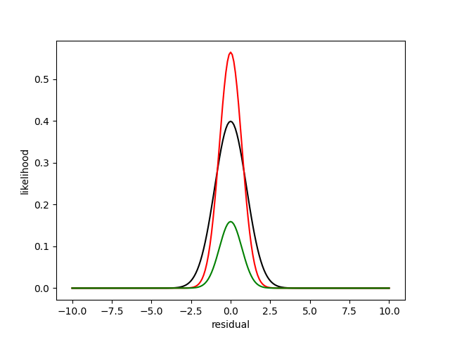

---
---

# Expressing Data Quality in Fitting
## Do Kester

## 1. Introduction

In real fitting processes it often occurs that data points are of different quality. 
Either as the result of previous calculations, e.g. when the datapoint is obtained from 
an integrating receiver, or from known deficiencies in the data such that the data have
unequal quality, through calbration of the measurements, or even just by an educated
hunch of the experimenter.

In this note we explore the possibilities to use these differences in
order to obtain a better fitting result. We can express the qualities as
either importance weights attached to the data points, or as a scale
factor in the residuals. 

 
Mostly data points are measured at locations (in time, space,
frequency etc.) that are known with much higher precision than what is
measured.  These locations are called the independent variables, and
what is measured at these locations, are called the dependent variables. 
In these cases, we fit the model by minimizing the mismatches in the
dependent variable, called <i>y</i>,  assuming that the other variable,
the independent one, called <i>x</i>, is known with a precision, at 
least an order of magnitude better. 

Assume we have N data points <i>D</i> = {<i>xi,yi</i>}. We want to
fit the data with an as-yet-unspecified model

$$
\begin{flalign}
\tag{1} \quad
m_i = F( x_i : \theta ) &&
\end{flalign}
$$

such that some norm of the residuals, <i>ri</i>, are minimumized over the parameters, <i>&theta;</i>.

$$
\begin{flalign}
\tag{2} \quad
r_i = y_i - m_i &&
\end{flalign}
$$

## 2. Quality as Weights

In our paper <a href="./references.html#kester8">(Kester and Mueller, 2021)</a>
(KM), we state 
our preference for weighting over scaling on the basis that weights are more general, more 
flexible than scales. We also state that our weights are treated as multiple cq. fractal 
observations. An observation with a  weight of 2 would yield in the same result as including 
that same observation twice in the dataset, without weight, i.e. a weight of 1.

The common suggestion, repeated in our paper, that the choice between weights and
scales is irrelevant with respect to the final fitting results, is somewhat too fast.
Up on closer inspection it turns out that the least-squares results and the maximum
likelihood results are indeed the same, provided that we choose 
<i>w&nbsp;=&nbsp;&sigma;-2</i>, where <i>w</i> is the weight and
<i>&sigma;</i> is the accuracy.
However, the calculation of the size
of the posterior and consequently, the evidence is different. The
overall shape of the posterior is not affected.

The crux is in the likelihood. The likelihood is the product of the error distribution values 
at individual data points, <i>xi</i>. 

$$
\begin{flalign}
\tag{3} \quad
L = \prod_i \mathcal{L}_i &&
\end{flalign}
$$

When we choose a Gaussian error distribution we obtain for individual data points,
without weights. We will address other error distributions later on in
this note.

$$
\begin{flalign}
\tag{4} \quad
\mathcal{L}_i = \sqrt {\frac{1}{2\pi\sigma^2}} \exp\left( - \frac{1}{2 \sigma^2} (y_i - m_i )^2 \right) &&
\end{flalign}
$$

where <i>yi</i> is the measured value at location <i>xi</i> and 
<i>mi</i>&nbsp;=&nbsp;<i>F</i>(<i>xi</i>&nbsp;:&nbsp;<i>&theta;</i>).
It is the value returned by the model, <i>F</i>,
at the same location and for certain values of the parameter vector, <i>&theta;</i>,
also known as mock data..
The scale factor, <i>&sigma;</i>, is in the narrative of KM,  part of the likelihood.
It is either a fixed value or a hyperparameter to be estimated in the problem too.

The likelihood of Eq.&nbsp;2 is displayed in Fig.&nbsp;1, using the black line. It is shown as a function 
of the residuals <i>r = y - m</i>. The scale factor <i>&sigma;</i>, is set to 1.0.

&nbsp;&nbsp;

<table><tr>
<td style="width: 50px"> </td>
<td style="width: 550px">
Figure 1. The Gaussian likelihood as function of residual size. In black for &sigma; = 1,
in green for <i>w</i> = 2, and in red for <i>&sigma;</i> = &frac12;&radic;2.
</td></tr>
</table>

When there are qualitative differences between individual data points, there are 2 ways 
to handle them: via weighting of the datapoints, and via scaling of the residuals.
For weighting we assume that a data point that has 
a weight, <i>w</i> has the same impact as <i>w</i> (of the same) data points with
a weight equal to 1. 
We can easily extend this to floating values of the weight,
<i>wi</i>.

With these assumptions Eq.&nbsp;4 transforms into 

$$
\begin{flalign}
\tag{5} \quad
\mathcal{L}_i = \left(\frac{1}{2\pi\sigma^2}\right)^{w_i/2} \exp\left( -
\frac{w_i}{2 \sigma^2} (y_i - m_i)^2 \right) &&
\end{flalign}
$$

This is the formula we have been using in our NestedSampler. 

In Fig.&nbsp;1 the likelihood of Eq.&nbsp;5 is displayed in green for a weight value, <i>w</i> = 2. 
This likelihood is <em>not</em> normalized as it is actually a product of 2 likelihoods
of the form of Eq.&nbsp;4. The latter is less than 1, everywhere, so the green line is consistently
below the black line.

However, there is another option, where we know the accuracy of the errors on the
data point, e.g. when the data point is the result of a previous calculation.
Assume <i>&sigma;i</i> represents the size of the errors. In
this narrative the <i>&sigma;</i>'s are a given. They are part of the
data, not part of the likelihood. 

$$
\begin{flalign}
\tag{6} \quad
\mathcal{L}_i = \left(\frac{1}{2\pi \sigma_i^2}\right)^{1/2} 
\exp\left( -\frac{1}{2} \left(\frac{y_i - m_i}{\sigma_i}\right)^2 \right) &&
\end{flalign}
$$

The likelihood of Eq.&nbsp;6 is shown in Fig.1 as the red line, using a value for
<i>&sigma;</i> = 1/ &radic;2.
This is a normalized likelihood, so when the width decreases, the height must increase.

Even if we put, as usual <i>w = s-2</i> (as in Fig.1), there
is still a difference between Eq.&nbsp;5 and Eq.&nbsp;6.  The
exponential parts of the equations turn out the same, but the
normalizing parts are different.  The least-squares and the maximum
likelihood solutions only depend on the exponential parts.  So they do
not differ in both representations of the data quality.  The Bayesian
solution, posterior and evidence, take the full likelihood into account,
so they are different.  Which one is better is up to the user to decide:
which of the notions, weighting or scaling, reflects better on the
problem and the data at hand. 

In the logarithm the likelihood transform into

$$ 
\begin{flalign}
\tag{7} \quad
\log L = \sum_i \log( \mathcal{L}( x_i ) ) &&
\end{flalign}
$$

Eq.&nbsp;4 (no differing data quality) transforms (N is the number of data points).

$$
\begin{flalign}
\tag{8} \quad
\log L = -0.5 N \log( 2\pi \sigma^2 ) - \frac{1}{2 \sigma^2} \sum_i ( y_i - m_i )^2 &&
\end{flalign}
$$

Equation 5 (using weights) transforms into.

$$
\begin{flalign}
\tag{9} \quad
\log L = -0.5 \log( 2\pi \sigma^2 ) \sum_i w_i - \frac{1}{2 \sigma^2} 
\sum_k w_i ( y_i - m_i )^2 &&
\end{flalign}
$$

Equation 6 (using scales) transforms into.

$$
\begin{flalign}
\tag{10} \quad
\log L = -0.5 N \log( 2\pi ) - \sum_i \log( \sigma_i ) - \frac{1}{2}
\sum_i \left( \frac{y_i - m_i}{\sigma_i}\right)^2 &&
\end{flalign}
$$

## 3. Quality as Errors

We will follow the discussions in Phil Gregory's Book (1) and the supplement to it (2). 
They are reference resp, as PG1 and PG2.

There are several narratives that can be followed, each valid in applicable circumstances.  
Here we assume that the likelihood is a Gaussian error distribution.

### 3.1. Single scale

All errors are from a Normal distribution with a single scale, <i>&sigma;</i>.
At this point it does not matter how the model <i>mi</i> is
calculated. We just assume it is there.

$$
\begin{flalign}
\tag{11} \quad
\mathcal{L}_i = \sqrt {\frac{1}{2\pi\sigma^2}} \exp\left( - \frac{1}{2} 
\left(\frac{y_i - m_i}{\sigma} \right)^2 \right) &&
\end{flalign}
$$

The scale, <i>&sigma;</i>, is either a given of the problem or an extra
(hyper)parameter, that must be estimated from the data. 

### 3.2. Known Accuracies

For each of the data points, the accuracy is known as
<i>&sigma;i</i>. The likelihood is the same as in Eq.2 except
that the accuracies, <i>&sigma;i</i>, are different at each
data point, replacing the <i>&sigma;</i> in Eq.&nbsp;2 by
<i>&sigma;i</i>.

$$
\begin{flalign}
\tag{12} \quad
\mathcal{L}_i = \sqrt {\frac{1}{2\pi\sigma_i^2}} \exp\left( - \frac{1}{2} 
\left(\frac{y_i - m_i}{\sigma_i} \right)^2 \right) &&
\end{flalign}
$$

### 3.3. Errors in the Model

When our (knowledge of the) model is incomplete, not embodying all
subtleties present in the data, there can be (systematic) errors which
are not caught when knowing the accuracies only. The model
incompleteness might be known at the level of each data point as 
<i>&sigma;m,i</i>, or globally as <i>&sigma;m</i>.
The latter might be an unknowm quantity, estimatable as a hyperparameter
of the problem.

Errors in the model can occur simultaneously to errors in the data
points. When combining 2 possible errors, the distribution takes the
form of a convolution of both individual error distributions. For
Gaussian distributions we obtain another Gaussian where the variance is
the sum of the individual variances. For other distributions it is not
so clear cut. In section 4 we discuss that situation.

$$
\begin{flalign}
\tag{13} \quad
\mathcal{L}_i = \sqrt {\frac{1}{2\pi (\sigma_i^2 + \sigma_{m,i}^2)}} \exp\left(
-0.5 \,  \frac{ ( y_i - m_i )^2}{\sigma_i^2 + \sigma_{m,i}^2} \right) &&
\end{flalign}
$$

All <i>&sigma;</i> values might be the same for all data points,
provided they are a given in the problem. Only one of them can be
sensibly estimated from the data. 

### 3.4. Errors in <i>x</i> and <i>y</i>

When we have errors in <i>x</i> and <i>y</i> of similar size, we do not
know the exact location of the independent variable. We have to estimate
them too. We call them the targets, <i>ti</i>. In stead of
Eq.1 we have 
 

$$
\begin{flalign}
\tag{14} \quad
m_i = F( t_i : \theta ) &&
\end{flalign}
$$

And in addition to Eq.&nbsp;2 we have an extra residual to minimize; this
time for the unknown <i>x</i>-location, for which holds that

$$
\begin{flalign}
\tag{15} \quad
\varepsilon_i = x_i - t_i &&
\end{flalign}
$$

The unknown <i>x</i>-locations are so called nuisance parameters of the
problem, each with their own prior. They have to be integrated over all
possible values to obtain the values for the model parameters,
<i>&theta;</i>.  When using the nested sampling algorithm, it means that
the nuisance parameters just can be ignored. 

PG1 presents a case where the nuisance parameters are integrated
analytically, so they are removed from the problem. PG1 needs to assume
that the model is a straight line and that one prior suffices for all
targets. The latter encodes the case where the possible range
of the values for the targets, <i>t</i>, is much smaller than the
possible range of the errors, <i>&epsilon;i</i>. PG1 ends up with one
(maybe 2) nuisance parameters in stead of N.

We think that these conditions are too restrictive; we prefer working
with nuisance parameters for the N targets. Again. using a Gaussian
error distribution, we multiply the probabilities of Eqs.&nbsp;11, 12, 
or 13, whatever the case is, with the probability for the residuals in 
<i>x</i>.

$$
\begin{flalign}
\tag{16} \quad
\mathcal{L}_i \muleq \sqrt {\frac{1}{2\pi\tau_i^2}} \exp\left( -0.5 
\left(\frac{x_i - t_i}{\tau_i} \right)^2 \right) &&
\end{flalign}
$$

where <i>&tau;</i> is the accuracy of the data points in
the <i>x</i>-direction.

As the targets are (nuisance) parameters to the problem, they need a
prior. As said before, PG1 chooses a single prior for all targets and
he could integrate the nuisance parameters out (for straight line
models). We want a prior for each target as we think that in most cases
the values for <i>xi</i> are not drawn from a single
distribution, but are significantly different in themselves with an
added error contribution. This leads to priors which are centered on the
data point values of <i>xi</i>. This may seem like cheating
as we are using the data for establishing the prior. But it is not. We
know beforehand that the targets need to be near the <i>x</i>-data,
whatever these data points are. We are not looking at the data and
decide what to choose; we already know what to do. 

Moreover, for a large
class of distributions that are function of the size of the mismatch
between target and data, it holds that the probability of the data,
given the target, is the same as the probabilty of the target given the
data. E.g. for a Gaussian distribution as prior

$$
\begin{eqnarray}
p( x | t, \tau ) & = & \sqrt {\frac{1}{2\pi\tau^2}} \exp\left( - \frac{1}{2} 
\left(\frac{x - t}{\tau} \right)^2 \right) \nonumber \\
& = & p( t | x, \tau ) 
\end{eqnarray}
$$

where the scale of the distribution, <i>&tau;</i>, needs to be
specified, estimated by the user. 

In its simplest form the likelihood becomes

$$
\begin{flalign}
\tag{17} \quad
\mathcal{L}_i = \frac{1}{2 \pi \sigma_i \tau_i}
\exp \left( -0.5 \left( 
\left( \frac{y_i - m_i}{\sigma_i} \right)^2 +
\left( \frac{x_i - t_i}{\tau_i} \right)^2 \right) \right) &&
\end{flalign}
$$

The values of <i>mi</i> are now evalutated on the targets 
of <i>x</i>: 
<i>mi</i>&nbsp;=&nbsp;<i>F</i>(<i>ti</i>&nbsp;:&nbsp;<i>&theta;</i>).

More succinctly, the likelihood can be written in matrix notation as

$$
\begin{flalign}
\tag{18} \quad
\mathcal{L}_i = \frac{1}{2\pi\sqrt{\det V_{i}}} \exp\left( - \frac{1}{2} 
( z_i - \zeta_i )^T V_i^{-1} ( z_i - \zeta_i ) \right) &&
\end{flalign}
$$

where

$$
\begin{flalign}
\tag{19} \quad
z_i = \left( \begin{array}{c} y_i \\ x_i \end{array} \right), \hspace{2em}
\zeta_i = \left( \begin{array}{c} m_i \\ t_i \end{array} \right), \hspace{2em}
V_i = \left( \begin{array}{cc} \sigma_i^2 & 0 \\ 0 & \tau_i^2 \end{array} \right) &&
\end{flalign}
$$

So <i>zi</i> is the data vector, the
<i>&zeta;i</i> is the target vector and <i>Vi</i>
is the variance matrix. The variance matrix contains 
<i>&sigma;y</i> being the accuracy deemed for the
<i>y</i>-data, eventually compounded by the accuracy (known or unknown)
for the model values at the target values, <i>t</i>, as in Eq.&nbsp;5. 
The values for <i>&sigma;x</i> are the accuracies deemed for the
<i>x</i>-data. Both <i>&sigma;</i>'s might be known on the level of
individual data points, or only globally for the problem as a whole.

When there are errors on both axes, the contours of equal likelihood 
form nested ellipsoids, whose semimajor axes are multiples of
<i>&sigma;x</i> and <i>&sigma;y</i>. The target
positions, <i>t</i>, are found where these ellipisoids touch the model
function, <i>F</i>. 
The optimal solution is found where the distances from data to targets
is minimal. Geometrically, we have to find those parameters,
<i>&theta;</i>, for which the ellipsoidal distance from data to model is
minimal.   

### 3.5. Correlated errors in <i>x</i> and <i>y</i>

When the errors in <i>x</i> and <i>y</i> are correlated, the variance
matrix, <i>Vi</i>, needs to be replaced by a covariance matrix.

$$
\begin{flalign}
\tag{20} \quad
V_i = \left( \begin{array}{cc} \sigma_i^2 & \varrho_i \\ \varrho_i & \tau_i^2 \end{array} \right)  &&
\end{flalign}
$$

where <i>&rho;i</i> is the covariance factor between
<i>xi</i> and <i>yi</i>.
With this replacement, the likelihood of Eq.&nbsp;18 stays the same.

With correlated errors, the ellipsoids are rotated according to the
correlation between <i>x</i> and <i>y</i>. We still want to find the
minimum in the ellipsoidal distances from data to model.  

#### 3.5.1. Example

Suppose we have measurements of the magnitudes of stars in 3 bands, 
U, B and V. To eliminate the
influence of the distance of the stars we take differences between the
bands: U&nbsp;-&nbsp;B and B&nbsp;-&nbsp;V. 

By construction the the errors in the differences are (anti)correlated.
Every error in B shows negative in U&nbsp;-&nbsp;B and positive in B&nbsp;-&nbsp;V. 

If the accuracies of U, B and V were <i>&sigma;U</i>,  
<i>&sigma;B</i>,  and <i>&sigma;V</i>, resp.,
the covariance matrix would be

$$
\begin{flalign}
\tag{21} \quad
V = \left( \begin{array}{cc} \sigma_U^2 + \sigma_B^2 & -\sigma_B^2 \\ 
-\sigma_B^2 & \sigma_V^2 + \sigma_B^2 \end{array} \right)  &&
\end{flalign}
$$

All this, of course, under conditions of independent measurements

#### 3.5.2. Model Mismatch

When there is also an mismatch in the model of (possibly unknown) size
<i>&sigma;m</i>, the most probable model function is the one
closest (in 2 dimensions) to the data points. The covariance matrix
reverts to   

$$
\begin{flalign}
\tag{22} \quad
V_i = \left( \begin{array}{cc} \sigma_i^2 + \sigma_m^2& \varrho_i \\ \varrho_i &
\tau_i^2 + \sigma_m^2 \end{array} \right)  &&
\end{flalign}
$$

The model mismatch is supposed to be independent of the other
accuracies; it does not affect the covariance.

#### 3.5.3. Computation

For computational reasons, we write out Eq.&nbsp;19, using the
covariance matrix of Eq.&nbsp;22. Firstly we write the covariance matrix as

$$
\begin{flalign}
\tag{23} \quad
V = \left( \begin{array}{cc} v_{yy} & v_{xy} \\ 
                             v_{xy} & v_{xx} \end{array} \right)  &&
\end{flalign}
$$

Where the <i>v</i>'s are (co)variances of <i>y</i> and <i>x</i>.

The determinant of V becomes

$$
\begin{flalign}
\tag{24} \quad
D = v_{yy} v_{xx} - v_{xy}^2 &&
\end{flalign}
$$

And the inverse of V is

$$
\begin{flalign}
\tag{25} \quad
V^{-1} = \frac{1}{D} 
\left( \begin{array}{cc} v_{xx} & -v_{xy} \\ 
                        -v_{xy} &  v_{yy} \end{array} \right)  &&
\end{flalign}
$$

In most computations we need the likelihood in logarithmic form.

$$
\begin{eqnarray}
\log \mathcal{L}_i & = & - \log( 2 \pi ) - 0.5 \log( D ) + \nonumber \\
&& - \frac{v_{xx} ( y - m )^2 - 2 v_{xy} ( y - m ) ( x - t ) +
v_{yy} ( x - t )^2}{2 D}
\end{eqnarray}
$$

All relevant items in Eq.&nbsp;28 need indices <i>i</i>. They are
omitted to keep it (relatively) simple.

We also need the partial derivatives of the log-likelihood to the
parameters, <i>&theta;</i>, to the targets, <i>t</i>, and, if present to
the unknown model accuracy, <i>&sigma;m</i> as in Eq.&nbsp;23.

$$
\begin{flalign}
\tag{26} \quad
\frac{\partial \log \mathcal{L}_i}{\partial \theta} =
\frac{v_{xx} ( y - m ) - v_{xy} ( x - t ) }{D} \frac{\partial
m}{\partial \theta} &&
\end{flalign}
$$

$$
\begin{flalign}
\tag{27} \quad
\frac{\partial \log \mathcal{L}_i}{\partial t_k} = 
\left( \frac{  v_{xx} ( y - m ) - v_{xy}( x - t ) }{D} 
\frac{\partial m}{ \partial t} +
\frac{ v_{yy} ( x - t ) - v_{xy}( y - m ) }{D}\right) \delta_{ik} &&
\end{flalign}
$$

Where <i>&delta;i,k</i> is the Kronecker delta.

The unknown model scale is present in <i>vyy</i>, 
<i>vxx</i>,  and
subsequently in <i>D</i>. 

$$
\begin{flalign}
\tag{28} \quad
D = ( \sigma^2 + \sigma_m^2 ) ( \tau^2 + \sigma_{m}^2 ) - \varrho^2  &&
\end{flalign}
$$

So in case of Eq.&nbsp;23 we have

$$
\begin{flalign}
\tag{29} \quad
\frac{\partial v_{yy}}{\partial \sigma_m} = 2 \sigma_m, \hspace{2em}
\frac{\partial v_{xx}}{\partial \sigma_m} = 2 \sigma_m, \hspace{2em}
\frac{\partial D}{\partial \sigma_m} = 2 \sigma_m ( \sigma^2 + \tau^2 +
2 \sigma_m^2 ) &&
\end{flalign}
$$

Combining these 

$$
\begin{eqnarray}
\frac{\partial \log \mathcal{L}_i}{\partial \sigma_m} & = &
- \frac{\sigma_m ( v_{xx} + v_{yy} + 2 \sigma_m^2)}{D} \nonumber \\
&& \times \left( 1 - \frac{v_{xx} ( y - m )^2 - 
2 v_{xy} ( y - m ) ( x - t ) + v_{yy} ( x - t )^2}{D} \right)
\nonumber \\
&& - \frac{\sigma_m ( ( x - t )^2 + ( y - m )^2 )}{D}
\end{eqnarray}
$$

## 4. Other Error Distributions

The schemes above only work on scaled error distributions; so not for  Poisson
and Bernouilli distributions.

In the table below is indicated what is implemented in BayesicFitting with
<b style='color:green'>&check;</b>,
and  what is not implemented with <b style='color:red'>&cross;</b>. 
The numbers in brackets refer to notes.

The orange <b style='color:orange'>&sigma;m</b> indicate a
scale factor due to the incompleteness of the model. It might either be
known or unknown.  
In the latter case the scale needs to be estimated from the data.
All other scales are known accuracies that need to be presented with the data.

<table width=100%; border=1px>
<tr>
<th width=15%></th>
<th width=5%></th>
<th colspan=6>ErrorDistributions</th>
</tr><tr>
<th>Scale</th>
<th width 5%>Eqn</th>
<th>Gauss</th>
<th>Laplace</th>
<th>Uniform</th>
<th>Expon</th>
<th>Cauchy</th>
<th>Mixed</th>
</tr><tr>
<th>&sigma;</th>
<td align="center">11</td>
<td align="center"><b style='color:green'>&check;</b></td>
<td align="center"><b style='color:green'>&check;</b></td>
<td align="center"><b style='color:green'>&check;</b></td>
<td align="center"><b style='color:green'>&check;</b></td>
<td align="center"><b style='color:green'>&check;</b></td>
<td align="center"><b style='color:red'>&cross;</b> (1)</td>
</tr><tr>
<th style='color:orange'> &sigma;m</th>
<td align="center">11</td>
<td align="center"><b style='color:green'>&check;</b></td>
<td align="center"><b style='color:green'>&check;</b></td>
<td align="center"><b style='color:green'>&check;</b></td>
<td align="center"><b style='color:green'>&check;</b></td>
<td align="center"><b style='color:green'>&check;</b></td>
<td align="center"><b style='color:green'>&check;</b></td>
</tr><tr>
<th>&sigma;i</th>
<td align="center">12</td>
<td align="center"><b style='color:green'>&check;</b></td>
<td align="center"><b style='color:green'>&check;</b></td>
<td align="center"><b style='color:green'>&check;</b></td>
<td align="center"><b style='color:green'>&check;</b></td>
<td align="center"><b style='color:green'>&check;</b></td>
<td align="center"><b style='color:red'>&cross;</b> (1)</td>
</tr><tr>
<th>&sigma;i + <b style='color:orange'>&sigma;m</b></th>
<td align="center">13</td>
<td align="center"><b style='color:green'>&check;</b></td>
<td align="center"><b style='color:red'>&cross;</b> (2)</td>
<td align="center"><b style='color:red'>&cross;</b> (3)</td>
<td align="center"><b style='color:red'>&cross;</b> (2)</td>
<td align="center"><b style='color:red'>&cross;</b> (2)</td>
<td align="center"><b style='color:red'>&cross;</b> (4)</td>
</tr><tr>
<th colspan=2</th>
<th colspan=6>Errors in X and Y (5)</th>
</tr><tr>
<th>( &sigma;i, &tau;i )</th>
<td align="center">18</td>
<td align="center"><b style='color:green'>&check;</b></td>
<td align="center"><b style='color:green'>&check;</b> (6)</td>
<td align="center"><b style='color:green'>&check;</b> (6)</td>
<td align="center"><b style='color:green'>&check;</b> (6)</td>
<td align="center"><b style='color:green'>&check;</b> (6)</td>
<td align="center"><b style='color:red'>&cross;</b> (1)</td>
</tr><tr>
<th>( &sigma;i, &tau;i, &rho;i )</th>
<td align="center">21</td>
<td align="center"><b style='color:green'>&check;</b></td>
<td align="center"><b style='color:red'>&cross;</b> (7)</td>
<td align="center"><b style='color:red'>&cross;</b> (7)</td>
<td align="center"><b style='color:red'>&cross;</b> (7)</td>
<td align="center"><b style='color:red'>&cross;</b> (7)</td>
<td align="center"><b style='color:red'>&cross;</b> (1)</td>
</tr><tr>
<th>( &sigma;i + <b style='color:orange'>&sigma;m</b>,
&tau;i + <b style='color:orange'>&sigma;m</b>, &rho;i )</th>
<td align="center">22</td>
<td align="center"><b style='color:green'>&check;</b></td>
<td align="center"><b style='color:red'>&cross;</b> (2)</td>
<td align="center"><b style='color:red'>&cross;</b> (3)</td>
<td align="center"><b style='color:red'>&cross;</b> (2)</td>
<td align="center"><b style='color:red'>&cross;</b> (2)</td>
<td align="center"><b style='color:red'>&cross;</b> (4)</td>

</tr>
<tr>
<th colspan=8>Notes</th>
</tr><tr>
<th width=5%>1</th>
<td colspan=7>&nbsp; Only of interest when both scales of the mixing
distributions are unknown.</td>
</tr><tr>
<th width=5%>2</th>
<td colspan=7>&nbsp; Convolution distribution unknown</td>
</tr><tr>
<th width=5%>3</th>
<td colspan=7>&nbsp; Convolution is a chopped triangular distribution.</td>
</tr><tr>
<th width=5%>4</th>
<td colspan=7>&nbsp; Only when both mixed distributions are Gauss.</td>
</tr><tr>
<th width=5%>5</th>
<td colspan=7>&nbsp; Assuming the same distribution in X and Y.</td>
</tr><tr>
<th width=5%>6</th>
<td colspan=7>&nbsp; Could in principle be done. However not implemented
yet for want of a good use case.</td>
</tr><tr>
<th width=5%>7</th>
<td colspan=7>&nbsp; Dont know; Maybe a rotated version of the previous.
Analogous to Gauss.</td>
</tr>
</table>

## 5. Combining weights and accuracies

In principle accuracies and weights can be combined. E.g. when one data
point represents a known number of observations, all with the same known
accuracy. 

The overall likelihood is the product of the likelihoods of the
individual points, as in Eq.&nbsp;3.
Using weights Eq.&nbsp;3 changes in

$$
\begin{flalign}
\tag{30} \quad
L = \prod_i \mathcal{L}_i^{w_i} &&
\end{flalign}
$$

It is irrelevant what the exact form of the individual likelihoods is.
They can all be combined in this way with weights.

