---
---
<!--
## Navigation

| Contents | Global | Documentation |
| :- | :- | :- |
| [1. Introduction](#intro) | [Home](../index.md) | [Manual](./manual.md) |
| [2. Imports](#imports) | [Readme](../README.md) | [Glossary](./glossary.md) |
| [3. Models](#model) | [Notes](./notes.md) | [Design](./design.md) |
| [4. Fitters](#fitter) | [Examples][exlink] | [Troubles](./troubles.md) |
| [5. NestedSampler](#ns) | | [Style](./convention.md) |
| [6. Synopsis](#synopsis) | | [References](./references.md) |
| :- | :- | :- |
-->

  Contents  
  

| Contents |
| :-: |
| [1. Introduction](#intro) |
| [2. Imports](#imports) |
| [3. Models](#model) |
| [4. Fitters](#fitter) |
| [5. NestedSampler](#ns) |
| [6. Synopsis](#synopsis) |

[exlink]: https://github.com/dokester/BayesicFitting/tree/master/BayesicFitting/examples

[exBess]: https://github.com/dokester/BayesicFitting/tree/master/BayesicFitting/examples/Bessel-J0-UserModel.ipynb
[exCoro]: https://github.com/dokester/BayesicFitting/tree/master/BayesicFitting/examples/Corona.ipynb
[exCorr]: https://github.com/dokester/BayesicFitting/tree/master/BayesicFitting/examples/CorrelatedErrors.ipynb
[exUefa]: https://github.com/dokester/BayesicFitting/tree/master/BayesicFitting/examples/Uefa2022.ipynb
[exHD20]: https://github.com/dokester/BayesicFitting/tree/master/BayesicFitting/examples/HD2039.ipynb
[exHerm]: https://github.com/dokester/BayesicFitting/tree/master/BayesicFitting/examples/Hermite1d-AstropyModel.ipynb
[exXand]: https://github.com/dokester/BayesicFitting/tree/master/BayesicFitting/examples/XandYErrors.ipynb
[exalph]: https://github.com/dokester/BayesicFitting/tree/master/BayesicFitting/examples/alphaComae.ipynb
[exarct]: https://github.com/dokester/BayesicFitting/tree/master/BayesicFitting/examples/arctanfit.ipynb
[exboyl]: https://github.com/dokester/BayesicFitting/tree/master/BayesicFitting/examples/boyles-law.ipynb
[exchir]: https://github.com/dokester/BayesicFitting/tree/master/BayesicFitting/examples/chirp.ipynb
[exchi2]: https://github.com/dokester/BayesicFitting/tree/master/BayesicFitting/examples/chirp2.ipynb
[excomb]: https://github.com/dokester/BayesicFitting/tree/master/BayesicFitting/examples/combifit.ipynb
[exexpf]: https://github.com/dokester/BayesicFitting/tree/master/BayesicFitting/examples/expfit.ipynb
[exfixp]: https://github.com/dokester/BayesicFitting/tree/master/BayesicFitting/examples/fix-parameters.ipynb
[exgaus]: https://github.com/dokester/BayesicFitting/tree/master/BayesicFitting/examples/gaussfit.ipynb
[exharm]: https://github.com/dokester/BayesicFitting/tree/master/BayesicFitting/examples/harmonicfit.ipynb
[exmode]: https://github.com/dokester/BayesicFitting/tree/master/BayesicFitting/examples/modelcomparison.ipynb
[exmrsf]: https://github.com/dokester/BayesicFitting/tree/master/BayesicFitting/examples/mrs-fringes.ipynb
[exnois]: https://github.com/dokester/BayesicFitting/tree/master/BayesicFitting/examples/noise.ipynb
[exnoi2]: https://github.com/dokester/BayesicFitting/tree/master/BayesicFitting/examples/noise2.ipynb
[exout2]: https://github.com/dokester/BayesicFitting/tree/master/BayesicFitting/examples/outliers-2.ipynb
[exoutl]: https://github.com/dokester/BayesicFitting/tree/master/BayesicFitting/examples/outliers.ipynb
[exrand]: https://github.com/dokester/BayesicFitting/tree/master/BayesicFitting/examples/randommap.ipynb
[exradi]: https://github.com/dokester/BayesicFitting/tree/master/BayesicFitting/examples/RadioSource.ipynb
[exroun]: https://github.com/dokester/BayesicFitting/tree/master/BayesicFitting/examples/roundtrip.ipynb
[exseal]: https://github.com/dokester/BayesicFitting/tree/master/BayesicFitting/examples/sealevel.ipynb
[exsimp]: https://github.com/dokester/BayesicFitting/tree/master/BayesicFitting/examples/simplemap.ipynb
[exsimf]: https://github.com/dokester/BayesicFitting/tree/master/BayesicFitting/examples/simplemapfit.ipynb
[exsumm]: https://github.com/dokester/BayesicFitting/tree/master/BayesicFitting/examples/summerdays.ipynb
[extemp]: https://github.com/dokester/BayesicFitting/tree/master/BayesicFitting/examples/temperature.ipynb

&nbsp;

# Manual

## Bayesian model fitting and evidence calculation.

### Preface

We have a paper out in "Astronomy and Computing" about BayesicFitting.
[Kester and Mueller (2021)](./references.md/#kester8) or find it directly
[here](https://www.sciencedirect.com/science/article/pii/S2213133721000573).

It is assumed that the reader is familiar with the Bayesian ways to
perform inference from data. If not,
there are enough books on the market that explain what it is about. 
E.g. [Sivia (2006)](./references.md/#sivia), 
[Bishop (2006)](./references.md/#bishop),
[von der Linden (2014)](./references.md/#linden) and 
[Jaynes (2003)](./references/#jaynes).
The equations implemented in this toolbox can be found in
[Kester (2004)](./references.md/#kester2).

  
## 1. Introduction

BayesicFitting is a Python toolbox that can be used to fit data to a
model *and* to find the model that fits the data best.  The first goal
is achieved by optimizing the parameters of the model in light of the
data present.  For the second goal the evidence is calculated, either as
a Gaussian approximation, or in case of NestedSampler by integrating
over the posterior. 

### Quick Start

The easiest way to get started with this package is to look into the 
[examples][exlink]
directory at github.com and find an example that looks like the problem 
to be solved.

To run the examples, find the examples directory or download it from github,
and start a notebook in that directory by typing 

    jupyter notebook

Select the example in the list that appears in the browser. 
Copy and edit the example until it works on the problem at hand.

### Structure

The toolbox contains over 100 classes. Each class forms an object that
encapsulates several methods. The name of the class is a good
indication of the functionality of the object it generates. E.g.
**PolynomialModel** generates a **Model** object that yields a polynomial of a
selected order, etc. Similarly there are collections of **Fitter**s,
**ErrorDistribution**s, **Prior**s and **Engine**s. 

Each class and all of its methods are fully documented, using document
strings. See the [Reference Manual](./classes.md).

The classes can be divided into 3 broad categories **Model**s,
**Fitter**s and classes pertaining to the **NestedSampler**. 

## 2. Imports 

All classes must be imported with

    from BayesicFitting import SomeClass

or of course with

    from BayesicFitting import *

which imports all classes. In the remainder of this manual it is assumed 
that all necessary imports have been performed in the code listed.

## 3. Models 

A model is a class that encapsulates a relation between independent 
variable, parameters and a dependent variable. 
The independent variable is called **x** (or `xdata`); de parameters are 
indicated as **p** (or `pars`, `param` or `params`) and the dependent 
variable is called **y** (or `ydata`).
The relation between them is a mathematical function **f**.

<!--latex
\begin{displaymath}
y = f(x:p) 
\end{displaymath}
latex-->

| &nbsp; | 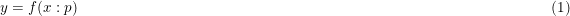 | (1) |
|:-:|:-|-------------------------------------------------:|

The result of the function together with its derivatives, parameter
values, and other possibly usefull information is packed into the
class. 

Assuming that `m` is a **Model**, all following attributes and methods are 
defined.

    np = m.npars                        # number of parameters in the model
    p = m.parameters                    # list of parameters of the model
    nd = m.ndim	                        # number of input dimensions in the model
    r = m.result( xdata, pars )         # results of f(xdata:pars)
    r = m( xdata )                      # short for m.result( xdata, p )
    dfdp = m.partial( xdata, pars )     # partial derivative of f to p
    dfdx = m.derivative( xdata, pars )  # derivative of f to x
    name = m.__str__()                  # name of the model as a string
    parname = m.parNames                # list of parameter names

### Dimensionality.

Most **Model**s are 1-dimensional i.e. they require a 1-dimensional
input vector. Two- or more-dimensional models need 2 or more numbers for
each result it produces. One could think of fitting  maps or cubes. The
results of a model is almost always a 1-dimensional vector, except 
when it is a [multiple output model](#multioutput). In those cases the 
attribute `ndout` is set to the number of output dimensions.

In general, models of different dimensionality cannot be combined into
[compound models](#compoundmodel).

### Simple Models.

Simple models are objects that are created by invoking one model class.

    m1 = PolynomialModel( 1 )
    m2 = GaussModel()

Both `m1` and `m2` are simple models. The first assumes a linear relation 
between `xdata` and `ydata`.

<!--latex
\begin{displaymath}
f(x:p) = p_0 + p_1 x 
\end{displaymath}
latex-->

| &nbsp; | 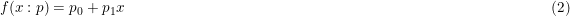 | (2) |
|:-:|:-|-------------------------------------------------:|

It has 2 parameters that can be optimized to fit the `ydata`.

The second model `m2` encapsulates the function

<!--latex
\begin{displaymath}
f(x:p) = p_0 \exp\left( -0.5 \left( \frac{ x - p_1 }{ p_2 } \right) ^ 2 \right)
\end{displaymath}
latex-->

| &nbsp; | 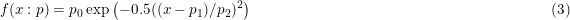 | (3) |
|:-:|:-|-------------------------------------------------:|

It has 3 parameters to be fitted.

<table><tr>
<td style="width: 10px;">  </td>
<td style="width: 350px; text-align: left;">
Figure 1 shows 3 simple models: PolynomialModel (blue), GaussModel (red) 
and ArctanModel (green).
</td></tr>
</table>

A simple model is a **Model**, i.e. all actions valid for **Model**s can be 
done with simple models.

<!--
#### Attributes

+ `npbase` : int 
    number of params in the base model
+ `ndim` : int 
    number of dimensions of input. 
    (default : 1)
+ `priors` : list of Prior 
    pertaining to each of the parameters of the model. 
    If the list is shorter than the number of parameters, the last one is repeated.
+ `posIndex` : list of int 
    list of indices indication positive-definite parameters. 
    (default : none)
+ `nonZero` : list of int 
    list of parameters that need a warning when they are equal to zero. 
    (default : none) 
    Warnings will only be issued once. Values are replaced by self.tiny
+ `tiny` : float 
    very small value, replacing zero valued when found on NonZero. 
    (default : 1e-20)
+ `deltaP` : array-like 
    (list of) width(s) for numerical partial calculation. 
    (default : 0.00001)
+ `parNames` : list of str 
    list of parameter names. 
    (default : ``parameter_k``)
-->
                                                                                                                               

### Fixed Models.

Upon construction of a simple model, the value(s) of one or more
parameters can be fixed.  Either with a constant value, turning the
model into one with less parameters, or with another **Model**. In the
latter case the parameter is changing as the **Model**. Results and
derivatives are constructed from the interacting models.

A keyword argument, `fixed=<dictionary>`, is used to construct a fixed
model. The dictionary consist of an integer key, indicating the
parameter index, and  a float value for fixing the parameter with a
constant, or a **Model** value for replacing the parameter by the model.
In the former case the fixed model has one parameter less than the original
model. In the latter case, the parameters of the replacing model are appended
to the parameters of the fixed model which also is one parameter less than
the original.

    m1 = PolynomialModel( 1, fixed={0:0.0} )	# line through origin
    m2 = GaussModel()
    m3 = ArctanModel( fixed={0:m2} )		# Gauss-modulated arctangus
    # Build a series of models of increasing polynomial order.
    pm1 = PolynomialModel( 1 )			# 1st order: p0 + p1 * x
    pm2 = PolynomialModel( 1, fixed={1:pm1} )	# 2nd order: p0 + ( p1 + p2 * x ) * x
    pm3 = PolynomialModel( 1, fixed={1:pm2} )	# 3rd order: p0 + ( p1 + ( p2 + p3 * x ) * x ) * x
    # etc. But not as efficient as PolynomialModel( 3 )

See also the [mrs-fringes example][exmrsf].

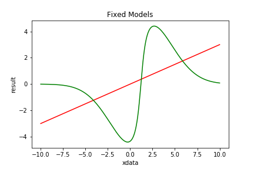
<table><tr>
<td style="width: 10px;">  </td>
<td style="width: 350px; text-align: left;">
Figure 2 shows the 2 fixed models listed above: PolynomialModel (red)
and ArctanModel (green).
</td></tr>
</table>

Fixed models are non-linear, except when the model is linear and the
parameters are fixed with constants.

A fixed model is a **Model**, i.e. all actions valid for **Model**s can be 
done with fixed models.

### Compound Models.

**Model**s can be combined by various operations (+, -, *, /, |) into a new
(compound) model. 
The 4 arithmetic operators do the obvious: they take the results of both 
models and apply the operation. 
The last operation is a pipe. It feeds the output of the first model, as 
input to the second model. 
For compound models the (partial) derivatives, (parameter) names etc are 
properly defined.

All operations are also available as assignment operators: +=, -=, *=, /=, and |=.

#### Addition (+)
To construct a gaussian emission line on a linearly changing background:

    m4 = PolynomialModel( 1 ) + GaussModel()

#### Subtraction (-)
To construct an absorption line with a voigt profile on a constant background:

    m5 = PolynomialModel( 0 ) 
    m5 -= VoigtModel()

<table><tr>
<td style="width: 10px;">  </td>
<td style="width: 350px; text-align: left;">
Figure 3 shows examples of Compound Models using addition and subtraction. 
</td></tr>
</table>

#### Multiplication (*) 
Using multiplication an alternative for m3 can be written as: 

    m6 = ArctanModel( fixed={0:1.0} ) * GaussModel() 

Note that without the fixed keyword in ArctanModel, `m6` would be
degenerate as both models have an amplitude parameter. By fixing one of
them to 1.0 the model avoids degeneracy.

#### Division (/)
To construct the inverse of *(p0 + p1 x2)*:

    m7 = ConstantModel( values=1 ) / PolynomialModel( 2, fixed={1:0.0} )

The ConstantModel is a model without parameters that returns a constant value, 
in this case 1.0 for any value of `x`.

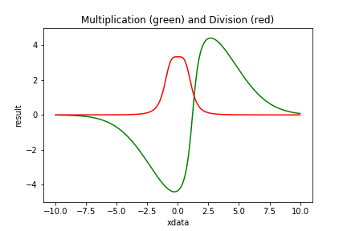
<table><tr>
<td style="width: 10px;">  </td>
<td style="width: 350px; text-align: left;">
Figure 4 shows examples of Compound Models using multiplication and division.
</td></tr>
</table>

#### Pipe (|)

A special operation that can be applied to two models 
is the pipe, indicated by |. It acts like the (unix) pipe: the
result of the left-hand model is used as input of the right-hand model.

When *m1*, *m2* and *m3* are models implementing

<!--latex
\begin{eqnarray*}
\quad m_1 &=& f_1(x:p)  \\
\quad m_2 &=& f_2(x:q)  \\
\quad m_3 &=& f_3(x:r)  
\end{eqnarray*}
latex-->

| &nbsp; | 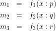 | (4) |
|:-:|:-|-------------------------------------------------:|

then

<!--latex
\begin{displaymath}
m_4 = m_1 | m_2 = f_2(f_1(x:p):q) 
\end{displaymath}
latex-->

| &nbsp; | 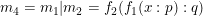 | (5) |
|:-:|:-|-------------------------------------------------:|

The input of *m2* is replaced by the result of *m1*. While in case of

<!--latex
\begin{displaymath}
m_5 = m_1 | m_2 + m_3 = f_2(f_1(x:p):q) + f_3(x:r) 
\end{displaymath}
latex-->

| &nbsp; | 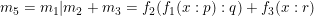 | (6) |
|:-:|:-|-------------------------------------------------:|

the m1 only influences m2, not m3. To influence both *m2* and *m3*, 
brackets are needed.

<!--latex
\begin{displaymath}
m_6 = m_1 | ( m_2 + m_3 ) = f_2(f_1(x:p):q) + f_3(f_1(x:p):r) 
\end{displaymath}
latex-->

| &nbsp; | 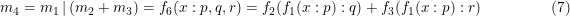 | (7) |
|:-:|:-|-------------------------------------------------:|

This is the only place where a 2-d model can be combined with a 1-d
model if the output of a 2-d model is 1 dimensional. Or in general the 
output dimensionality of the left hand model must conform the input 
dimensionality of the right hand model.

In the FixedModels paragraph a gauss modulated arctan model was
constructed. In that model the gauss and the arctan had its own x-shift
parameter.  Both parameters were set to the same value in Figure 2,
making a balanced wave function. 

To force them being the same, the x-shift parameters in both models are
fixed to 0. Then x is shifted linearly and it is piped through the other
models. 

    m10 = ArctanModel( fixed={0:1.0,1:0.0} ) * GaussModel( fixed={1:0.0} )
    m11 = PolynomialModel( 1, fixed={1:1.0} ) | m10

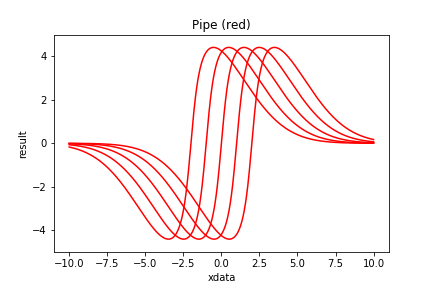
<table><tr>
<td style="width: 10px;">  </td>
<td style="width: 350px; text-align: left;">
Figure 5 shows examples of Compound Models with a pipe.
</td></tr>
</table>

Compound models are **Model**s and can be combined with other (compound)
models into a new model. This way quite complicated models can be formed
without worrying about internal consistency. See the 
[gaussfit example][exgaus].

Compound models are non-linear
unless all its constituents are linear and its operations are additive.

A compound model ia a **Model**, i.e. all actions valid for **Model**s can be 
done with compound models.

### Brackets

The models in a chain are processed, from left to right. There is no
adherence to operation preferences. However, when a *compound* model is
appended to a chain, the appended model is considered as a single unit.
It gets a set of brackets around it. If `m1`, `m2` and `m3` are all models, then 

    m = m1 * m2
    m += m3

is different from

    m = m1
    m *= m2 + m3

The first is processed as `( m1 * m2 ) + m3` while the second is processed
as `m1 * ( m2 + m3 )`. The brackets are introduced implicitly. 
This feature was used in the piping example above.
Explicit placement of brackets can be done as m = m1 * ( m2 + m3 ).

### ConstantModel

The **ConstantModel** returns the same (constant) result no matter what 
the input. The result can be a single value (0, 1 or whatever) or the 
result of another **Model** with known parameters or even a table. 
However, if a table is used, the table values are returned as result, 
irrespective of whatever the input was.

The **ConstantModel** has no parameters and strictly speaking, it can not
be fitted. It states that the the data, except for the constant form, is
mere noise.  It might seem a useless class, but it can be interesting in
model comparison. E.g. to decide whether some feature is present or not.
See [example][exradi].

    m1 = ConstantModel( value=1.5 )
    m2 = ConstantModel( fixedModel=ExpModel( params=[1.0, -2.0] ) )

### CombiModel

A **CombiModel** combines a number of repetitions of the same model,
possibly with relations of same parameters.

    gm = GaussModel()               # model to be repeated
    ac = {1:[0,1.4,2.7,3.6]}        # add connection of par[1] (centers)
    mc = {2:[1,1,1,1]}              # mul connection of par[2] (widths)
    m12 = CombiModel( gm, nrepeat=4, addCombi=ac, mulCombi=mc )

In the example case above all gauss widths are the same and the lines
have a fixed separation. The remaining parameters are
[amp0, center, width, amp1, amp2, amp3].

<table><tr>
<td style="width: 10px;">  </td>
<td style="width: 350px; text-align: left;">
Figure 6 shows example of a Combi Model.
</td></tr>
</table>
    
See also the 
[combifit example][excomb].

A **Repeating Model** is another way to define a repetition of the same model.
The difference is that **RepeatingModel**s can be [dynamic](#dynamic).

### Kernel Models

**KernelModel**s encapsulate kernel functions into a model. A kernel
function is a an even integrable function. It is bound if the function
value is 0 everywhere except for a region around zero.

    km1 = KernelModel()                     # default: Biweight
    km2 = KernelModel( kernel=Cosine() )
    km3 = KernelModel( kernel=Tophat( 0 ) )
    km4 = KernelModel( kernel=Tophat( 1 ) )
    km5 = KernelModel( kernel=Tophat( 4 ) )

<table><tr>
<td style="width: 10px;">  </td>
<td style="width: 350px; text-align: left;">
Figure 7 shows examples of KernelModels. The Biweight kernel is in blue;
the Cosine in green. The remaining 3 are 0, 1 and 4 convolutions of Tophat.
</td></tr>
</table>

**SincModel** is actually defined as a **KernelModel** with a Sinc kernel.
Both **GaussModel** and **LorentzModel** could be defined in the same
way, but are not.

Two dimensional kernel models also exist: **Kernel2dModel**. They come is
3 varieties: circular, elliptic and rotated.

    km6 = Kernel2dModel( kernel=Gauss )
    km7 = Kernel2dModel( kernel=Gauss, shape='elliptic' )
    km8 = kernel2dModel( kernel=Gauss, shape='Rotated' )

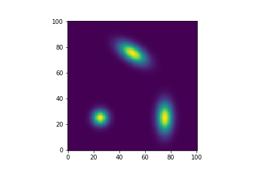
<table><tr>
<td style="width: 10px;">  </td>
<td style="width: 350px; text-align: left;">
Figure 8 shows examples of Kernel2dModels. Lower left is a circular 2d
kernel; lower right an elliptic one and in the upper center a rotated one. 
</td></tr>
</table>

  
### Dynamic Models

Dynamic models can alter their behaviour by changing the number of 
parameters they contain. The purpose is to find the best model both in
complexity (number of parameters) as in the parameter values itself.
**Fitter**s cannot do this, however the **NestedSampler** can.

Dynamic models have 2 extra methods `grow()` and `shrink()` that increase
cq. decrease the number of parameters. The rate of growth is governed by
a growPrior.

Dynamic models inherit from **Model** and from **Dynamic**.

    mdl1 = PolynomialDynamicModel( 2 )
    mdl2 = HarmonicDynamicModel( 0, maxOrder=6 )
    mdl3 = RepeatingModel( 1, GaussModel(), minComp=1, maxComp=7,
		same=2, growPrior=JeffreysPrior() )

mdl1 starts as a polynomial of degree 2. It has a minimum degree of 0
and no maximum. The growPrior is an **ExponentialPrior**. 

mdl2 starts as a HarmonicModel of order 0 with a maximum at 6. The
growPrior is a **UniformPrior**. 

mdl3 consists of at least 1 repetition of a **GaussModel**, up to 6 repetitions
are possible, where all **GaussModel**s have the same value for the 2nd
parameters (width).

### Modifiable Models

Modifiable models can alter the internal structure of the model. E.g.
the location of the knots in **SplinesNodel**. Again the purpose is to
find the best internal structure and the best parameters that go with
it. This can be done with **NestedSampler**

Modifiable models implement an extra method `vary()` that varies the
structure. 

Most modifiable models are dynamic. They always inherit from
**Modifiable** too.

It is indeed debatable whether the internal structure is not just
another set of parameters. We chose this way as changes in the internal
structure can be much more complicated than a simple change in value. 

An example of a Dynamic, Modifyable model can be found [here][exCoro] or
[here][exchir].

### Multiple Output Models

Some models are easier defined when it results in 2 (or more) values per
observation. Eg. the outcome of football match (3-1), or the position of
a star in orbit around another (distance and angle). These model have an
extra attribute `ndout` indicating how many output values per
observation are present. See [example][exUefa].

The use of **MultipleOutputProblem** is needed in **NestedSampler** to
flatten the multiple outputs.

### External Models

The class **AstropyModel** is a wrapper for models originating from
astropy.modeling.Model. Any **FittableModel**, wrapped in an
**AstropyModel** can be used in BayesicFittings fitters and samplers.

    from astropy import modeling
    gm = modeling.models.Gaussian1D()
    model = AstropyModel( gm )

See [example][exHerm] for how to construct and use an Astropy-fittable 
model.

Using **UserModel**, externally generated functionals of the form f(x:p)
can participate.

    def f( x, p ) :
        return p[0] * numpy.sin( p[1] * x + p[2] * numpy.log( x + p[3] ) )
    model = UserModel( 4, f )		# 4 is the number of parameters
	
Optionally the partial derivatives df/dp and df/dx, and a name can be
provided too. Otherwise numerically calculated values will be used.

    model = UserModel( 4, f, userPartial=dfdp, userDeriv=dfdx, 
                       userName="myName" )

Where dfdp and dfdx are methods: dfdp( x, p ) and dfdx( x, p ). The
correctness of the (partial) derivatives can be checked with the method

    model.testPartial( x, p, silent=False )

The methods are compared with numeric calculations of df/dp and df/dx.

See [example][exBess] for how to construct and use a user-defined model

## 4. Fitters 

A **Fitter** is an algorithm that minimizes the errors **&epsilon;**,
the differences between the data, **y**, and the model, **f(x:p)**.

<!--latex
\begin{displaymath}
\epsilon = y - f(x:p) 
\end{displaymath}
latex-->

| &nbsp; | 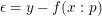 | (8) |
|:-:|:-|-------------------------------------------------:|

The best fit is found through optimization of the parameters **p**.
Traditionally this is done by finding the minimum of
**&chi;2**, the sum of the squared errors. This least-squares
method is computationally simple, especially if **f** is a linear
function in its parameters **p**. These problems can be solved by (the
equivalent of) one matrix inversion.
Non-linear least-squares methods also exist. They are more demanding and
require iterative methods to arrive at the minimum.  Still, they are
relatively simple.

Other methods focus around the maximalization of the likelihood. Maximum
likelihood is attained when the errors are minimal.
Several likelihood functions, defining the probability of the errors,
obtained by the combination of model and data, are available in BayesicFitting.
These likelihoods are also known as [**ErrorDistribution**](#list-errdis)s.
Using the **GaussErrorDistribution**, while maximizing the likelihood 
is equivalent to using the least-squares method. And if the **Prior** is
a **UniformPrior** for all parameters, the maximum likelihood solution
is the same as the maximum posterior solution.  While the posterior
itself is a multidimensional Gaussian.

Procedures like least squares and maximum likelihood are usefull parts
of the Bayesian framework. 

### Data Quality.

In a fitting process, it often occurs that data points are of different 
quality due to a variety of reasons. 
We can express the qualities as either importance weights attached to 
the data points, or as a scale factor in the residuals. 
In our paper [Kester and Mueller (2021)](./references.md/#kester8) we 
expressed our preference for weights.
However, we reconsidered it in the light of correlated errors in both
axes, see [Data Quality](./dataquality.html)
Since version 3.1.0 of BayesicFitting, we offer both options.

#### Weights.

Up on fitting, weights can be provided as a vector of the same length as
the data vector.  The behaviour of the fitter is such
that when a point has a weight of n, this is equivalent to a case where that
particular point is present in the dataset n times. This concept is
extended to non-integral values of the weights. 
Weights could be derived from the standard deviations in a previous
calculation. In that case the weights should be set to the inverse
squares of the stdevs. However weights do not need to be inverse
variances; they could be derived in any other way. One specially usefull
feature of the use of weights, is that some weights might be set to zero,
causing those points not to contribute at all to the fit.

#### Accuracy.

The accuracy is a (set of) numbers that represent a user provided estimate 
of the size of the errors. 
Accuracies do not change the "number of observations", as weights do. Each 
measurement might have a different accuracy; it is still one measurement. 
When choosing weight = accuracy-2, the difference only matters 
in the calculation of the evidence. 
Accuracy can be one number, valid for all data, or a vector of N, one value for 
each data point. When there are possibly errors in both the dependent variable 
and the independent variable, it can be a matrix of (N,2) or of (N,3). 
In the latter case the third number is the (Pearson) correlation coefficient 
between both variables. 

### Linear Fitters.

As with **Model**s there are two kinds of **Fitter**s, linear an
non-linear ones for linear and non-linear **Model**s resp. 

The landscape for linear models is monomodal i.e. it has only
one (global) minimum. The linear fitter has generally no problem finding
this minimum in one direct matrix conversion. It is fast and efficient.
This package has 2 linear fitters: **Fitter** and **QRFitter**.

    xdata = numpy.asarray( [1.0, 1.3, 1.5, 1.8, 2.0] )
    ydata = numpy.asarray( [3.2, 3.9, 3.7, 4.0, 5.6] )
    model = PolynomialModel( 1 )        # suppose liner relation 
    ftr = Fitter( xdata, model )        # define the fitter
    par = ftr.fit( ydata, plot=True )   # optimal values for parameters
    
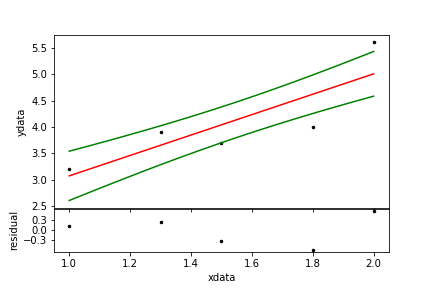
<table><tr>
<td style="width: 10px;">  </td>
<td style="width: 350px; text-align: left;">
Figure 9. A simple linear fit. The black dots are the data,
the red line is the model and the green line a one-sigma
confidence region.
</td></tr>
</table>

### Non-linear Fitters.

For non-linear models the &chi;2-landscape can be complicated.
It can have many minima of which only one is the deepest. That is the
one the fitter should find. Non linear fitters search for a gradient in
the landscape to descend into the valley. Wherever a minimum is found,
most fitters get stuck. There are several strategies to search the
landscape but all of them are iterative. There is no single best
strategy. It depends on the problem and on knowledge of the starting
values for the parameters. This package has a dozen  non-linear fitters.

Some non-linear fitters are strictly least-squares, others can be used as
maximum likelihood fitters too.

    xdata = numpy.asarray( [ 0.0, 1.0, 1.3, 1.5, 1.8, 2.0, 3.0] )
    ydata = numpy.asarray( [-1.2,-0.9,-0.3, 0.0, 0.5, 1.0, 0.8] )
    wgts  = numpy.asarray( [ 0.5, 2.1, 0.9, 1.3, 1.2, 0.8, 1.1] )  # weights
    model = ArctanModel( )    
    ftr = LevenbergMarquardtFitter( xdata, model )  # define the fitter
    par = ftr.fit( ydata, weights=wgts )            # optimal parameters 

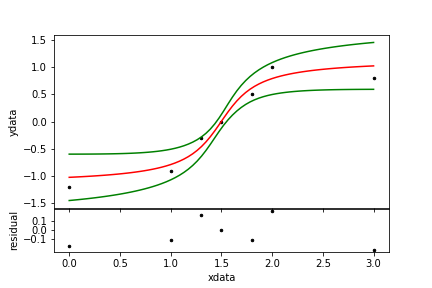
<table><tr>
<td style="width: 10px;">  </td>
<td style="width: 350px; text-align: left;">
Figure 10. A non-linear fit.
</td></tr>
</table>

### Maximum Likelihood Fitters.

**LevenbergMarquardtFitter** and **CurveFitter** are strictly least
squares fitters. Other non-linear fitters like **AmoebaFitter** and the
**ScipyFitter**s can also be used as **MaxLikelihoodFitter**s. 
The maximize the [likelihood](#list-errdis) selected for the fitter.

    ftr = AmoebaFitter( xdata, model, errdis='laplace' )

See the [summerdays example][exsumm].

### Fitter Results.

When an optimal solution for the parameters has been found, a number of
methods, all inherited from **BaseFitter**, are available to calculate
[standard deviations](./glossary.md/#stdev), 
[noise scale](./glossary.md/#noise), 
[&chi;2](./glossary.md/#chisq), 
[confidence regions](./glossary.md/#confidence)
and the [evidence](./glossary.md/#evidence). 

    par   = ftr.parameters           # optimal parameters (same as above)
    stdev = ftr.stdevs               # standard deviations on parameters
    covar = ftr.covariance           # covariance matrix
    chisq = ftr.chisq                # chisq at the optimal params
    scale = ftr.scale                # scale of the remaining noise
    yfit  = ftr.getResult()          # fitted model values
    yfit  = model( xdata )           # same as previous
    yband = ftr.monteCarloError()    # 1-sigma confidence region

All items above are more or less derived from the covariance matrix at
the optimal parameter location.

### Evidence.

The [evidence](./glossary.md/#evidence) is a number that indicates how
probable a model is given the data. Evidence is not an absolute number;
it must always be used to compare one model with other model(s).

For the casual user the evidence is the single item that lifts Bayesian
fitting way above ordinary fitting. Wonderful things can be done with it
that are beyond the standard ways. See my papers 
[Kester (1999)](./references.md/#kester1), 
[Kester, Beitema and Lutz (2009)](./references.md/#kester3), 
[Kester and Bontekoe(2010)](./references.md/#kester4), 
[Kester (2010)](./references.md/#kester5), 
[Kester, Avruch and Teyssier (2014)](./references.md/#kester6) and
[Kester, Higgins and Teyssier (2017)](./references.md/#kester7).

 
The evidence can only be calculated when the limits on the parameters
are provided. And, when the noise scale is fitted too, also for the
scale. [Priors](./glossary.md/#prior) for the parameters are assumed to
be Uniform, for the scale it is JeffreysPrior.

It is up to the user to make sure that the optimal parameters and noise
scale are well within the limits provided. Otherwise the gaussian 
approximation of the evidence calculation is invalid.

    limits = [-100.0,100.0]             # either 2 floats: all pars same limit. Or
    lo = [-100.0, 0.0, 10.0]            # lower limits for the parameters
    hi = [+100.0, 100.0, 20.0]          # upper limits for the parameters
    limits = [lo,hi]                    # or 2 lists of floats
    noiselim = [0.01, 10]               # limits on noisescale; all > 0
                                        # the 10-log evidence is obtained as:
    evidence = ftr.getEvidence( limits=limits, noiseLimits=noiselim )

When in the above examples `model` has more than 3 parameters, the last limit
is repeated for all remaining cases. 

There is a lot of mumbo-jumbo about priors. Formally, it is a
representation of the knowledge about the problem before the data is
taken into account. In abstracto one could imagine that there is no
prior knowledge. In such cases the determination of priors seems highly
subjective. However, in real life problems there are always limits
on what can be measured in sensitivity, spectral range, duration,
location etc. And consequentially on what values the parameters can attain. 

See [example on model comparison][exmode] or
[harmonicfit][exharm] for demonstration of the use of
evidence to determine the best model.
For instructions on when to optimize the noise scale too, see
[noise2 example][exnoi2].
For a demonstration on the influence of noise on model selection see
[noise example][exnois].

### Keep fixed.

The **Fitter**s have the option to keep one or more parameters fixed
during the fitting proces.
It can be done in the construction of the fitter 

    fitter = SomeFitter( xdata, model, keep={key:value} )

to fix the parameter for the lifetime of the fitter.
Or in the fit method itself.

    params = fitter.fit( ydata, keep={key:value} )

to fix the parameter for this fit only.
In both cases, `key` is a parameter index and `value` is a float at which
the parameter should be fixed.

Note that [fixing the parameter in the model](#fixedmodel) replaces
a parameter permanently with the chosen value. 

See the [fix parameters example][exfixp]
for the suble differences between fixing the model, the fitter or the fit.

### Two or more dimensions.

Sometimes the independent input `xdata` has more than 1 dimension. Then
a 2 or more dimensional models is required for a fit. The input,
`xdata`, is of the form array[N,D], where D is the number of dimensions
and N is the number of D-dimensional points. If N = 1 it can collapse to
array[D].

When the data to be fitted has the form of a map, or a cube, the `xdata`
still need to be an enumeration of all pixels. **ImageAssistant**
extracts the necessary `xdata` from the map, and converts the map values
in 1-d `ydata`. It is silently invoked by the fitter when the keyword
map is set.

    y = numpy.zeroes( (3,4), dtype=float )  # some empty map 
    mdl = PolySurfaceModel( 0, 0 )
    fitter = Fitter( y, mdl, map=True )     # use y here as xdata
    print( fitter.xdata.shape )             # show shape of internal xdata
    > [12,2]
    pars = fitter.fit( y )                  # use y here too, now as ydata
    print( fitter.yfit.shape )              # show the shape of the result
    > [3,4]                                 # same as the original map y
    print( mdl( fitter.xdata ).shape )      # the model however, returns  
    > [12]                                  # a 1-d version of y

See [simplemap][exsimp] for more about the use of the keyword `map`. 
And [randommap][exrand] for random
observation in a 2-d object and about the explicit use of
**ImageAssistant**.

### Robust fitting.

A special fitter is **RobustShell**. It is a shell around any other
fitter. **RobustShell** iteratively de-weights outlying points. It makes
the fit more robust in the presence of a minority of outliers i.e.
points that should not partake in the fit. The de-weighting process is
governed by one of the [kernels](#synops-kernel).

    np = 101                                # 
    xdata = numpy.linspace( 0, 1, np )      # make 101 datapoints
    ydata = numpy.linspace( 0.3, 0.5, np ) + 0.3 * numpy.random.rand( np )
    no = 20                                 # 20 outliers
    out = numpy.asarray( np * numpy.random.rand( no ), dtype=int )
    val = 1 * numpy.random.rand( no )
    ydata[out] += val                       # at random place, value
    pm = PolynomialModel( 1 )               
    ftr = Fitter( xdata, pm )               
    par0 = ftr.fit( ydata )                 # simple fit
    rft = RobustShell( ftr )
    par1 = rft.fit( ydata )                 # robust fit
    rwgt = rft.weights                      # resulting robust weights

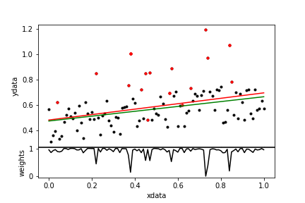
<table><tr>
<td style="width: 10px;">  </td>
<td style="width: 350px; text-align: left;">
Figure 11. A robust fit. The data points are in black; the outliers are
red. The normal fit is the red line; the robust fit is green. In the
lower panel the resulting weights are displayed.
</td></tr>
</table>

Robust fitting is even more dangerous than ordinary fitting. Never trust
the results without thorough checking.

This more elaborate [example][exoutl] shows the suppression of
irrelevant points. 

<!--
### Normalize

### Set limits.

-->

## 5. Samplers

### NestedSampler

**NestedSampler** is a novel technique to do Bayesian calculations.  It
samples the Posterior while integrating it to calculate the evidence.
The evidence and the samples from the posterior are the main results of
NestedSampler. From the samples, the optimal values for the model
parameters, its standard deviations etc can be calculated.

Nested sampling is an idea of David McKay and John Skilling.
Skilling has written a separate chapter in [Sivia's book](./references.md/#sivia)
explaining the Nested Sampling idea, including an algorithm in C, which
served as the basis (via JAVA) for our implementation. 

**NestedSampler** applies an ensemble of walkers, initially evenly
distributed over the prior probability. Then an iterative process is
started. Every iteration the walker with the lowest likelihood is
discarded and replaced by a copy of one of the remaining walkers. The
copied walker is wandered around randomly by one or more **Engine**s, 
provided it keeps a higher likelihood than the value of the discarded
walker. Each of these steps is at a valid position, where they could
be part of the ensemble. The steps are called phantoms. 
By this procedure the ensemble of walkers stays randomly distributed over
the prior while the ensemble as a whole slowly ascends the likelihood
to the top. The discarded walker is kept as a sample of the posterior,
appropriately weighted. 
**NestedSampler** uses **Prior**s for the initial distribution and for
the sampling strategy of the parameters. An **ErrorDistribution** is
used to calculate the likelihoods.

**NestedSampler** needs more information to run than ordinary
**Fitter**s. It needs priors for all  its parameters and it needs a
likelihood function. 

We start off defining some data. 

    xdata = [1.0, 2.0, 3.0, 4.0, 5.0]
    ydata = [0.2, 1.3, 4.5, 1.4, 0.1]

Set up the model with limits on the uniform priors of the parameters.

    model = GaussModel()
    lolim = [-10.0, 0.0, 0.0]		    # low limits on the params
    hilim = [+10.0, 5.0, 5.0]		    # high limits
    model.setLimits( lolim, hilim )	    # use UniformPrior with limits

The likelihood is calculated by the **GaussErrorDistribution**. By
default it has a fixed scale (= 1). However in most real cases ( see 
[noise2 example][exnoi2] )  it is better to 
treat the scale as a hyperparameter, which needs a prior, by default a
**JeffreysPrior**, and limits.

    limits = [0.01, 10]
    ns = NestedSampler( xdata, model, ydata, limits=limits )	

We execute the program as

    logE = ns.sample()

where `logE` is the 10log of the evidence.

After the call to `sample()` optimal parameters, standard deviations, scale and the
optimal fit of the model are available from **NestedSampler**.

    param = ns.parameters
    stdev = ns.standardDeviations
    scale = ns.scale
    yfit  = ns.modelfit

The values are actually obtained from the **SampleList**, a list of
**Sample**s, that is the other result of the **NestedSampler**.
From the **SampleList** numerous items can be extracted.

    slist = ns.samples
    param = slist.parameters		## same as params above
    mlpar = slist.maxLikelihoodParameters

In the examples directory the use of **NestedSampler** is demonstrated
in [HD2039][exHD20] and [outliers2][exout2].

### PhantomSampler

**PhantomSampler** is an extension of **NestedSampler**, in the sense 
that it uses all phantoms to calculate the evidence integral. 
The phantoms are the intermediate steps taken by the walker when it
is wandered around by the engines. In general there are much more
phantoms than walkers. Keeping the same density in integration steps,
we need less walkers, which speeds up the algorithm. By default
**PhantomSampler** has an ensemble of 20 walkers. 

The downside is possibly less precision due to correlation between the
phantoms.

The **PhantomSampler** is operated in the same way as **NestedSampler**.

### NestedSolver

**NestedSolver** applies the same algorithm to **OrderProblem**s, where 
the problem is solved by finding an optimal order. The parameters are no
floats but integers, that provide an ordering of the data. The iconic 
example is the traveling salesman problem. However all kind of scheduling 
problems fall in this category too.

A problem specific cost function functions as a (unnormalized) likelihood. 
As the likelihood is unnormalized, **NestedSolver** can not calculate an
evidence. Instead, **NestedSolver**'s `solve()` method returns the last 
(best) sample as the solution of the order problem.

### Problem

The **Problem** classes have been introduced in version 2.0. They are
meant to broaden the applicability of NestedSampler beyond the classic
problems that we addressed before. A **Problem** collects all items that 
are needed to solve the problem, where the parameters constitute the
solution. 

A **ClassicProblem** consists of a parameterized model with a list of
measured data at the locations of the independent variables. Optionally
there are weights and/or accuracies. 
The **ClassicProblem** is invoked by default.

Other **Problem**s need to be invoked separately.

In case there could be errors both in the independent variable (x) and in
the dependent variable (y), the **ErrorsInXandYProblem** should be
invoked. To solve this kind of problems we need to assign extra
parameters for all values of the independent variable (x). These new
positions need to be estimated along with the parameters of the model
itself. These new parameters need a prior. A **GaussPrior** with a fixed
scale is advised. The priors will be centered on the measured x values.

    prior = GaussPrior( scale=0.1 )
    problem = ErrorsInXandYProblem( model, xdata, ydata, prior=prior )
    ns = NestedSampler( problem=problem )
    evidence = ns.sample()

The extra parameters needed here, are called nuisance parameters.

For models that naturally produce 2 or more dimensional outputs (like
the **StellarOrbitModel**) the **MultipleOutputProblem** need to be
invoked. It just reshapes the residuals into a 1-dim array before it is
used to calculate the likelihood.

The **EvidenceProblem** uses the evidence calculated for different
instantiations of a **Modifiable** model, as "likelihood" in a next
level of Bayes' theorem to determine which of the instantiations is best.
The "likelihood" to be used here is the **ModelDistribution**. It
calculates the evidence of the model either as a Gaussian approximation
or by using **NestedSampler** on a **ClassicProblem**.

The **OrderProblem** is for integer valued problems where the solution 
is found in some ordering of the data. The only example now is the
**SalesmanProblem**. 

See below for lists of available [**Problem**s](#list-problems). 
More **Problem**s can be expected in later versions.
 

### Samples and SampleList

A **Sample** is a collection of items.

+ id : int 
    identity of the sample.
+ parent : int 
    id of the parent of this sample.
+ model : Model 
    the model being used.
+ parameters : array-like 
    list of model parameters.
+ hyper : array-like (optional) 
    list of hyper parameters from the **ErrorDistribution**.
+ nuisance : array-like (optional) 
    list of nuisance parameters.
+ logL : float 
    log Likelihood = log P( data | params )
+ logW : float 
    log weight. The weights are found as the exp( logW ).
    The weights sum to 1.0 when normalized
+ fitIndex : None or array-like 
    list of all parameters to be fitted; None is all.
    

The resulting samples from the posterior are collected in list of
samples, a **SampleList**.  Once a sample list is obtained from a
NestedSampler run, weighted average parameters and scale can be obtainde
from it.  The maximum likelihood version of the same, is located at the
last index of the sample list.  Median and modus version can be found at
the midpoint of the cumulative weights, resp.  the maximum value of the
weights. 

    slist = ns.samples
    param = slist.parameters		## same as params above
    mlpar = slist.maxLikelihoodParameters
    

When using the samples of the posterior for other purposes than are
provided in **SampleList**, all items derived from individual
**Sample**s should be weighted with

    weight = exp( sample.logW )

before averaging them.
    

### Walkers and WalkerList.

The internal ensemble of trial points is designed as a **WalkerList**, 
or a list of **Walker**s. **Walker**s are similar to **Sample**s, except 
that they have a **Problem** in stead of a **Model**.

The number of walkers can be set with the `ensemble` keyword. By default
`ensemble=100`. The number of walkers that are discarded in every
iteration can be set with `discard`. By default `discard=1`. When
discard is greater than 1, it might be profitable to set the keyword
`threads=True` to randomize each walker in a separate thread. And
finally the keyword `maxsize` can be used to limit the amount of
resulting samples. When the size of the sample list is larger than
maxsize, the samples with the smallest weights are thrown out. By
default `maxsize=None`.

    ns = NestedSampler( xdata, model, ydata, ensemble=200, discard=5,
                        threads=True, maxsize=5000 ) 

### Prior

Before **NestedSampler** can be started with `ns.sample()` the **Model**
should be provided with **Prior**s for all parameters. The same holds
for the **ErrorDistribution** if it has unknown hyperparameters.

Priors are attributes of the simple model.

    gm = GaussModel()
    amppr = ExponentialPrior( scale=10 )        # prior on amplitude (>0)
    cenpr = UniformPrior( limits=[-1,1] )       # prior on center
    widpr = JeffreysPrior( limits=[0.1, 2] )    # prior on width
    gm.priors = [amppr, centpr, widpr]          # set the priors
    
The default prior for model parameters is the **UniformPrior**. The
**UniformPrior** needs limits: low and high. When a **Model** is
provided with limits it sets the priors as **UniformPrior** with the limits.

    low = [0.0, 2.0, -10]           # lower limits
    high = [10, 10, 10]             # upper limits; high[k]>low[k] forall k
    model.setLimits( low, high )    # makes list of 3 uniformPriors with limits

When the model has more parameters than the length of the limits cq.
priors, the last one is repeated for all remaining parameters. 

The priors are attributes of the simple models. In compound models the
priors are taken from the constituent simple models, including the
repetition of the last prior. So priors should be set, before using the
simple model in a compound one. 

Suitable **Prior**s can have limits, which may be circularly folded for
parameters that represent a phase or a period.
The circular keyword either takes a boolean, to indicate that it is circular 
between the limits, or a float to define the period of circularity.

    lp = LaplacePrior( center=1.0, scale=0.5, circular=3 )
    pr = UniformPrior( limits=[2,3], circular=True )

See below for lists of available [**Prior**s](#list-priors).

### ErrorDistribution

The **ErrorDistribution** determines the likelihood function.

Except the **PoissonErrorDistribution** and the
**BernoulliErrorDistribution** all others have one or more
**HyperParameter**s which are governed by a **Prior**, unless they
are known in advance.

    dis = GaussErrorDistribution( )
    dis.setLimits( [0.1, 1.0] )
    ns = NestedSampler( xdata, model, ydata, distribution=dis )

The **GaussErrorDistribution** is an descendant of the abstract 
**ScaledErrorDistribution**. As is the **LaplaceErrorDistribution**, the
**ExponentialErrorDistribution** and the **UniformErrorDistribution**.
They are all different norms of the residuals. The
**ExponentialErrorDistribution** has another **HyperParameter** called
power, It is the (fractional) norm.

The **PoissonErrorDistribution** is for counting experiments, with 
integer-valued data. 

The **BernoulliErrorDistribution** is for categorical data.  It needs a
model with as much outputs (ndout) as there are categories.  The
dependent variable (y) contains an integer (< ndout) indicating to which
category this data point belongs.  Each model output gives the
probability (0 <= p <= 1), that the item falls in that category.  
At present only the **SoftMaxModel** is available. 

The use of a mixture of 2 error distributions
(**MixedErrorDistribution**) is shown in
[outliers2][exout2].

To avoid certain combinations of parameters a "constrain" attribute can be 
attached to an **ErrorDistribution**. It needs to be a user-provided callable 
method in the form

    def insideSphere( logL, problem, allpars, lowLogL ) :
        return logL if numpy.sum( numpy.square( allpars ) ) < 1.0 else lowlogL - 1

    errdis.constrain = insideSphere

When the to be avoided condition occurs logL is returned as one less than the 
low likelihood limit so it will never be selected. 
Otherwise logL should be returned unchanged. It should be noted that the 
acceptable area should be large enough that it can reasonly be sampled randomly
for an initial ensemble of **Walker**s. 
Although the constrain is applied during the calculation of the likelihood, 
it is actually a prior condition. It is known beforehand that there are areas 
in the parameter space that are inaccessable cq. should be avoided.

See below for lists of available [**ErrorDistribution**s](#list-errdis).

Since version 2.0 the **ErrorDistribution**s has changed its interface.
Previously it was called as `GaussErrorDistribution( xdata, ydata )`.
Now the responsiblities of ErrorDistribution and Problem are better separated. 

For the only **OrderProblem** at present we provide the **DistanceCostFunction** 
to obtain a proxy of the likelihood.

### Engine

An **Engine** is piece of programming that moves a walker around in
parameter space such that the resulting walker is distributed randomly
over the priors within the constraint that the likelihood associated
with the walker remains higher than a preselected level.

The engines of choice for continuous parameter estimation are the
**GalileanEngine** and the **ChordEngine**. 

The **GalileanEngine** starts at the copied walker. It selects a random
step in parameter space and moves forward half a dozen times. When a
step trespasses the likelihood boundary it mirrors on the boundary to
get back into allowed space. If that is also unsuccesfull in reverses
its steps.

The **ChordEngine** selects a random direction, though its starting point.
It extends that direction until is is outside the the selected level. 
It selects a random point on the line. If it is inside the level, it is 
the new point. Otherwise replace one of the endpoints and select again.

The initial distribution of the walkers is made by **StartEngine**.

When the model is dynamic, the **BirthEngine** and **DeathEngine** are
added to the engine list to govern the increase and decrease of the
number of parameters.

When a model is modifiable, the **StructurEngine** is added to the
engine list, to randomly change the structure of the model.

For the **SalesmanProblem** 5 engines are provided that all change the 
order in the parameters by some way: **MoveEngine**, **ReverseEngine**,
**SwitchEngine**, **LoopEngine**, **ShuffleEngine** and **NearEngine**.

**Engine**s are selectable in the construction.
The keyword `rate` governs the speed of the engines. High rate equals
high speed equals low accuracy.  

    ns = NestedSampler( xdata, model, ydata, rate=0.5,
                        engines=["galilean", "gibbs", "chord", "step"] )

See below for lists of available [**Engine**s](#list-engines).

Each iteration of **NestedSampler** the **Engine**s in the list are 
selected in a random order and executed until enough movement is provided 
to the **Walker**. By setting the attributes "slow" to an **Engine**, it 
is selected only every slow-th iteration. With

    ns.engine[1].slow = 3  

the **GibbsEngine** is selected every third iteration only. To be used for 
expensive, biased or unbalanced **Engines**.

### PhantomCollection

The **PhantomCollection** collects all valid steps that each walker take 
on their way to randomization. For non-dynamic models the **PhantomCollection**
is just a **WalkerList** containing a walker at each step. For dynamic models, 
it is a dictionary with the number of parameters as key and a **WalkerList** 
as value. The **WalkerList**s are kept sorted according to their log Likelihood 
and cropped to the present likelihood constraint. 

The **PhantomCollection** is used as a proxy for a bounding box that encompasses 
the accessable likelihood area, given the present likelihood constraint.

Other uses of the **PhantomCollection** are under development.
 

### Other keyword arguments

Just like the **Fitter**s **NestedSampler** can have a keywords
`weights` to set weights and `keep` to keep some parameters fixed at a
known value. Both keywords act as in the **Fitter**s.
Also analog to the fitters, the `sample()` method can have the
keywords `keep` and `plot`.

When the keyword `bestBoost` is set to `True`, every walker step is 
checked whether it is the best in the **PhantomCollection**. 
If so, a **Fitter** is run, starting from the best point to improve 
it even further. As this is done in the **PhantomCollection**, it does 
not affect the evidence calculation, but it could open a corridor
to the top that otherwise might not be found. By default `bestBoost` 
is `False`. Other options are `True`, using a **LevenbergMarquardtFitter**,
or the name of some other (non-linear) fitter which is then used.

The keyword `verbose` determines how much output the program generates.

+ 0 : silent
+ 1 : basic information. it is the default.
+ 2 : some info about every 100th iteration
+ 3 : some info about every iteration

The keyword `seed` seeds the random number generator, to ensure the same
random sequence each run.

    ns = NestedSampler( xdata, model, ydata, weights=wgts, keep={0:1.0},
                        seed=123456, verbose=2, bestBoost=True ) 
    logE = ns.sample( keep={2:3.14}, plot=True )

## 6. Synopsis

All classes are listed with a one-line purpose. They are organized by
their functionality into 5 sections, models, fitters, nested sampling,
kernels and miscellaneous.

  
### Models

  
#### simple models 1-dimensional

+ **ArctanModel** 
    Arctangus Model. See [example][exarct]
+ **BasicSplinesModel** 
    General splines model of arbitrary order and with arbitrary knot settings.
+ **BSplinesModel** 
    General b-splines model of arbitrary order and with arbitrary knot settings.
+ **ChebyshevPolynomialModel** 
    Chebyshev polynomial model of arbitrary degree.
+ **ConstantModel** 
    ConstantModel is a Model which does not have any parameters.
+ **EtalonModel** 
    Fabry-Perot Etalon Model. See [example][exmrsf]
+ **ExpModel** 
    Exponential Model. See [example][exexpf]
+ **FreeShapeModel** 
    Pixelated Model.
+ **GaussModel** 
    Gaussian Model. See [example][exgaus]
+ **HarmonicModel** 
    Harmonic oscillator Model. See [example][exharm]
+ **KernelModel** 
    Kernel Model, a Model build around a [**Kernel**](#synops-kernel).
+ **LogisticModel** 
    Logistic function.
+ **LorentzModel** 
    Lorentz profile
+ **PadeModel** 
    General Pade model of arbitrary degrees in numerator and denominator.
    See [example][exboyl]
+ **PolySineAmpModel** 
    Sine of fixed frequency with polynomials as amplitudes.
+ **PolynomialModel** 
    General polynomial model of arbitrary degree. 
    See [example][exseal]
+ **PowerLawModel** 
    General powerlaw model of arbitrary degree.
+ **PowerModel** 
    General power model of arbitrary degree.
    See [example][exboyl]
+ **PseudoVoigtModel** 
    Weighted sum of Gauss and Lorentz models; approximation of **VoigtModel**
+ **RadialVelocityModel** 
    Radial velocity variations of a star, caused by an orbiting planet. 
    [Gregory](#ref4).  See [example][exHD20]
+ **SincModel** 
    Sinc Model.
+ **SineAmpModel** 
    Sine with fixed frequency.
+ **SineModel** 
    Sinusoidal Model. See [example][exoutl]
+ **SplinesModel** 
    General splines model of arbitrary order and with arbitrary knot settings.
    See [example][exmrsf]
+ **VoigtModel** 
    Voigt's Gauss Lorentz convoluted model for spectral line profiles.

#### Simple wrapper models
+ **AstropyModel** 
    Wrapper fro FittableModels from astropy.modeling.
    See [example][exHerm]
+ **UserModel** 
    Wrapper for a user provided function f(x:p).
    See [example][exBess]

#### Simple models 2-dimensional inputs

+ **EtalonDriftModel** 
    Sinusoidal Model with drifting frequency.
+ **FreeShape2dModel** 
    Pixelated 2-dim Model. (TBD)
+ **Kernel2dModel** 
    Two dimensional **Kernel** Model. See [example][exrand]
+ **PolySurfaceModel** 
    General polynomial surface model of arbitrary degree.
    See [example][exsimf]
+ **ProductModel** 
    Direct product of 2 (or more) models. Two (or more) dimensional.
+ **SurfaceSplinesModel** 
    Surface splines model of arbitrary order and knot settings.

#### Simple models 2-dimensional outputs

+ **StellarOrbitModel** 
    Orbit of a double star as function of time, resulting in 2d sky position.
    [Boule](#ref6). See [example][exalph]

#### Simple models more-dimensional inputs and outputs

+ **FootballModel** 
    More or less complex model for the outcome of football marches.
    See [example][exUefa]
+ **SoftMaxModel** 
    Generalization of the LogisticModel over multiple inputs and outputs

#### Simple dynamic or modifiable models.

Dynamic models have an adaptable number of parameters.
They can only be used with **NestedSampler**.

+ **DecisionTreeModel** 
    Decision Tree, dynamic and modifiable.
+ **HarmonicDynamicModel** 
    Harmonic oscillator Model of variable order.
+ **PolynomialDynamicModel** 
    General polynomial model of variable degree.
+ **RepeatingModel** 
    Variable number of repetitions of the same Model
+ **SplinesDynamicModel** 
    BasicSplinesModel with unknown number of knots and locations

#### Compound models.

+ **BracketModel** 
    BracketModel provides brackets to a chain of models.
+ **CombiModel** 
    CombiModel combines a number of copies of the same model.
    See [example][excomb]

#### Base models.

Base Models should never be called directly. They contain features 
common to all classes that inherit from them.

+ **BaseModel** 
    BaseModel implements the common parts of simple models.
+ **FixedModel** 
    FixedModel implements the 'fixing' of parameters for simple models.
+ **Model** 
    Model implements the common parts of (compound) models.
+ **LinearModel** 
    Anchestor of all linear models.
+ **NonLinearModel** 
    Anchestor of all non-linear models.
+ **Dynamic** 
    Contains a number of methods common to Dynamic models.
+ **Modifiable** 
    Contains a number of methods common to Modifiable models.

#### Helpers.

+ **NeuralNetUtilities** 
    Building blocks for SoftMaxModel and NeuralNetModel (TDB). 

  
### Fitters

#### Linear fitters

+ **Fitter** 
    Fitter for linear models. See [example][extemp]
+ **QRFitter** 
    Fitter for linear models, using QR decomposition.

#### Nonlinear fitters (least-squares)

+ **CurveFitter** 
    CurveFitter implements scipy.optimize.curve_fit.
+ **LevenbergMarquardtFitter** 
    Non-linear fitter using the Levenberg-Marquardt method.
    See [example][exoutl]

#### Nonlinear fitters (least-squares and maximum likelihood)

+ **AmoebaFitter** 
    Fitter using the simulated annealing simplex minimum finding algorithm,
    See [example][excomb]
+ **ScipyFitter** 
    Unified interface to the Scipy minimization module `minimize`, to fit 
    data to a model.
    ScipyFitter contains the classes:
    - **NelderMeadFitter** 
        Nelder Mead downhill simplex.
    - **PowellFitter** 
        Powell's conjugate direction method. See [example][exsumm]
    - **ConjugateGradientFitter** 
        Conjugate Gradient Method of Polak and Ribiere.
    - **BfgsFitter** 
        Quasi-Newton method of Broyden, Fletcher, Goldfarb, and Shannon.
    - **NewtonCgFitter** 
        Truncated Newton method
    - **LbfgsbFitter** 
        Limited Memory Algorithm for Bound Constrained Optimization
    - **TncFitter** 
        Truncated Newton method with limits.
    - **CobylaFitter** 
        Constrained Optimization BY Linear Approximation.
    - **SlsqpFitter** 
        Sequential Least Squares
    - **DoglegFitter** 
        Dog-leg trust-region algorithm.
    - **TrustNcgFitter** 
        Newton conjugate gradient trust-region algorithm.

#### Base fitters.

BaseFitters contain common methods for fitters that inherit from them.

+ **BaseFitter** 
    Base class for all Fitters.
+ **IterativeFitter** 
    Base class with methods common to all iterative fitters.
+ **MaxLikelihoodFitter** 
    Base class with methods common to fitters handling ErrorDistributions.

#### Helpers.

+ **RobustShell** 
    For fitting in the presence of outliers. 
    See [example][exoutl]
+ **ImageAssistant** 
    Helper class in case the data are in the form of an image.
    See [example][exrand]
+ **AnnealingAmoeba** 
    Minimizer using an annealing Nelder-Mead simplex.
+ **MonteCarlo** 
    Helper class to calculate the confidence region of a fitted model.
+ **ConvergenceError** 
    Thrown when an iterative fitter stops while the minimum has not been found.

### NestedSampler

+ **NestedSampler** 
    A novel technique to do Bayesian calculation.
    See [example1][exHD20] or 
    [example2][exalph] or 
    [example3][exout2]
+ **PhantomSampler** 
    A possibly faster version of NestedSampler
+ **NestedSolver** 
    A version of NestedSampler for for **OrderProblem**s
+ **Explorer** 
    Helper class of NestedSampler to run the **Engine**s.
+ **Walker** 
    Trial point in parameter space.
+ **WalkerList** 
    Ensemble of **Walker**s.
+ **PhantomCollection** 
    Ordered collection of phantoms.
+ **Sample** 
    Weighted random draw from a Posterior distribution from **NestedSampler**.
+ **SampleList** 
    List of **Sample**s with interpretational methods.

#### Problems

+ **ClassicProblem** 
    Default problem
+ **ErrorsInXandYProblem** 
    Classic problem with errors in both xdata and ydata.
    See [example][exXand]
+ **EvidenceProblem** 
    For **Dynamic** and **Modifiable** models. [Kester and Mueller (2021)](./references.md/#kester8).
    see [example][exchi2]
+ **MultipleOutputProblem** 
    Problems with more dimensional output values.
    See [example][exalph]
+ **OrderProblem** 
    Problems where the order of the data provides the solution.
+ **SalesmanProblem** 
    Traveling salesman problem.
    See [example][exroun]

<!-- dont remove -->

+ **Problem** 
    Base class defining problems.

#### Prior distributions

+ **CauchyPrior** 
    Cauchy prior distribution.
+ **ExponentialPrior** 
    Exponential prior distribution.
+ **GaussPrior** 
    Gauss prior distribution.
+ **JeffreysPrior** 
    Jeffreys prior distribution, for scale-like parameters.
+ **LaplacePrior** 
    Laplace prior distribution.
+ **UniformPrior** 
    Uniform prior distribution, for location parameters.
    See [example][exXand]
+ **CircularUniformPrior** 
    Uniform prior distribution wrapped at the endpoints, for phase-like parameters.
    See [example][exalph]

<!-- dont remove -->

+ **Prior** 
    Base class defining prior distributions.

#### Error distributions.

+ **BernoulliErrorDistribution** 
    To calculate a likelihood for categorials.
+ **DistanceCostFunction** 
    To calculate the distrance travelled by the salesman.
+ **GaussErrorDistribution** 
    To calculate a Gauss likelihood.
    See [example][exout2]
+ **Gauss2dErrorDistribution** 
    To calculate a Gauss likelihood for correlated error in X and Y.
    See [example][exCorr]
+ **ExponentialErrorDistribution** 
    To calculate a generalized Gaussian likelihood.
+ **LaplaceErrorDistribution** 
    To calculate a Laplace likelihood.
+ **MixedErrorDistribution** 
    A mixture of 2 errordistributions
    See [example][exout2]
+ **ModelDistribution** 
    For use in **EvidenceProblem**
    See [example][exchir]
+ **PoissonErrorDistribution** 
    To calculate a Poisson likelihood.
    See [example][exsumm]
+ **UniformErrorDistribution** 
    To calculate a Uniform likelihood.
    See [example][exout2]

<!-- dont remove -->
    
+ **ErrorDistribution** 
    Base class that defines general methods for a error distribution.
+ **ScaledErrorDistribution** 
    Base class that defines methods common to error distributions with a scale.

#### Hyper parameters.

+ **NoiseScale** 
    Hyperparameter for the scale of a ScaledErrorDistribution 

<!-- dont remove -->

+ **HyperParameter** 
    Values and priors for the parameter(s) of an ErrorDistribution.
    

#### Engines.

+ **ChordEngine** 
    Select a random point on a chord sliced though the likelihood.
+ **GalileanEngine** 
    Move all parameters in forward steps, with mirroring on the edge.
+ **GibbsEngine** 
    Move a one parameter at a time by a random amount.
+ **StartEngine** 
    Generates an initial random walker.
+ **StepEngine** 
    Move a walker in a random direction.

<!-- dont remove -->

+ **BirthEngine** 
    Increase the number of parameters of a walker
+ **DeathEngine** 
    Decrease the number of parameters of a walker

<!-- dont remove -->

+ **StructureEngine** 
    Vary the internal structure of a modifiable model randomly.

<!-- dont remove -->

+ **LoopEngine** 
    Unloop a loop
+ **MoveEngine** 
    Move part of the parameter list to another position
+ **NearEngine** 
    Move to the nearest location first
+ **ReverseEngine** 
    Reverse part of the parameter list in place
+ **ShuffleEngine** 
    Shuffle part of the parameter list in place
+ **StartOrderEngine** 
    Initilize the order problem
+ **SwitchEngine** 
    Switch two positions

<!-- dont remove -->

+ **Engine** 
    Base class that defines general properties of a Engine.

### Kernels

Kernels are even functions that are integrable over (-inf,+inf). 
A kernel is bound when it is zero outside (-1,+1)

They can be encapsulated in a **KernelModel** or in a 2dim
**Kernel2dModel**. They also find use in the **RobustShell**.

| Name | Function | Bound | Comment |
|:-|:-|:-|:-|
| **Biweight** | ( 1-x2 )2 | true | |
| **CosSquare** | cos2 ( 0.5 &pi; x ) | true | |
| **Cosine** | cos( 0.5 &pi; x ) | true | |
| **Gauss** | exp( -0.5 x2 ) | false | |
| **Huber** | min( 1, 1/\|x\| ) | false | improper because infinite integral
| **Lorentz** | 1 / ( 1 + x2 ) | false | |
| **Parabola** | 1 - x2 | true | |
| **Sinc** | sin(x) / x | false | do not use in **RobustShell** |
| **Tophat** | convolution | true | 0 to 6 convolutions of Uniform |
| **Triangle** | 1 - \|x\| | true | |
| **Tricube** | ( 1 - \|x\|3 )3 | true | |
| **Triweight** | ( 1 - x2 )3 | true | |
| **Uniform** | 1.0 | true | |

### Miscellaneous

+ **Formatter** 
    Format a number or array, nicely into a string.
+ **Kepplers2ndLaw** 
    Calculates radius and true anomaly (and derivatives) for Kepplers 2nd law.
+ **LogFactorial** 
    Natural logarithm of n!
+ **OrthonormalBasis** 
    Construct a orthonormal basis from (random) vectors.
+ **Plotter** 
    Plot a model fitted to data.
+ **Tools** 
    Various tools.

