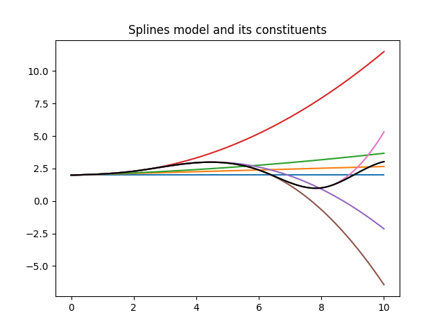
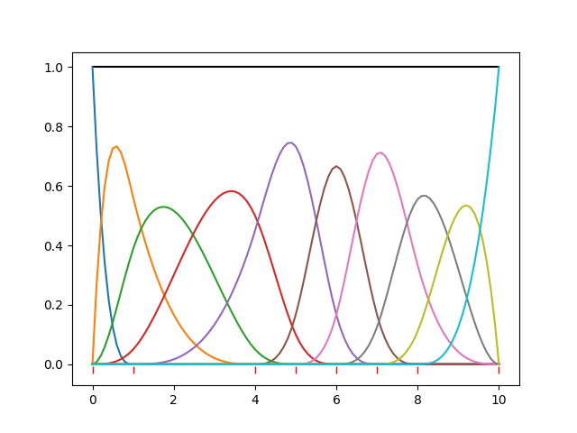

---
---

# Splines Model

## Introduction

Splines can be used to model relationships between data points where a
strict  mathematical model is unknown or impossible. Splines of order N
over K knots are defined as pieces of Nth order polynomials between the
knots. The polynomial pieces and its N-1 derivatives are all continuous
on the knots locations. We call this property N-smooth.
The spline model is defined over a finite domain. 
The knots can be located anywhere in the domain provided that
there is one knot at the minimum of the domain and one knot at the
maximum.

The behaviour of splines of different orders is explained in the table.

| order | Behaviour between Knots | Continuity at Knots |
|:-|:-|:-|
| 0 | piecewise constant | not continuous at all |
| 1 | piecewise linear | lines are continuous (connected) |
| 2 | parabolic pieces | 1st derivatives are also continuous |
| 3 | cubic pieces | 2nd derivatives are also continuous |
| n&gt;3 | n-th order polynomials | (n-1)-th derivatives are also continuous |

The most often used splines are cubic splines on a regular grid of
knots.

From here on we work with cubic splines on a random grid
unless otherwise indicated. It is quite easy to extend the ideas to
lower or higher orders.


## Simple Spline.

My first implementation of splines were based on this continuity only.

Assume we have a set of knots as in

    |------------|------|---------|-------------------|---
    k0           k1     k2        k3                  k4   etc..

The set of knots defines the domain where the spline model is valid.

We define a 3rd order polynomial to the first knot segement $(k_0,k_1)$

```math
\begin{flalign}
\tag{1}
\quad f_0 (x) = p_0 + p_1 x_0 + p_2 x_0^2 + p_3 x_0^3 &&
\end{flalign}
```

Where $x_0$ is the distance to $k_0 : x_0  = x - k_0$.

For the second segment $(k_1,k_2)$ we extend the function of the previous segment
and add 

$$
\begin{flalign}
\quad f_1 (x) = p_4 x_1^3 \\ 
              = 0  \notag
\end{flalign}
\qquad
\begin{flalign}
\tag{2}
\mbox{if} x > k_1 && \\ 
\mbox{if} x < k_1 && 
\end{flalign}
$$

where $x_1$ is the distance to $k_1 : x_1 = x - k_1$.

Note that the function $f_1$ is continuously differentiable to
the 3rd derivative. For $x < k_1$ it is all 0; for $x > k_1$
it is a 3rd order polynomial and at $x = k_1$  the
derivatives from the up-side are all 0, equal to those from the
low-side. 

For the next segments we repeat this procedure.

So in the end we have a spline function $f(x)$ as

$$
\begin{flalign}
\tag{3}
\quad f(x) = p_0 + p_1 x_0 + p_2 x_0^2 + p_3 x_0^3 + \sum p_{i+4} x_i^3 &&
\end{flalign}
$$

Obviously this (piecewise) function is continuously differentiable to 
the 3rd derivative as it is a sum of continuously differentiable
functions. So it is a valid cubic spline model.

This simple algorithm has two disadvantages. Firstly it is not
symmetric. We could also have started at the end of the domain and
worked our way to the beginning. We would obtain a different spline
representation, not better or worse than the first. Secondly the
parameters are not localized. Each parameter influences the result over
the rest of the domain. Preferably one parameters affects only one part of
the model without influencing the others. In this algorithm a parameter
affects all later parameters.

Even with these defects it is a usefull and fast algorithm. 
The algorithm is implemented in **SplinesModel**.

In figure 1 the model is displayed with all its components.



<table><tr>
<td style="width: 50px;">   
<td style="width: 450px;">
Figure 1 shows the the splines model and all its components.
The knots are located at (0,2,4,6,8,10).
</tr>
</table>


Figure 1 is made with the following piece of python code.

    from BayesicFitting import SplinesModel
    import matplotlib.pyplot as plt

    x = numpy.linspace( 0, 10, 101, dtype=float )
    kn = numpy.linspace( 0, 10, 6, dtype=float )
    sm = SplinesModel( knots=kn )

    par = [1.989, 0.066, 0.010, 0.016, -0.046, -0.028, 0.210, -0.286]
    sm.parameters = par

    part = sm.partial( x, par )
    yf = numpy.zeros( 101, dtype=float )
    for k in range( sm.npars ) :
        yf += part[:,k] * par[k]  
        plt.plot( x, yf )
        
    plt.plot( x, sm.result( x, par ), 'k-' )
    plt.title( "Splines model and its constituents" )
    plt.show()


## Basis Splines.

To address the defaults of simple splines, basis splines were invented.
They consist of a set of base functions that, linearly combined, form the
required functional relation.

Carl de Boor (in "A Practical Guide to Splines.", (1978)
Springer-Verlag. ISBN 978-3-540-90356-7.)
designed a recursive algorithm where each recursion
produces a set of base splines of a higher order. 

John Foster and Juha Jeronen implemented de Boor's algorithm in Python
in the [bspline package](https://github.com/johnfoster/bspline).
We encapsulated the bspline package into our **BSplinesModel**.

In figure 2 a set of basis splines of order 3 is displayed, using
parameters all equal to 1.0. 
The knots are at (0,1,4,5,6,7,8,10). 8 knots resulting in 10 basis
functions and as many parameters.
The sum of the components is the black line
constant at 1.0.



<table><tr>
<td style="width: 50px;">   
<td style="width: 450px;">
Figure 2 shows the de Boor splines model and all its components.<br> 
The position of the knots is indicated with red bars low in the plot.
</tr>
</table>


Unfortunately the recursive implementation in **BsplinesModel** is about
20 times slower than the the splines in **SplinesModel**.


## Constructing a Basis.

We would like to see whether the continuity approach can be applied to
these basis functions. we will explain the construction of cubic
(3-order) splines on a set of arbitrarily spaced knots, where the number 
of knots is larger than the order.

### First Blob

Looking at figure 2, we observe that the first (blue) blob runs only in the
first knot segment. It is unbound (0-smooth) at the left side and 3-smooth with 0
at the right side. 

We have a 3rd order polynomial between the first 2 knots.

$$
\begin{flalign}
\tag{4}
\quad f_1(x)  = a + b x + c x^2  + d x^3 &&
\end{flalign}
$$

          f_1        
    |------------|----
    x_0            x_1 

The property 3-smooth implies that the function and it first and
second derivative are 0 at $x_1$, while the function is unbound,
arbitrary at $x_0$. We normalize the blob in $x_0$ at 1. 

$$
\begin{flalign}
\tag{5}
\quad f_1(x_1) &=& 0 \\
\quad f'_1(x_1) &=& 0 \\
\quad f''_1(x_1) &=& 0 \\
\quad f_1(x_0) &=& 1
\end{flalign}
$$

Now we have 4 equations with 4 unknown coefficients (a,b,c,d) which we can solve.

### Second Blob.

For the second blob we see that it is defined over two knot segments.
In each segment a 3rd order polynomial function is defined. 

         f_1           f_2        
    |--------------|--------|---
    x_0            x_1      x_2 


$$
\begin{flalign}
\tag{6}
\quad f_1(x) = a_1 + b_1 x + c_1 x^2 + d_1 x^3 && \\
\quad f_2(x) = a_2 + b_2 x + c_2 x^2 + d_2 x^3 &&
\end{flalign}
$$

The function, $f_1$ is 1-smooth at $x_0$;
$f_1$ and $f_2$ are 3-smooth at $x_1$,
and $f_2$ is 3-smooth with 0 at $x_2$. 
Again we need a normalization at $x_1$.

$$
\begin{flalign}
\tag{7}
\quad f_1(x_0) = 0 && \\
\quad f_1(x_1) = f_2(x_1) && \\
\quad f'_1(x_1) = f'_2(x_1) && \\
\quad f''_1(x_1) = f''_2(x_1) && \\
\quad f_2(x_1) = 0 && \\
\quad f'_2(x_1) = 0 && \\
\quad f''_2(x_1) = 0 && \\
\quad f_1(x_1) = 1 &&
\end{flalign}
$$

We have 8 equations and 8 coefficients (4 per function) so it can be solved directly.

### Next Blobs.

A pattern is developing. The next blob is 2-smooth at $x_0$, and
3-smooth at all other knots, resulting in 12 polynomial coefficients.
The ones after that are 3-smooth everywhere over 4 knot segments,
resulting in 16 coefficients.
Until the end where the pattern is the reverse of the one at the start.

### Renormalization

The normalization that we applied on the individual knots is not exactly
what we want, although it is perfectly valid and we could use it as is.
We would rather have the blobs such that a constant line at 1.0 would be
the result when all parameters are set to 1.0.

So we calculate the results at the top position of the blobs (more or
less; it does not matter that much as is should be 1 everywhere) and set 
all these results to 1.0. This is a matrix equation of
size nrknots, and can be solved directly. 

### Small number of knots

In case we have a cubic spline on a set of 2 knots, $x_0$ and
$x_1$, we have 4 blobs. The smoothnes at the knots is given in the table below. 

| blob | x_0  | x_1  |
|:-|:-|:-|
| 1 | 0-smooth | 3-smooth 
| 2 | 1-smooth | 2-smooth 
| 3 | 2-smooth | 1-smooth 
| 4 | 3-smooth | 0-smooth 

In case we have a cubic spline on a set of 3 knots, $x_0$,
$x_1$ and $x_2$, the smoothnes of the blobs at the knots is given in the 
table below. 

| blob | x_0  | x_1  | x_2 
|:-|:-|:-|:-|
| 1 | 0-smooth | 3-smooth | n/a 
| 2 | 1-smooth | 3-smooth | 3-smooth 
| 3 | 2-smooth | 3-smooth | 2-smooth 
| 4 | 3-smooth | 3-smooth | 1-smooth 
| 5 | n/a | 3-smooth | 0-smooth 

It is easy to generalize the behaviour for splines of other orders.

### Algorithm

The construction above is implemented in **BasicSplinesModel**.
Up on initialization of the class all polynomial coefficients are
calculated and normalized. This takes some time, but after that the
calculation of the spline results, S, is fast.

In the model each blob $f_k$ has assigned a parameter $p_k$.

$$
\begin{flalign}
\tag{8}
\quad S(x:p) = \sum p_k f_k( x ) &&
\end{flalign}
$$

We can expand the $f_k$ into its blob coefficients.

$$
\begin{flalign}
\tag{9}
\quad S(x:p) = \sum p_k ( a_k + b_k x + c_k x^2 + d_k x^3 ) &&
\end{flalign}
$$

And then multiply and sum the parameters and coefficients to speed up
the calculations.

$$
\begin{flalign}
\tag{10}
\quad S(x:p) = \sum ( p_k a_k ) + \sum ( p_k b_k ) x + \sum ( p_k c_k ) x^2 + 
               \sum ( p_k d_k ) x^3 &&  
\end{flalign}
$$


The coefficients and the parameters can be multiplied together, forming
one piecewise 3-order polynomial function of the x's.

This algorithm proved to be 10 times faster than the recursive one.
Still slower by a factor 2 than the first one. 

The advantages we obtained though, are that the blobs are independent.
when one parameter changed only localized effects are seen. Even when
the position of a knot shifts, adjacent knots are only slightly
affected. This opens the option of a **SplinesDynamicModel**.

